# CI/CD流水线配置

<cite>
**本文档引用的文件**
- [Makefile](file://Makefile)
- [hack.mk](file://hack/hack.mk)
- [hack-cli.mk](file://hack/hack-cli.mk)
- [Dockerfile](file://Dockerfile)
- [docker-compose.yml](file://docker-compose.yml)
- [docker-compose.prod.yml](file://docker-compose.prod.yml)
- [app/goods/Dockerfile](file://app/goods/Dockerfile)
- [app/admin/manifest/config/config.prod.yaml](file://app/admin/manifest/config/config.prod.yaml)
- [app/goods/manifest/config/config.prod.yaml](file://app/goods/manifest/config/config.prod.yaml)
- [app/admin/hack/hack.mk](file://app/admin/hack/hack.mk)
- [app/goods/hack/hack.mk](file://app/goods/hack/hack.mk)
- [app/flash-sale/test/run_tests.bat](file://app/flash-sale/test/run_tests.bat)
- [generate-proto.sh](file://generate-proto.sh)
- [rebuild-all-servers.sh](file://rebuild-all-servers.sh)
- [rebuild-service.sh](file://rebuild-service.sh)
</cite>

## 目录
1. [简介](#简介)
2. [项目结构](#项目结构)
3. [核心组件](#核心组件)
4. [架构概览](#架构概览)
5. [详细组件分析](#详细组件分析)
6. [依赖关系分析](#依赖关系分析)
7. [性能考虑](#性能考虑)
8. [故障排除指南](#故障排除指南)
9. [结论](#结论)
10. [附录](#附录)

## 简介

本项目是一个基于GoFrame框架的微服务架构系统，包含多个独立的服务模块和统一的CI/CD流水线配置。本文档详细介绍了如何使用Makefile构建规则和自动化脚本创建完整的CI/CD流水线，涵盖代码质量检查、单元测试、集成测试、镜像构建、推送和部署的完整流程。

项目采用多阶段Docker构建策略，支持多环境部署，并提供了完整的自动化测试和质量保证体系。

## 项目结构

项目采用模块化架构，每个服务都有独立的配置和部署文件：

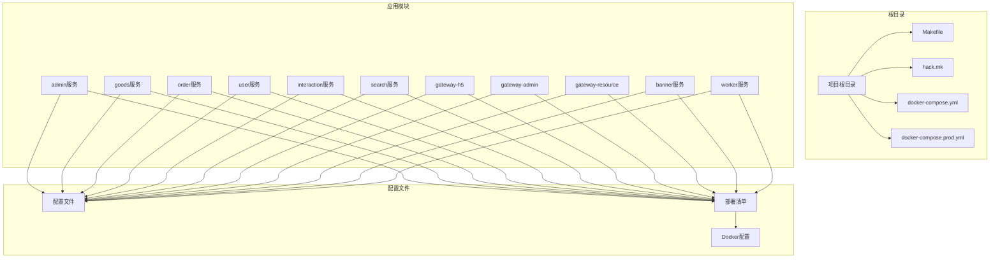

**图表来源**
- [Makefile](file://Makefile#L1-L1)
- [hack.mk](file://hack/hack.mk#L1-L77)
- [docker-compose.yml](file://docker-compose.yml#L1-L355)

**章节来源**
- [Makefile](file://Makefile#L1-L1)
- [hack.mk](file://hack/hack.mk#L1-L77)
- [docker-compose.yml](file://docker-compose.yml#L1-L355)

## 核心组件

### 构建系统

项目使用GoFrame CLI工具进行代码生成和构建管理，通过Makefile统一管理各种构建任务。

### 镜像构建

采用多阶段Docker构建策略，支持单服务和全量服务构建两种模式。

### 部署管理

使用Kubernetes Kustomize进行环境管理，支持开发、测试、生产多环境部署。

**章节来源**
- [hack-cli.mk](file://hack/hack-cli.mk#L1-L20)
- [hack.mk](file://hack/hack.mk#L34-L66)

## 架构概览

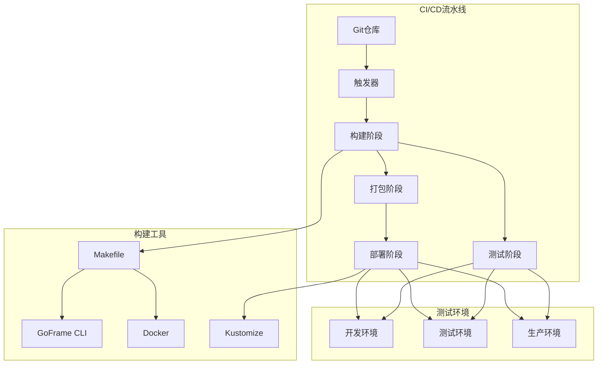

**图表来源**
- [hack.mk](file://hack/hack.mk#L8-L11)
- [hack.mk](file://hack/hack.mk#L34-L43)
- [hack.mk](file://hack/hack.mk#L52-L66)

## 详细组件分析

### Makefile构建规则

项目使用统一的Makefile来管理构建流程，包含以下核心目标：

#### 基础构建目标

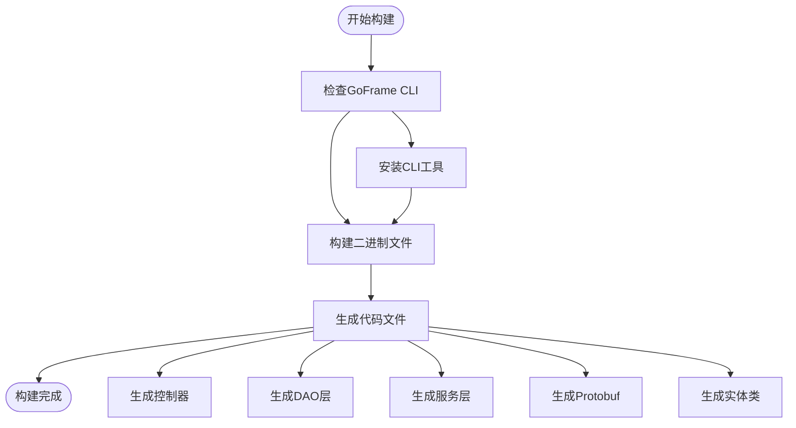

**图表来源**
- [hack.mk](file://hack/hack.mk#L8-L31)

#### 镜像构建流程

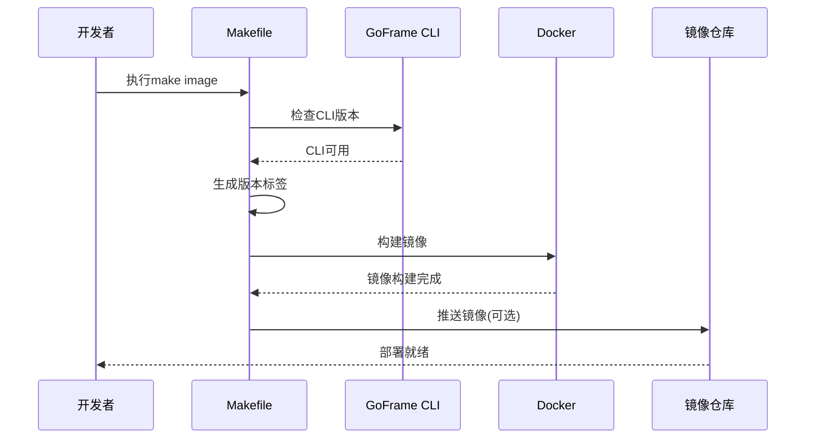

**图表来源**
- [hack.mk](file://hack/hack.mk#L34-L49)

#### 部署流程

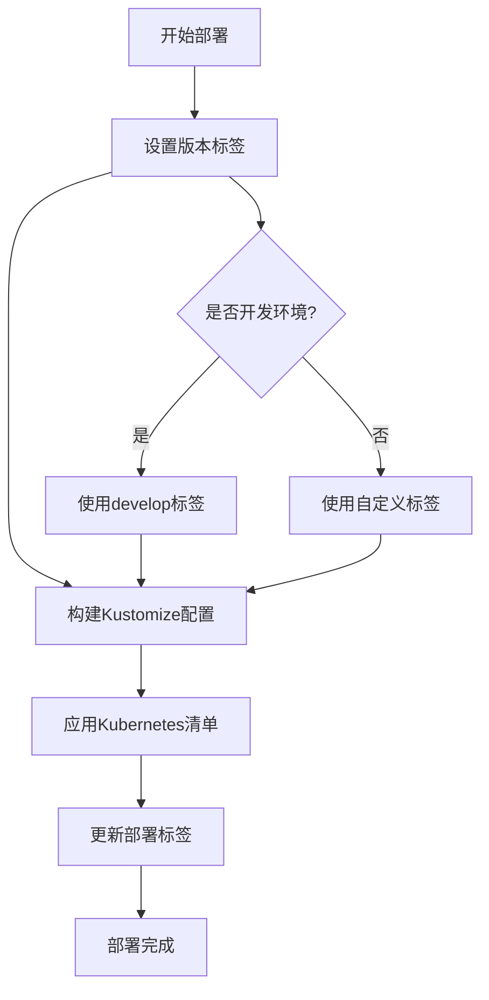

**图表来源**
- [hack.mk](file://hack/hack.mk#L52-L66)

**章节来源**
- [hack.mk](file://hack/hack.mk#L1-L77)
- [hack-cli.mk](file://hack/hack-cli.mk#L1-L20)

### Docker镜像配置

项目提供了两种Docker构建策略：

#### 单服务Dockerfile

每个服务都有独立的Dockerfile，专注于特定服务的构建：

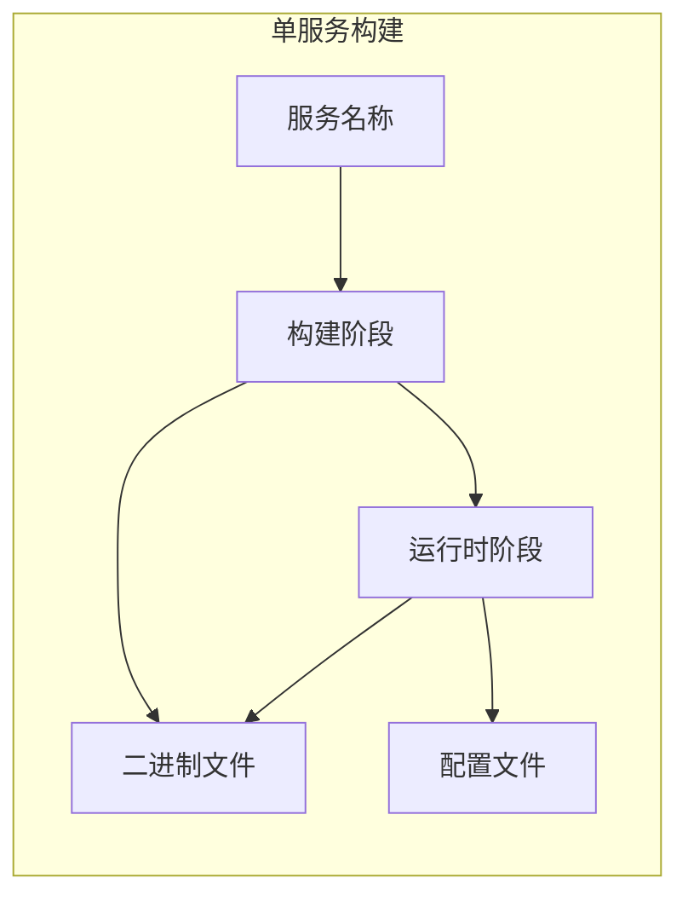

**图表来源**
- [app/goods/Dockerfile](file://app/goods/Dockerfile#L1-L39)

#### 全量构建Dockerfile

根目录的Dockerfile支持同时构建所有服务：

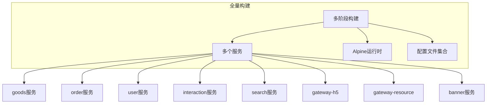

**图表来源**
- [Dockerfile](file://Dockerfile#L1-L49)

**章节来源**
- [app/goods/Dockerfile](file://app/goods/Dockerfile#L1-L39)
- [Dockerfile](file://Dockerfile#L1-L49)

### 配置管理系统

项目使用YAML配置文件管理不同环境的服务配置：

#### 生产环境配置

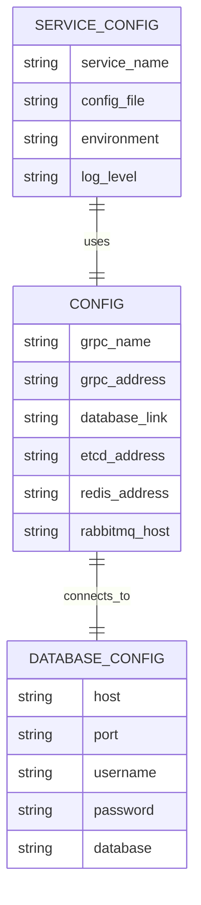

**图表来源**
- [app/admin/manifest/config/config.prod.yaml](file://app/admin/manifest/config/config.prod.yaml#L1-L22)
- [app/goods/manifest/config/config.prod.yaml](file://app/goods/manifest/config/config.prod.yaml#L1-L60)

**章节来源**
- [app/admin/manifest/config/config.prod.yaml](file://app/admin/manifest/config/config.prod.yaml#L1-L22)
- [app/goods/manifest/config/config.prod.yaml](file://app/goods/manifest/config/config.prod.yaml#L1-L60)

### 测试自动化

项目提供了完整的测试自动化流程，包括单元测试、集成测试和性能测试：

#### 测试执行流程

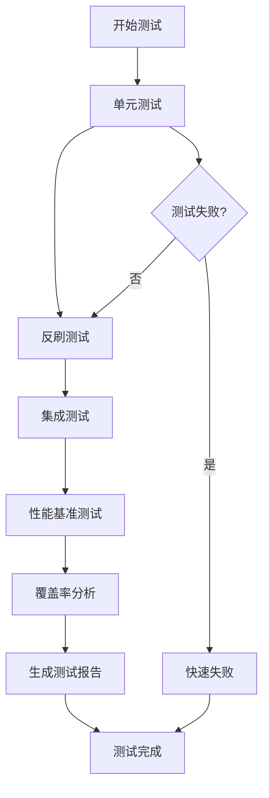

**图表来源**
- [app/flash-sale/test/run_tests.bat](file://app/flash-sale/test/run_tests.bat#L12-L31)

**章节来源**
- [app/flash-sale/test/run_tests.bat](file://app/flash-sale/test/run_tests.bat#L1-L43)

### 开发工具链

项目提供了多种开发辅助脚本：

#### 重建服务脚本

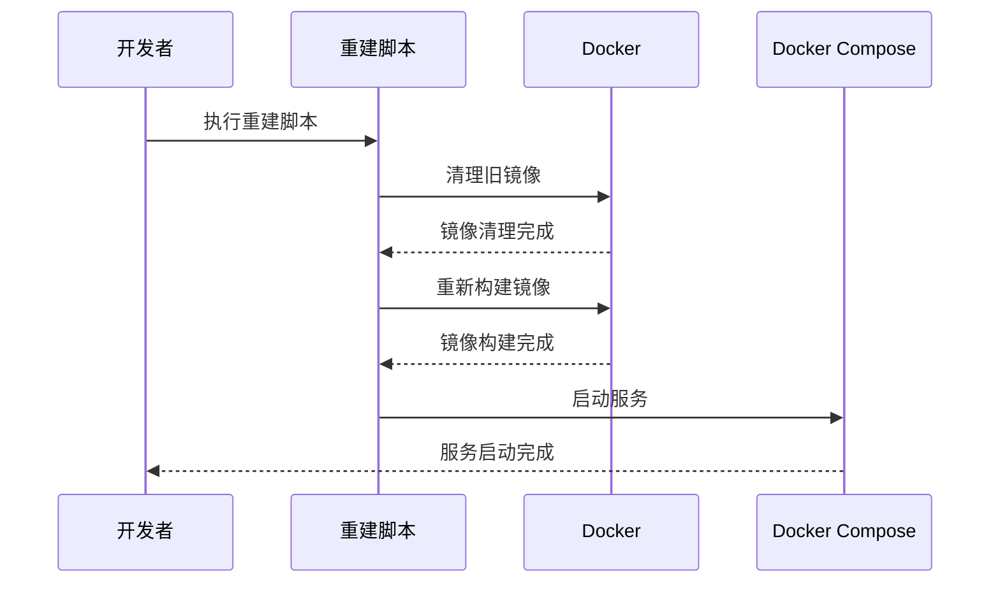

**图表来源**
- [rebuild-all-servers.sh](file://rebuild-all-servers.sh)
- [rebuild-service.sh](file://rebuild-service.sh)

**章节来源**
- [rebuild-all-servers.sh](file://rebuild-all-servers.sh)
- [rebuild-service.sh](file://rebuild-service.sh)

## 依赖关系分析

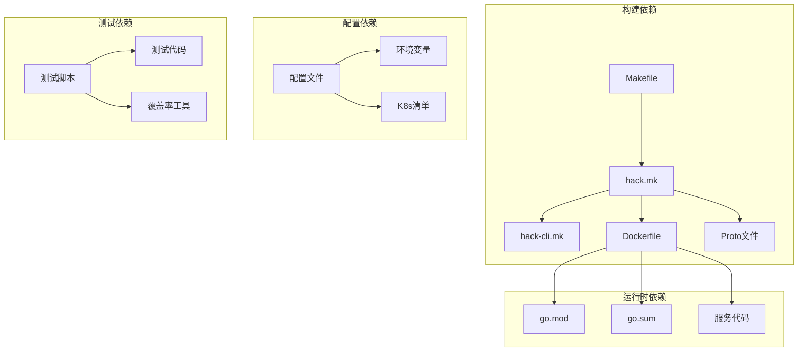

**图表来源**
- [Makefile](file://Makefile#L1-L1)
- [hack.mk](file://hack/hack.mk#L1-L77)
- [Dockerfile](file://Dockerfile#L1-L49)

**章节来源**
- [Makefile](file://Makefile#L1-L1)
- [hack.mk](file://hack/hack.mk#L1-L77)
- [Dockerfile](file://Dockerfile#L1-L49)

## 性能考虑

### 构建性能优化

1. **多阶段构建**：使用Alpine Linux作为运行时基础镜像，减少镜像大小
2. **并行构建**：Makefile支持并行执行多个构建任务
3. **缓存优化**：Docker构建利用层缓存机制

### 部署性能优化

1. **健康检查**：Kubernetes健康检查确保服务可用性
2. **资源限制**：生产环境配置CPU和内存限制
3. **滚动更新**：支持无停机部署

## 故障排除指南

### 常见构建问题

1. **GoFrame CLI未安装**
   - 解决方案：执行`make cli.install`自动安装

2. **Docker构建失败**
   - 检查网络连接和代理设置
   - 确认Docker守护进程正常运行

3. **依赖下载超时**
   - 修改GOPROXY为国内镜像源
   - 检查防火墙设置

### 部署问题

1. **Kubernetes部署失败**
   - 检查命名空间权限
   - 验证资源配置正确性

2. **服务启动失败**
   - 查看容器日志
   - 检查端口占用情况

**章节来源**
- [hack-cli.mk](file://hack/hack-cli.mk#L13-L20)
- [hack.mk](file://hack/hack.mk#L52-L66)

## 结论

本项目的CI/CD流水线配置提供了完整的自动化构建、测试和部署解决方案。通过GoFrame CLI工具、Makefile构建系统和Docker容器化技术，实现了高效的微服务交付流程。

关键优势包括：
- 统一的构建和部署流程
- 完整的测试覆盖
- 多环境支持
- 自动化的质量保证
- 灵活的配置管理

## 附录

### 部署前检查清单

- [ ] 所有服务代码已通过静态分析
- [ ] 单元测试全部通过
- [ ] 集成测试验证通过
- [ ] Docker镜像构建成功
- [ ] Kubernetes配置文件验证通过
- [ ] 环境变量配置正确
- [ ] 网络连通性测试通过

### 回滚机制

1. **版本标记**：使用Git提交哈希作为镜像标签
2. **金丝雀发布**：逐步替换旧版本实例
3. **健康检查**：自动检测新版本稳定性
4. **快速回滚**：发现问题立即回滚到上一个稳定版本

### 最佳实践

1. **持续集成**：每次代码提交都触发构建和测试
2. **代码审查**：强制代码审查流程
3. **监控告警**：建立完善的监控和告警机制
4. **文档维护**：保持文档与代码同步更新