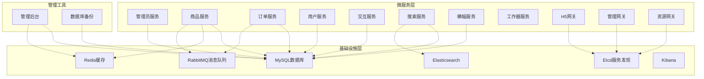
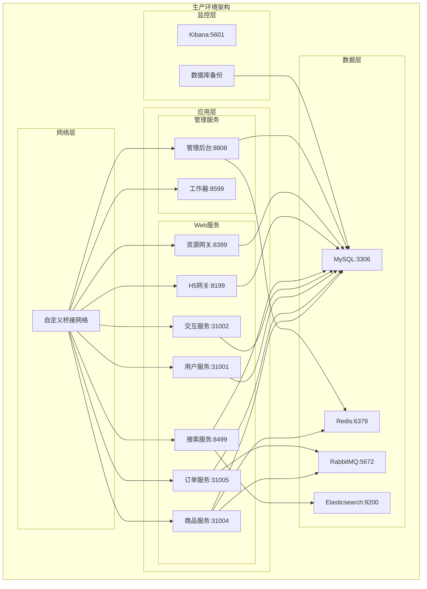
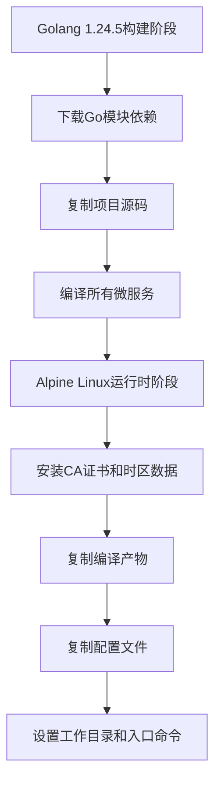
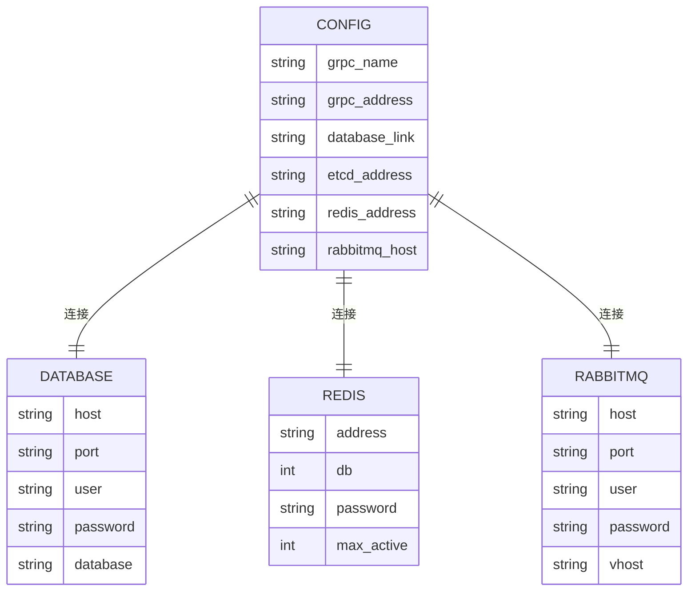
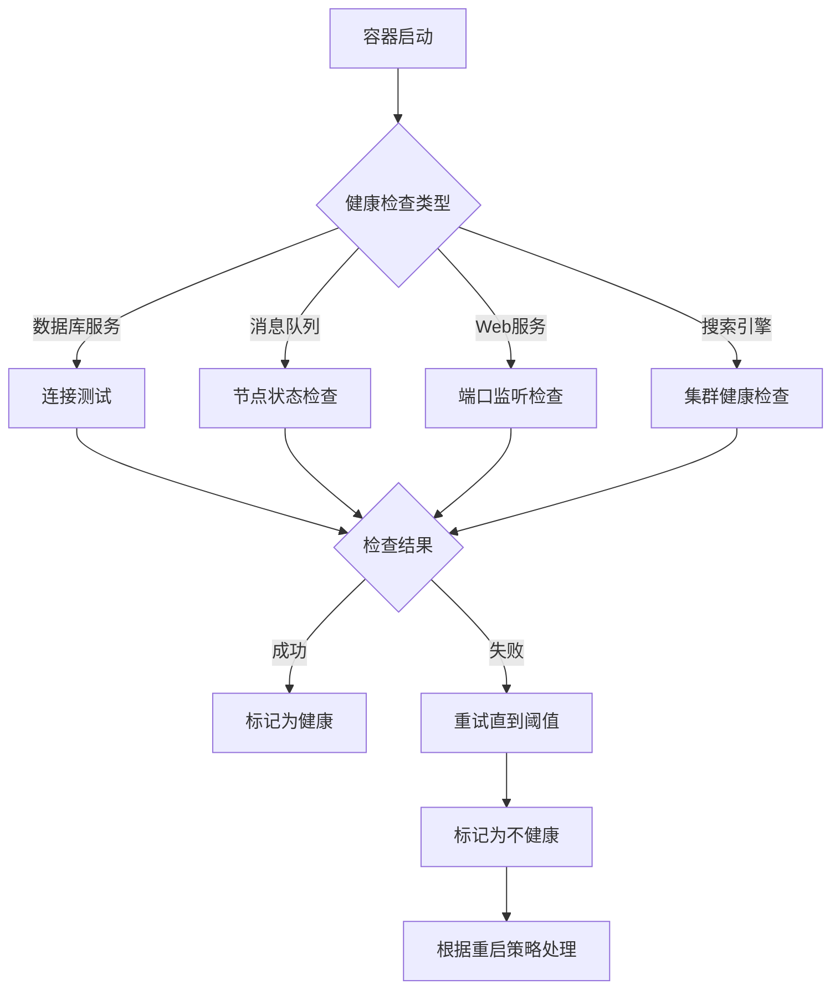
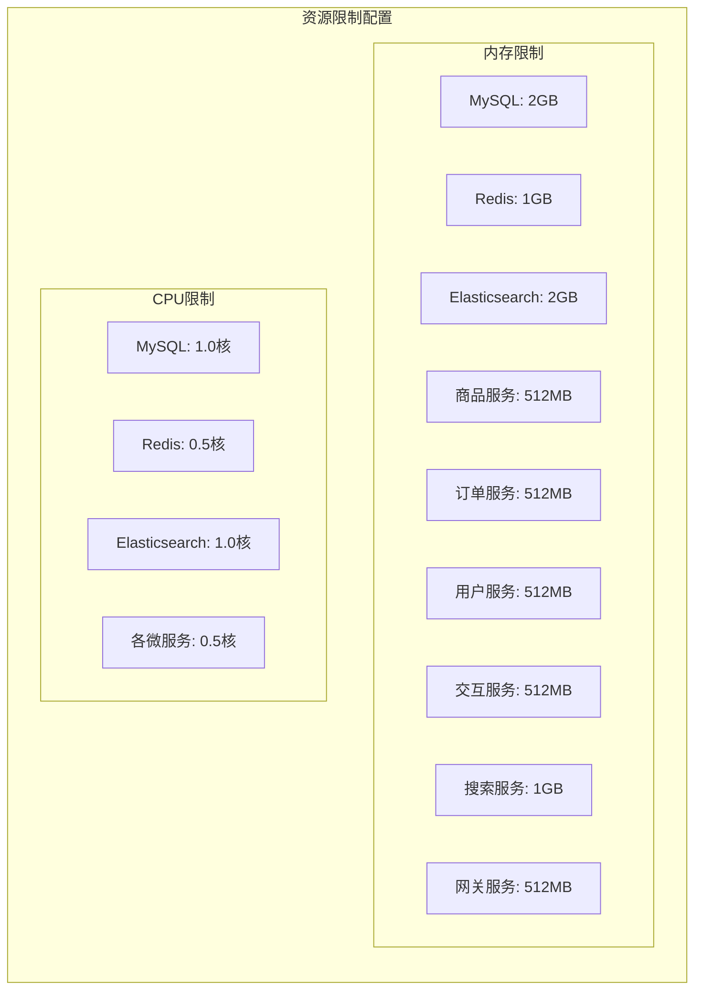
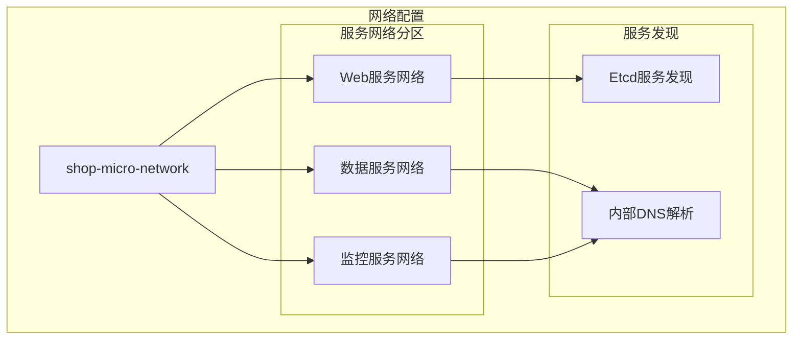
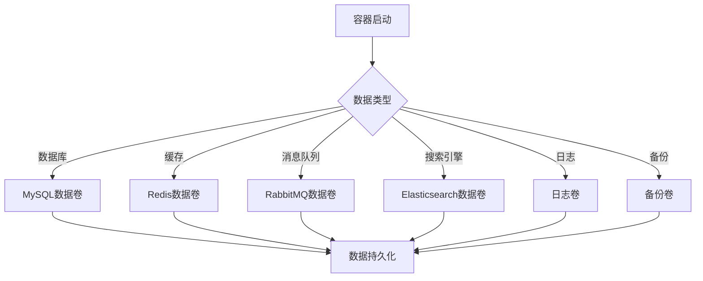
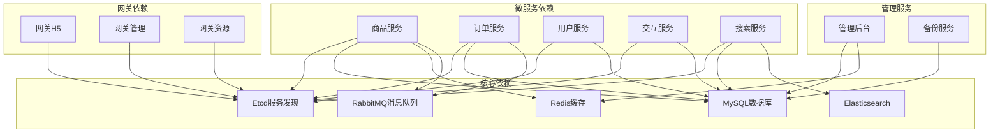

# Docker容器化部署

<cite>
**本文档引用的文件**
- [Dockerfile](file://Dockerfile)
- [docker-compose.yml](file://docker-compose.yml)
- [docker-compose.prod.yml](file://docker-compose.prod.yml)
- [.dockerignore](file://.dockerignore)
- [rebuild-all-servers.sh](file://rebuild-all-servers.sh)
- [rebuild-service.sh](file://rebuild-service.sh)
- [app/admin/manifest/docker/Dockerfile](file://app/admin/manifest/docker/Dockerfile)
- [app/goods/manifest/docker/Dockerfile](file://app/goods/manifest/docker/Dockerfile)
- [app/order/manifest/docker/Dockerfile](file://app/order/manifest/docker/Dockerfile)
- [app/user/manifest/docker/Dockerfile](file://app/user/manifest/docker/Dockerfile)
- [app/admin/manifest/config/config.prod.yaml](file://app/admin/manifest/config/config.prod.yaml)
- [app/goods/manifest/config/config.prod.yaml](file://app/goods/manifest/config/config.prod.yaml)
- [app/order/manifest/config/config.prod.yaml](file://app/order/manifest/config/config.prod.yaml)
- [app/user/manifest/config/config.prod.yaml](file://app/user/manifest/config/config.prod.yaml)
- [app/interaction/manifest/config/config.prod.yaml](file://app/interaction/manifest/config/config.prod.yaml)
</cite>

## 目录
1. [简介](#简介)
2. [项目结构](#项目结构)
3. [核心组件](#核心组件)
4. [架构概览](#架构概览)
5. [详细组件分析](#详细组件分析)
6. [依赖关系分析](#依赖关系分析)
7. [性能考虑](#性能考虑)
8. [故障排除指南](#故障排除指南)
9. [结论](#结论)
10. [附录](#附录)

## 简介

本指南详细介绍了基于GoFrame微服务架构的Docker容器化部署方案。该项目采用多服务架构，包含用户服务、商品服务、订单服务、交互服务等多个微服务，以及配套的数据存储和消息中间件服务。

系统支持开发环境和生产环境两种部署模式，提供完整的容器编排、健康检查、资源限制和监控配置。通过Docker Compose实现服务间的协调部署，确保各微服务能够稳定运行并与依赖组件正确通信。

## 项目结构

项目采用模块化的微服务架构，每个服务都有独立的Dockerfile和配置文件：



**图表来源**
- [docker-compose.yml](file://docker-compose.yml#L1-L355)
- [docker-compose.prod.yml](file://docker-compose.prod.yml#L1-L551)

**章节来源**
- [docker-compose.yml](file://docker-compose.yml#L1-L355)
- [docker-compose.prod.yml](file://docker-compose.prod.yml#L1-L551)

## 核心组件

### 基础设施服务

#### MySQL数据库服务
- 版本: 8.0
- 端口映射: 3306:3306
- 数据持久化: 使用命名卷 `mysql_data`
- 初始化脚本: 自动执行 `init-db` 目录下的SQL文件
- 健康检查: 使用 `mysqladmin ping` 检测
- 重启策略: `unless-stopped`

#### Redis缓存服务
- 版本: 7-alpine
- 端口映射: 6379:6379
- 数据持久化: 使用命名卷 `redis_data`
- 配置: 启用AOF持久化，内存限制512MB
- 健康检查: 使用 `redis-cli ping` 检测

#### RabbitMQ消息队列
- 版本: 4.1.0-management-alpine
- 端口映射: 5672:5672, 15672:15672
- 数据持久化: 使用命名卷 `rabbitmq_data`
- 插件: 自动启用延迟消息插件
- 健康检查: 使用 `rabbitmq-diagnostics ping` 检测

#### Elasticsearch搜索引擎
- 版本: 8.11.0
- 端口映射: 9200:9200, 9300:9300
- 数据持久化: 使用命名卷 `es-data`
- 插件: 自动安装IK中文分词器
- 健康检查: 检测集群健康状态

### 微服务组件

#### GoFrame微服务
- 镜像: 基于Alpine Linux的轻量级镜像
- 端口映射: 每个服务使用独立端口范围
- 配置挂载: 挂载各服务的配置文件
- 日志管理: 挂载日志目录到宿主机
- 依赖: 通过etcd进行服务发现

#### 网关服务
- H5网关: 8199端口，提供移动端API接口
- 管理网关: 8299端口，提供管理端API接口  
- 资源网关: 8399端口，提供静态资源服务

**章节来源**
- [docker-compose.yml](file://docker-compose.yml#L4-L355)
- [docker-compose.prod.yml](file://docker-compose.prod.yml#L15-L551)

## 架构概览

系统采用多阶段Docker构建策略，结合生产环境的资源限制和健康检查配置：



**图表来源**
- [docker-compose.prod.yml](file://docker-compose.prod.yml#L1-L551)

**章节来源**
- [docker-compose.prod.yml](file://docker-compose.prod.yml#L1-L551)

## 详细组件分析

### Dockerfile构建配置

#### 多阶段构建策略
项目采用两阶段构建优化镜像大小和安全性：



**图表来源**
- [Dockerfile](file://Dockerfile#L1-L49)

#### 构建优化策略
- **分层缓存**: Go模块下载和源码复制分离，优化构建缓存
- **多服务并行**: 在单个构建步骤中编译所有微服务
- **精简运行时**: 使用Alpine Linux替代标准Golang镜像
- **时区配置**: 包含TZ数据库，支持国际化应用

**章节来源**
- [Dockerfile](file://Dockerfile#L1-L49)

### 服务配置文件

#### 生产环境配置结构
每个微服务都包含独立的生产环境配置文件，统一管理数据库连接、缓存配置和消息队列设置：



**图表来源**
- [app/goods/manifest/config/config.prod.yaml](file://app/goods/manifest/config/config.prod.yaml#L1-L60)
- [app/order/manifest/config/config.prod.yaml](file://app/order/manifest/config/config.prod.yaml#L1-L86)

#### 配置文件示例分析

**商品服务配置要点**:
- gRPC服务监听: `:31004`
- MySQL连接: `mysql:root:password@tcp(mysql:3306)/goods`
- Redis连接: `redis:6379` (DB1)
- RabbitMQ交换机配置: 包含多个业务交换机

**订单服务配置要点**:
- gRPC服务监听: `:31005`
- 微信支付配置: 完整的微信小程序支付参数
- 订单超时: 30分钟 (1800000毫秒)
- RabbitMQ交换机: 订单超时和事件处理

**用户服务配置要点**:
- gRPC服务监听: `:31001`
- 微信小程序配置: AppId和Secret
- RabbitMQ队列: 用户注册事件

**章节来源**
- [app/admin/manifest/config/config.prod.yaml](file://app/admin/manifest/config/config.prod.yaml#L1-L22)
- [app/goods/manifest/config/config.prod.yaml](file://app/goods/manifest/config/config.prod.yaml#L1-L60)
- [app/order/manifest/config/config.prod.yaml](file://app/order/manifest/config/config.prod.yaml#L1-L86)
- [app/user/manifest/config/config.prod.yaml](file://app/user/manifest/config/config.prod.yaml#L1-L42)
- [app/interaction/manifest/config/config.prod.yaml](file://app/interaction/manifest/config/config.prod.yaml#L1-L22)

### 健康检查配置

#### 健康检查策略
生产环境采用多层次健康检查策略：



**图表来源**
- [docker-compose.prod.yml](file://docker-compose.prod.yml#L29-L158)

#### 健康检查配置示例

**MySQL健康检查**:
- 检测命令: `mysqladmin ping -h localhost`
- 间隔: 10秒
- 超时: 5秒
- 重试次数: 5次
- 启动延迟: 30秒

**Elasticsearch健康检查**:
- 检测命令: `curl -f http://localhost:9200/_cluster/health`
- 间隔: 30秒
- 超时: 10秒
- 重试次数: 5次

**Web服务健康检查**:
- 检测命令: `nc -z localhost 端口号`
- 间隔: 30秒
- 超时: 10秒
- 重试次数: 3次
- 启动延迟: 60秒

**章节来源**
- [docker-compose.prod.yml](file://docker-compose.prod.yml#L29-L158)

### 资源限制配置

#### 生产环境资源约束
每个服务都配置了明确的资源限制，确保系统稳定性：



**图表来源**
- [docker-compose.prod.yml](file://docker-compose.prod.yml#L37-L162)

#### 资源分配策略
- **数据库服务**: 较高的内存分配，确保查询性能
- **缓存服务**: 中等内存分配，支持LRU淘汰策略
- **Web服务**: 较低内存分配，支持高并发请求
- **搜索引擎**: 高内存分配，支持全文检索

**章节来源**
- [docker-compose.prod.yml](file://docker-compose.prod.yml#L37-L162)

### 网络配置

#### 网络架构设计
系统采用自定义桥接网络，确保服务间通信的安全性和稳定性：



**图表来源**
- [docker-compose.prod.yml](file://docker-compose.prod.yml#L529-L535)

#### 网络隔离策略
- **服务间隔离**: 不同类型的服务部署在不同的网络分区
- **外部访问控制**: Web服务暴露特定端口给外部访问
- **内部通信**: 服务间通过内部网络进行通信
- **MTU优化**: 网络驱动MTU设置为1450字节

**章节来源**
- [docker-compose.prod.yml](file://docker-compose.prod.yml#L529-L535)

### 数据持久化

#### 存储策略
系统采用命名卷确保数据持久化和迁移便利：



**图表来源**
- [docker-compose.yml](file://docker-compose.yml#L14-L355)
- [docker-compose.prod.yml](file://docker-compose.prod.yml#L536-L551)

#### 备份策略
- **自动备份**: MySQL备份服务每24小时执行一次
- **保留策略**: 保留7天的备份数据
- **压缩存储**: 备份文件使用gzip压缩
- **增量清理**: 自动清理过期备份

**章节来源**
- [docker-compose.prod.yml](file://docker-compose.prod.yml#L500-L528)

## 依赖关系分析

### 服务依赖图



**图表来源**
- [docker-compose.yml](file://docker-compose.yml#L147-L325)
- [docker-compose.prod.yml](file://docker-compose.prod.yml#L206-L450)

### 依赖管理策略

#### 服务启动顺序
系统通过 `depends_on` 和健康检查确保正确的启动顺序：

1. **基础设施服务**: MySQL → Redis → RabbitMQ → Etcd → Elasticsearch
2. **数据服务**: 各微服务
3. **网关服务**: 网关服务最后启动
4. **管理服务**: 管理后台和备份服务

#### 服务发现机制
- **Etcd集成**: 所有微服务通过Etcd进行服务注册和发现
- **动态配置**: 支持配置的动态更新
- **负载均衡**: 通过Etcd实现服务间的负载均衡

**章节来源**
- [docker-compose.yml](file://docker-compose.yml#L147-L325)
- [docker-compose.prod.yml](file://docker-compose.prod.yml#L206-L450)

## 性能考虑

### 构建优化

#### 多阶段构建优势
- **镜像体积**: 从标准Golang镜像的约1GB减少到约150MB
- **构建速度**: 利用Docker缓存机制，增量构建更快
- **安全性**: 运行时镜像不包含编译工具链

#### 编译优化
- **并行编译**: 在单个构建步骤中编译所有微服务
- **模块化**: 每个服务独立编译，便于增量更新
- **静态链接**: 生成静态二进制文件，减少运行时依赖

### 运行时优化

#### 资源分配
- **内存优化**: 根据服务类型合理分配内存，避免资源浪费
- **CPU亲和性**: 通过CPU限制实现资源隔离
- **连接池**: 数据库和缓存连接池配置优化

#### 网络优化
- **MTU设置**: 1450字节MTU优化网络性能
- **连接复用**: HTTP连接复用减少连接开销
- **负载均衡**: 通过Etcd实现服务间的负载均衡

## 故障排除指南

### 常见问题诊断

#### 容器启动失败
```bash
# 检查容器状态
docker compose ps

# 查看容器日志
docker compose logs [服务名]

# 检查依赖服务
docker compose ps | grep -E "(mysql|redis|rabbitmq|etcd)"
```

#### 网络连接问题
```bash
# 检查网络连接
docker exec [容器名] ping [目标服务]

# 检查端口监听
docker exec [容器名] netstat -tlnp

# 检查DNS解析
docker exec [容器名] nslookup [服务名]
```

#### 数据库连接问题
```bash
# 检查MySQL连接
docker exec mysql mysql -u root -p -e "SHOW DATABASES;"

# 检查Redis连接
docker exec redis redis-cli ping

# 检查RabbitMQ连接
docker exec rabbitmq rabbitmqctl status
```

### 性能问题诊断

#### 内存使用过高
```bash
# 检查容器内存使用
docker stats --format "table {{.Name}}\t{{.MemUsage}}"

# 分析内存使用模式
docker exec [容器名] top -b -n 1 | head -20
```

#### CPU使用率过高
```bash
# 检查容器CPU使用
docker stats --format "table {{.Name}}\t{{.CPUPerc}}"

# 分析CPU热点
docker exec [容器名] go tool pprof http://localhost:6060/debug/pprof/profile
```

#### 磁盘空间不足
```bash
# 检查磁盘使用
df -h

# 清理Docker占用空间
docker system df
docker volume prune
docker image prune
```

### 配置问题排查

#### 配置文件错误
```bash
# 检查配置文件语法
docker exec [容器名] cat /app/config/config.yaml

# 验证配置连接
docker exec [容器名] /app/main --test-config
```

#### 环境变量问题
```bash
# 检查环境变量
docker exec [容器名] env | grep -E "(MYSQL|RABBITMQ|REDIS)"

# 验证环境变量
docker exec [容器名] printenv | grep -E "(TZ|ENV|LOG_LEVEL)"
```

**章节来源**
- [rebuild-all-servers.sh](file://rebuild-all-servers.sh#L1-L129)
- [rebuild-service.sh](file://rebuild-service.sh#L1-L543)

## 结论

本Docker容器化部署方案为GoFrame微服务架构提供了完整的容器化解决方案。通过多阶段构建优化、生产环境资源配置、健康检查和监控集成，确保了系统的稳定性、可维护性和可扩展性。

关键优势包括：
- **模块化设计**: 每个微服务独立部署，便于维护和扩展
- **资源优化**: 合理的资源分配和限制，提升系统整体性能
- **高可用性**: 完善的健康检查和重启策略
- **可观测性**: 全面的日志管理和监控配置
- **安全性**: 网络隔离和最小权限原则

该方案既适用于开发环境的快速迭代，也满足生产环境的高可用要求，为微服务架构的容器化部署提供了最佳实践参考。

## 附录

### 部署命令参考

#### 开发环境部署
```bash
# 启动开发环境
docker compose up -d

# 查看服务状态
docker compose ps

# 查看日志
docker compose logs -f
```

#### 生产环境部署
```bash
# 启动生产环境
docker compose -f docker-compose.prod.yml up -d

# 重新构建所有服务
./rebuild-all-servers.sh

# 重新构建单个服务
./rebuild-service.sh goods-service
```

#### 健康检查
```bash
# 检查所有服务健康状态
docker compose ps

# 检查特定服务健康状态
docker compose ps [服务名]

# 查看健康检查日志
docker compose logs [服务名] | grep -i health
```

### 监控和日志

#### 日志管理
```bash
# 查看所有服务日志
docker compose logs -f --tail=100

# 查看特定服务日志
docker compose logs -f [服务名]

# 按时间过滤日志
docker compose logs --since="2024-01-01" --until="2024-01-02"
```

#### 性能监控
```bash
# 查看容器资源使用
docker stats --format "table {{.Name}}\t{{.CPUPerc}}\t{{.MemUsage}}"

# 查看网络使用
docker stats --format "table {{.Name}}\t{{.NetIO}}"

# 查看磁盘使用
docker stats --format "table {{.Name}}\t{{.BlockIO}}"
```