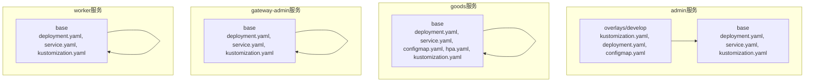
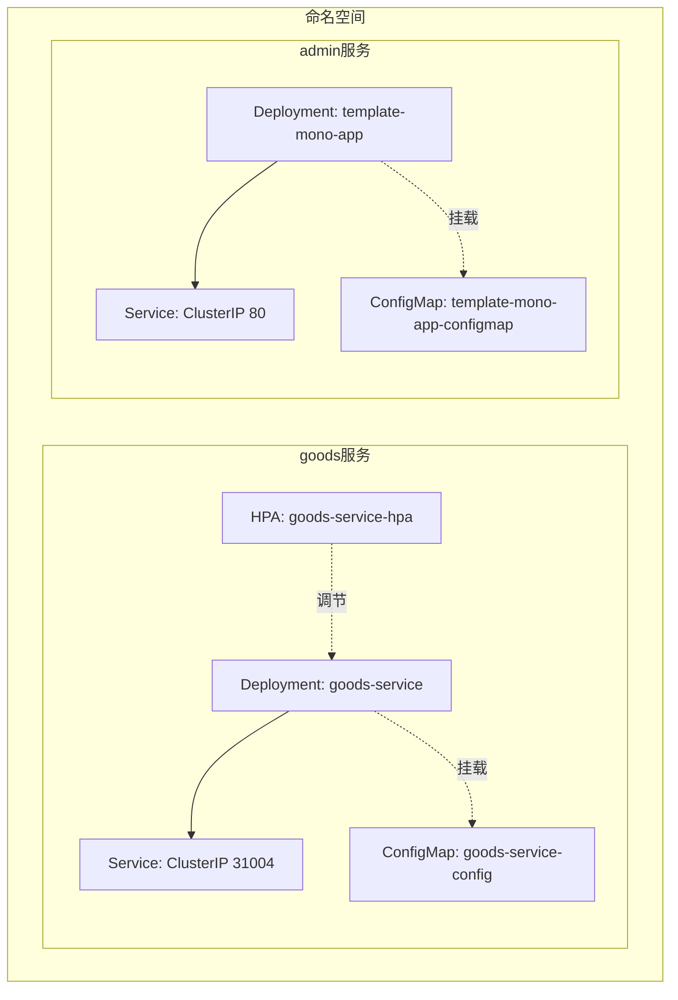
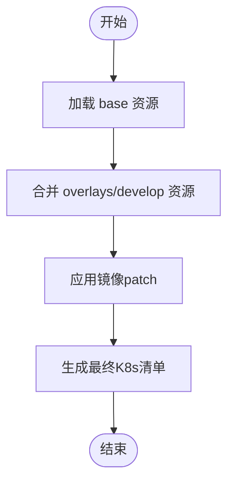
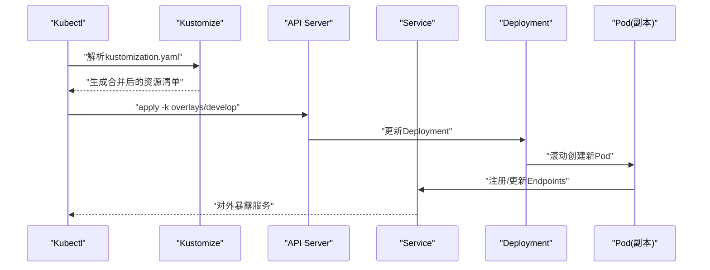
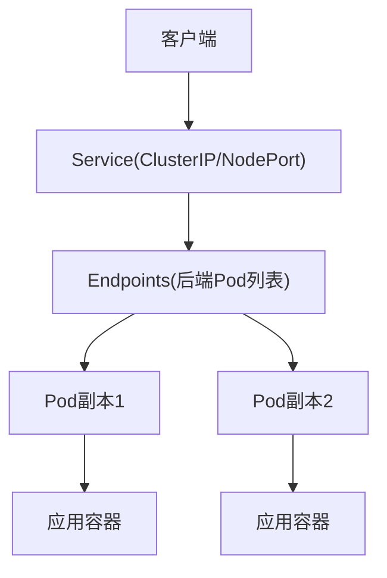
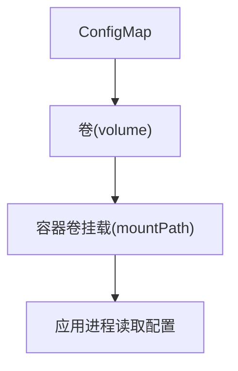
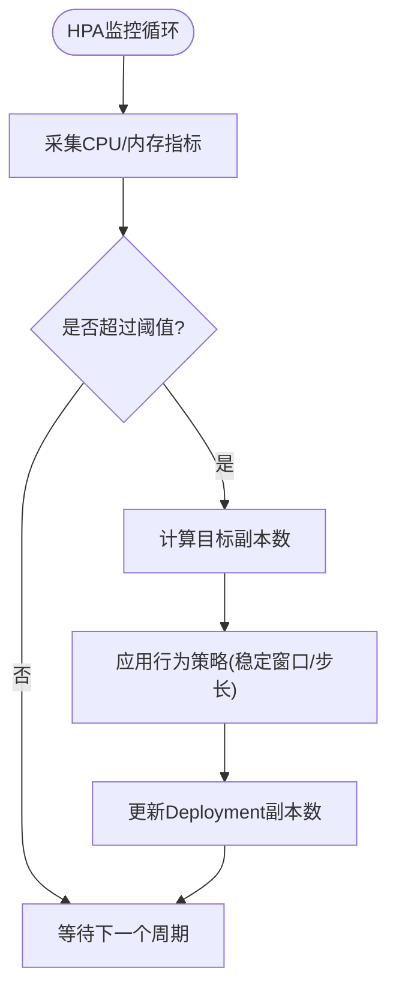
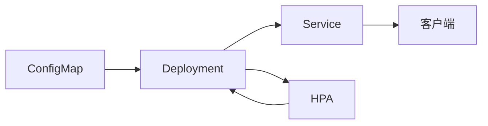

# Kubernetes集群部署

<cite>
**本文档引用的文件**
- [app/admin/manifest/deploy/kustomize/base/kustomization.yaml](file://app/admin/manifest/deploy/kustomize/base/kustomization.yaml)
- [app/admin/manifest/deploy/kustomize/base/deployment.yaml](file://app/admin/manifest/deploy/kustomize/base/deployment.yaml)
- [app/admin/manifest/deploy/kustomize/base/service.yaml](file://app/admin/manifest/deploy/kustomize/base/service.yaml)
- [app/admin/manifest/deploy/kustomize/overlays/develop/kustomization.yaml](file://app/admin/manifest/deploy/kustomize/overlays/develop/kustomization.yaml)
- [app/admin/manifest/deploy/kustomize/overlays/develop/deployment.yaml](file://app/admin/manifest/deploy/kustomize/overlays/develop/deployment.yaml)
- [app/admin/manifest/deploy/kustomize/overlays/develop/configmap.yaml](file://app/admin/manifest/deploy/kustomize/overlays/develop/configmap.yaml)
- [app/admin/manifest/docker/Dockerfile](file://app/admin/manifest/docker/Dockerfile)
- [app/goods/manifest/deploy/kustomize/base/kustomization.yaml](file://app/goods/manifest/deploy/kustomize/base/kustomization.yaml)
- [app/goods/manifest/deploy/kustomize/base/deployment.yaml](file://app/goods/manifest/deploy/kustomize/base/deployment.yaml)
- [app/goods/manifest/deploy/kustomize/base/service.yaml](file://app/goods/manifest/deploy/kustomize/base/service.yaml)
- [app/goods/manifest/deploy/kustomize/base/configmap.yaml](file://app/goods/manifest/deploy/kustomize/base/configmap.yaml)
- [app/goods/manifest/deploy/kustomize/base/hpa.yaml](file://app/goods/manifest/deploy/kustomize/base/hpa.yaml)
- [app/gateway-admin/manifest/deploy/kustomize/base/kustomization.yaml](file://app/gateway-admin/manifest/deploy/kustomize/base/kustomization.yaml)
- [app/gateway-admin/manifest/deploy/kustomize/base/deployment.yaml](file://app/gateway-admin/manifest/deploy/kustomize/base/deployment.yaml)
- [app/gateway-admin/manifest/deploy/kustomize/base/service.yaml](file://app/gateway-admin/manifest/deploy/kustomize/base/service.yaml)
- [app/worker/manifest/deploy/kustomize/base/kustomization.yaml](file://app/worker/manifest/deploy/kustomize/base/kustomization.yaml)
- [doc/Kubernetes编排实战与HPA自动扩缩容最佳实践指南.md](file://doc/Kubernetes编排实战与HPA自动扩缩容最佳实践指南.md)
</cite>

## 目录
1. [简介](#简介)
2. [项目结构](#项目结构)
3. [核心组件](#核心组件)
4. [架构总览](#架构总览)
5. [详细组件分析](#详细组件分析)
6. [依赖分析](#依赖分析)
7. [性能考虑](#性能考虑)
8. [故障排查指南](#故障排查指南)
9. [结论](#结论)
10. [附录](#附录)

## 简介
本指南面向在Kubernetes集群上部署微服务的工程团队，围绕仓库中的Kustomize配置管理、Deployment与Service等K8s资源定义、HPA自动扩缩容、服务发现与健康检查、滚动更新策略、生产环境资源限制与安全策略、监控配置，以及kubectl命令行操作与故障排查方法进行全面说明。文档以GoFrame微服务项目为基础，结合各子模块的Kustomize overlay结构，提供可落地的部署实践。

## 项目结构
项目采用Kustomize对每个微服务进行配置管理，标准目录结构如下：
- base：存放通用的基础资源配置（Deployment、Service、ConfigMap、HPA等）
- overlays/<环境>：按环境（如develop）进行差异化覆盖，合并基础配置并注入环境特有设置（如镜像版本、ConfigMap）

图表来源
- [app/admin/manifest/deploy/kustomize/base/kustomization.yaml](file://app/admin/manifest/deploy/kustomize/base/kustomization.yaml#L1-L9)
- [app/admin/manifest/deploy/kustomize/overlays/develop/kustomization.yaml](file://app/admin/manifest/deploy/kustomize/overlays/develop/kustomization.yaml#L1-L15)
- [app/goods/manifest/deploy/kustomize/base/kustomization.yaml](file://app/goods/manifest/deploy/kustomize/base/kustomization.yaml#L1-L11)
- [app/gateway-admin/manifest/deploy/kustomize/base/kustomization.yaml](file://app/gateway-admin/manifest/deploy/kustomize/base/kustomization.yaml#L1-L9)
- [app/worker/manifest/deploy/kustomize/base/kustomization.yaml](file://app/worker/manifest/deploy/kustomize/base/kustomization.yaml#L1-L9)

章节来源
- [app/admin/manifest/deploy/kustomize/base/kustomization.yaml](file://app/admin/manifest/deploy/kustomize/base/kustomization.yaml#L1-L9)
- [app/admin/manifest/deploy/kustomize/overlays/develop/kustomization.yaml](file://app/admin/manifest/deploy/kustomize/overlays/develop/kustomization.yaml#L1-L15)
- [app/goods/manifest/deploy/kustomize/base/kustomization.yaml](file://app/goods/manifest/deploy/kustomize/base/kustomization.yaml#L1-L11)
- [app/gateway-admin/manifest/deploy/kustomize/base/kustomization.yaml](file://app/gateway-admin/manifest/deploy/kustomize/base/kustomization.yaml#L1-L9)
- [app/worker/manifest/deploy/kustomize/base/kustomization.yaml](file://app/worker/manifest/deploy/kustomize/base/kustomization.yaml#L1-L9)

## 核心组件
- Kustomize基础与覆盖层
  - base中声明资源清单与引用关系；overlays通过patch与额外资源实现环境差异化
- Deployment
  - 定义副本数、容器镜像、资源请求/限制、健康检查探针、卷挂载与镜像拉取密钥
- Service
  - 提供稳定网络访问，支持ClusterIP、NodePort等类型，配合标签选择器实现服务发现
- ConfigMap
  - 存放应用配置，支持挂载为只读卷
- HPA
  - 基于CPU/内存利用率的自动扩缩容，支持行为策略与稳定窗口

章节来源
- [app/admin/manifest/deploy/kustomize/base/deployment.yaml](file://app/admin/manifest/deploy/kustomize/base/deployment.yaml#L1-L22)
- [app/admin/manifest/deploy/kustomize/base/service.yaml](file://app/admin/manifest/deploy/kustomize/base/service.yaml#L1-L13)
- [app/admin/manifest/deploy/kustomize/overlays/develop/configmap.yaml](file://app/admin/manifest/deploy/kustomize/overlays/develop/configmap.yaml#L1-L15)
- [app/goods/manifest/deploy/kustomize/base/deployment.yaml](file://app/goods/manifest/deploy/kustomize/base/deployment.yaml#L1-L60)
- [app/goods/manifest/deploy/kustomize/base/service.yaml](file://app/goods/manifest/deploy/kustomize/base/service.yaml#L1-L17)
- [app/goods/manifest/deploy/kustomize/base/configmap.yaml](file://app/goods/manifest/deploy/kustomize/base/configmap.yaml#L1-L64)
- [app/goods/manifest/deploy/kustomize/base/hpa.yaml](file://app/goods/manifest/deploy/kustomize/base/hpa.yaml#L1-L37)

## 架构总览
下图展示了服务在Kubernetes中的典型部署形态：Deployment管理Pod副本，Service提供稳定访问入口，ConfigMap作为配置源，HPA根据资源指标动态调整副本数。

图表来源
- [app/goods/manifest/deploy/kustomize/base/deployment.yaml](file://app/goods/manifest/deploy/kustomize/base/deployment.yaml#L1-L60)
- [app/goods/manifest/deploy/kustomize/base/service.yaml](file://app/goods/manifest/deploy/kustomize/base/service.yaml#L1-L17)
- [app/goods/manifest/deploy/kustomize/base/configmap.yaml](file://app/goods/manifest/deploy/kustomize/base/configmap.yaml#L1-L64)
- [app/goods/manifest/deploy/kustomize/base/hpa.yaml](file://app/goods/manifest/deploy/kustomize/base/hpa.yaml#L1-L37)
- [app/admin/manifest/deploy/kustomize/base/deployment.yaml](file://app/admin/manifest/deploy/kustomize/base/deployment.yaml#L1-L22)
- [app/admin/manifest/deploy/kustomize/base/service.yaml](file://app/admin/manifest/deploy/kustomize/base/service.yaml#L1-L13)
- [app/admin/manifest/deploy/kustomize/overlays/develop/configmap.yaml](file://app/admin/manifest/deploy/kustomize/overlays/develop/configmap.yaml#L1-L15)

## 详细组件分析

### Kustomize配置管理（基础与覆盖层）
- 基础层（base）
  - 聚合资源：Deployment、Service、ConfigMap、HPA等
  - 统一标签选择器，确保Service与Deployment匹配
- 覆盖层（overlays/develop）
  - 引入基础层与额外资源（如ConfigMap）
  - 通过patch覆盖镜像版本、命名空间等环境差异
  - 保持环境隔离与配置复用

图表来源
- [app/admin/manifest/deploy/kustomize/base/kustomization.yaml](file://app/admin/manifest/deploy/kustomize/base/kustomization.yaml#L1-L9)
- [app/admin/manifest/deploy/kustomize/overlays/develop/kustomization.yaml](file://app/admin/manifest/deploy/kustomize/overlays/develop/kustomization.yaml#L1-L15)
- [app/admin/manifest/deploy/kustomize/overlays/develop/deployment.yaml](file://app/admin/manifest/deploy/kustomize/overlays/develop/deployment.yaml#L1-L10)

章节来源
- [app/admin/manifest/deploy/kustomize/base/kustomization.yaml](file://app/admin/manifest/deploy/kustomize/base/kustomization.yaml#L1-L9)
- [app/admin/manifest/deploy/kustomize/overlays/develop/kustomization.yaml](file://app/admin/manifest/deploy/kustomize/overlays/develop/kustomization.yaml#L1-L15)
- [app/admin/manifest/deploy/kustomize/overlays/develop/deployment.yaml](file://app/admin/manifest/deploy/kustomize/overlays/develop/deployment.yaml#L1-L10)

### Deployment：资源、健康检查与滚动更新
- 资源限制与请求
  - 为CPU与内存分别设置limits与requests，保障调度与稳定性
- 健康检查
  - livenessProbe与readinessProbe使用TCP探针，配置初始延迟与周期
- 卷与配置
  - 通过ConfigMap挂载只读配置卷，日志输出至emptyDir卷
- 镜像拉取
  - 通过imagePullSecrets支持私有镜像仓库认证
- 滚动更新策略
  - 默认滚动更新策略适用于大多数场景；如需更激进或保守策略，可在Deployment中显式配置

图表来源
- [app/goods/manifest/deploy/kustomize/base/deployment.yaml](file://app/goods/manifest/deploy/kustomize/base/deployment.yaml#L1-L60)
- [app/goods/manifest/deploy/kustomize/base/service.yaml](file://app/goods/manifest/deploy/kustomize/base/service.yaml#L1-L17)
- [app/admin/manifest/deploy/kustomize/overlays/develop/configmap.yaml](file://app/admin/manifest/deploy/kustomize/overlays/develop/configmap.yaml#L1-L15)

章节来源
- [app/goods/manifest/deploy/kustomize/base/deployment.yaml](file://app/goods/manifest/deploy/kustomize/base/deployment.yaml#L1-L60)
- [app/goods/manifest/deploy/kustomize/base/service.yaml](file://app/goods/manifest/deploy/kustomize/base/service.yaml#L1-L17)
- [app/admin/manifest/deploy/kustomize/overlays/develop/configmap.yaml](file://app/admin/manifest/deploy/kustomize/overlays/develop/configmap.yaml#L1-L15)

### Service：服务发现与负载均衡
- 类型选择
  - 内部服务使用ClusterIP，便于微服务间通信
  - 外部访问场景可使用NodePort或Ingress（需额外Ingress资源）
- 端口映射
  - 保持port与targetPort一致，便于维护与理解
- 标签选择器
  - 与Deployment的matchLabels保持一致，确保流量正确转发

图表来源
- [app/goods/manifest/deploy/kustomize/base/service.yaml](file://app/goods/manifest/deploy/kustomize/base/service.yaml#L1-L17)
- [app/admin/manifest/deploy/kustomize/base/service.yaml](file://app/admin/manifest/deploy/kustomize/base/service.yaml#L1-L13)

章节来源
- [app/goods/manifest/deploy/kustomize/base/service.yaml](file://app/goods/manifest/deploy/kustomize/base/service.yaml#L1-L17)
- [app/admin/manifest/deploy/kustomize/base/service.yaml](file://app/admin/manifest/deploy/kustomize/base/service.yaml#L1-L13)

### ConfigMap：配置注入与热更新
- 配置内容
  - 包含日志、数据库、缓存、消息队列等运行时配置
- 挂载方式
  - 通过volumeMounts将ConfigMap挂载为只读卷，应用启动时读取
- 更新策略
  - ConfigMap变更会触发滚动更新，确保新Pod读取最新配置

图表来源
- [app/goods/manifest/deploy/kustomize/base/configmap.yaml](file://app/goods/manifest/deploy/kustomize/base/configmap.yaml#L1-L64)
- [app/goods/manifest/deploy/kustomize/base/deployment.yaml](file://app/goods/manifest/deploy/kustomize/base/deployment.yaml#L45-L56)
- [app/admin/manifest/deploy/kustomize/overlays/develop/configmap.yaml](file://app/admin/manifest/deploy/kustomize/overlays/develop/configmap.yaml#L1-L15)

章节来源
- [app/goods/manifest/deploy/kustomize/base/configmap.yaml](file://app/goods/manifest/deploy/kustomize/base/configmap.yaml#L1-L64)
- [app/goods/manifest/deploy/kustomize/base/deployment.yaml](file://app/goods/manifest/deploy/kustomize/base/deployment.yaml#L45-L56)
- [app/admin/manifest/deploy/kustomize/overlays/develop/configmap.yaml](file://app/admin/manifest/deploy/kustomize/overlays/develop/configmap.yaml#L1-L15)

### HPA自动扩缩容：策略与行为
- 触发条件
  - 基于CPU利用率与内存利用率，设置目标平均利用率阈值
- 副本范围
  - 设置最小与最大副本数，避免资源不足或过度扩容
- 行为策略
  - 扩容/缩容稳定窗口与百分比步长，降低抖动风险
- 部署与验证
  - 通过kubectl查看HPA状态与描述，结合压力测试验证效果

图表来源
- [app/goods/manifest/deploy/kustomize/base/hpa.yaml](file://app/goods/manifest/deploy/kustomize/base/hpa.yaml#L1-L37)
- [app/goods/manifest/deploy/kustomize/base/deployment.yaml](file://app/goods/manifest/deploy/kustomize/base/deployment.yaml#L8-L8)

章节来源
- [app/goods/manifest/deploy/kustomize/base/hpa.yaml](file://app/goods/manifest/deploy/kustomize/base/hpa.yaml#L1-L37)
- [doc/Kubernetes编排实战与HPA自动扩缩容最佳实践指南.md](file://doc/Kubernetes编排实战与HPA自动扩缩容最佳实践指南.md#L142-L224)

### Ingress路由与负载均衡（扩展建议）
- Ingress控制器
  - 建议在集群中部署Ingress控制器（如Nginx、Traefik或Cloud Load Balancer）
- 路由规则
  - 将域名与路径映射到对应Service，实现统一入口与TLS终止
- 负载均衡
  - 结合Service的负载均衡策略与后端Pod健康状态，确保流量分发稳定

[本节为概念性说明，未直接分析具体文件，故无章节来源]

### 生产环境资源限制与安全策略
- 资源限制
  - 为CPU与内存设置requests与limits，确保公平调度与资源隔离
- 安全策略
  - 使用imagePullSecrets拉取私有镜像；限制容器权限，避免不必要的特权
- 配置安全
  - 敏感配置放入Secret，非敏感配置放入ConfigMap

章节来源
- [app/goods/manifest/deploy/kustomize/base/deployment.yaml](file://app/goods/manifest/deploy/kustomize/base/deployment.yaml#L23-L29)
- [app/goods/manifest/deploy/kustomize/base/deployment.yaml](file://app/goods/manifest/deploy/kustomize/base/deployment.yaml#L57-L59)

### 监控配置（Prometheus/Grafana）
- 指标采集
  - 通过Prometheus抓取HPA、Deployment与Pod指标
- 可视化
  - 使用Grafana仪表盘展示CPU、内存、QPS等关键指标
- 告警
  - 基于动态告警规则配置阈值，及时发现异常

章节来源
- [doc/Kubernetes编排实战与HPA自动扩缩容最佳实践指南.md](file://doc/Kubernetes编排实战与HPA自动扩缩容最佳实践指南.md#L211-L224)

## 依赖分析
- 组件耦合
  - Service依赖Deployment的标签选择器；HPA依赖Deployment的scaleTargetRef
- 外部依赖
  - 镜像拉取依赖私有仓库凭证；数据库、缓存、消息队列等通过ConfigMap配置
- 潜在风险
  - 资源请求缺失会导致HPA无法工作；标签不匹配会导致Service无法转发流量

图表来源
- [app/goods/manifest/deploy/kustomize/base/configmap.yaml](file://app/goods/manifest/deploy/kustomize/base/configmap.yaml#L1-L64)
- [app/goods/manifest/deploy/kustomize/base/deployment.yaml](file://app/goods/manifest/deploy/kustomize/base/deployment.yaml#L1-L60)
- [app/goods/manifest/deploy/kustomize/base/service.yaml](file://app/goods/manifest/deploy/kustomize/base/service.yaml#L1-L17)
- [app/goods/manifest/deploy/kustomize/base/hpa.yaml](file://app/goods/manifest/deploy/kustomize/base/hpa.yaml#L1-L37)

## 性能考虑
- 合理设置HPA阈值与行为策略，避免频繁扩缩容
- 为关键服务预留充足的资源余量，防止突发流量导致性能下降
- 使用稳定窗口与步长策略，减少抖动对业务的影响

[本节提供一般性指导，未直接分析具体文件，故无章节来源]

## 故障排查指南
- HPA不触发
  - 检查Metrics Server是否安装与运行；确认Deployment设置了资源requests；核对HPA选择器与标签匹配
- 扩缩容频繁抖动
  - 增大缩容稳定窗口；减小扩缩容步长；调整阈值避免在临界值附近波动
- 资源不足
  - 配置Pod优先级与抢占；启用集群自动扩缩容；调整HPA最大副本数

章节来源
- [doc/Kubernetes编排实战与HPA自动扩缩容最佳实践指南.md](file://doc/Kubernetes编排实战与HPA自动扩缩容最佳实践指南.md#L245-L276)

## 结论
通过Kustomize的base/overlay模式，项目实现了配置的标准化与环境隔离；结合Deployment、Service、ConfigMap与HPA，能够满足微服务在Kubernetes上的稳定部署与弹性伸缩需求。建议在生产环境中完善Ingress路由、监控告警与安全策略，并持续优化HPA参数以适配业务负载特征。

[本节为总结性内容，未直接分析具体文件，故无章节来源]

## 附录

### kubectl命令行操作指南
- 应用Kustomize配置
  - 开发环境：使用overlay路径进行应用
  - 生产环境：切换到对应的overlay目录
- 查看资源状态
  - 查看Deployment、Service、HPA与Pod状态
- 验证HPA效果
  - 使用describe查看HPA事件与扩缩容历史
  - 进行压力测试观察副本数变化

章节来源
- [doc/Kubernetes编排实战与HPA自动扩缩容最佳实践指南.md](file://doc/Kubernetes编排实战与HPA自动扩缩容最佳实践指南.md#L226-L237)
- [doc/Kubernetes编排实战与HPA自动扩缩容最佳实践指南.md](file://doc/Kubernetes编排实战与HPA自动扩缩容最佳实践指南.md#L211-L224)

### Docker镜像构建参考
- 基于精简基础镜像，复制二进制与资源，设置工作目录与启动命令
- 建议在CI中完成多阶段构建并推送至私有仓库，配合imagePullSecrets使用

章节来源
- [app/admin/manifest/docker/Dockerfile](file://app/admin/manifest/docker/Dockerfile#L1-L17)