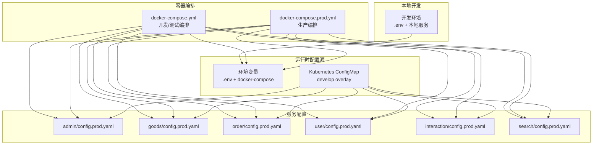
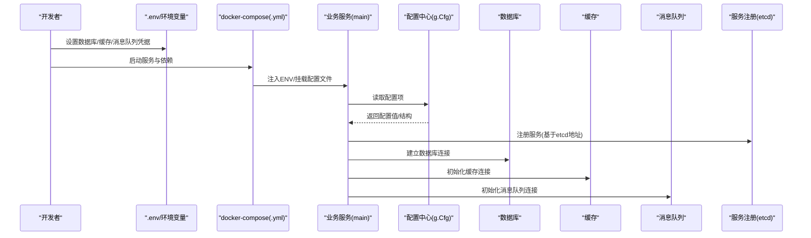
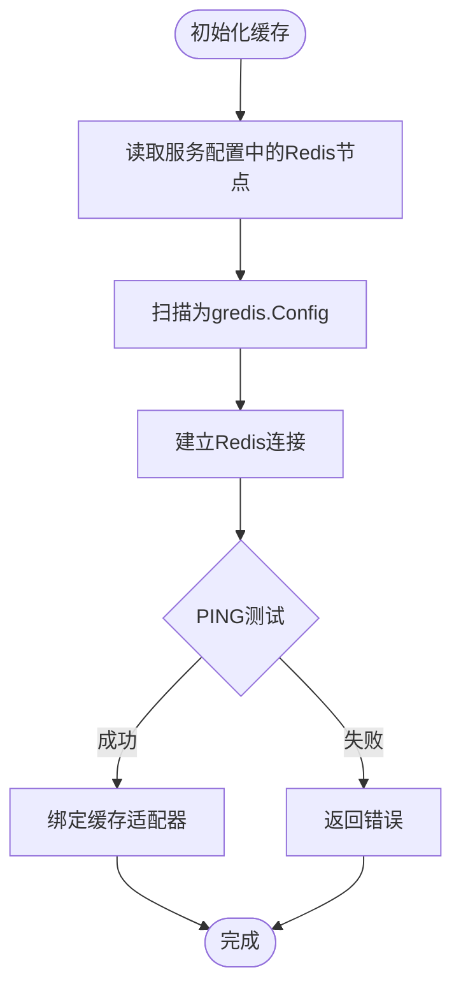
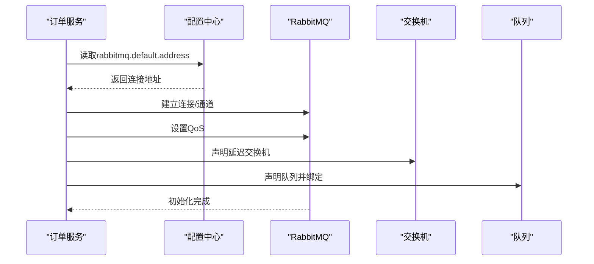
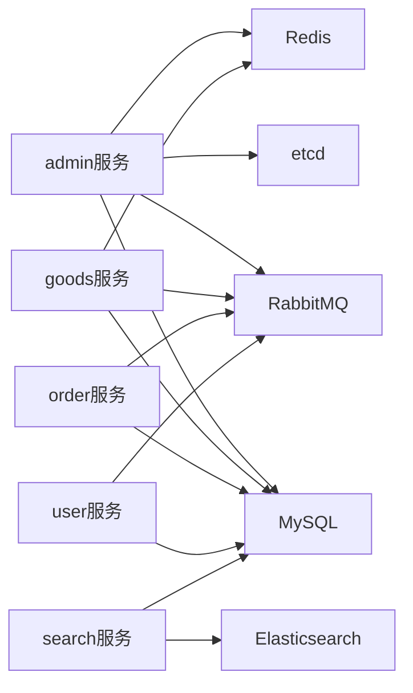

# 环境配置管理

<cite>
**本文引用的文件**
- [.env](file://.env)
- [docker-compose.yml](file://docker-compose.yml)
- [docker-compose.prod.yml](file://docker-compose.prod.yml)
- [app/admin/main.go](file://app/admin/main.go)
- [app/admin/manifest/config/config.prod.yaml](file://app/admin/manifest/config/config.prod.yaml)
- [app/admin/manifest/deploy/kustomize/overlays/develop/configmap.yaml](file://app/admin/manifest/deploy/kustomize/overlays/develop/configmap.yaml)
- [app/goods/manifest/config/config.prod.yaml](file://app/goods/manifest/config/config.prod.yaml)
- [app/order/manifest/config/config.prod.yaml](file://app/order/manifest/config/config.prod.yaml)
- [app/user/manifest/config/config.prod.yaml](file://app/user/manifest/config/config.prod.yaml)
- [app/interaction/manifest/config/config.prod.yaml](file://app/interaction/manifest/config/config.prod.yaml)
- [app/search/manifest/config/config.prod.yaml](file://app/search/manifest/config/config.prod.yaml)
- [app/goods/utility/goodsRedis/redis.go](file://app/goods/utility/goodsRedis/redis.go)
- [app/flash-sale/utility/redis.go](file://app/flash-sale/utility/redis.go)
- [app/order/utility/rabbitmq/client.go](file://app/order/utility/rabbitmq/client.go)
- [app/flash-sale/utility/rabbitmq.go](file://app/flash-sale/utility/rabbitmq.go)
- [app/gateway-resource/utility/qiniu.go](file://app/gateway-resource/utility/qiniu.go)
</cite>

## 目录
1. [引言](#引言)
2. [项目结构](#项目结构)
3. [核心组件](#核心组件)
4. [架构总览](#架构总览)
5. [详细组件分析](#详细组件分析)
6. [依赖关系分析](#依赖关系分析)
7. [性能考量](#性能考量)
8. [故障排查指南](#故障排查指南)
9. [结论](#结论)
10. [附录](#附录)

## 引言
本指南围绕微服务项目的环境配置管理展开，系统阐述开发、测试、生产三类环境的配置差异与管理策略；解释 .env 文件的使用与敏感信息安全管理；提供配置模板化与参数化的方案；覆盖数据库连接、缓存、消息队列、第三方服务集成的配置示例；并总结配置热更新、配置验证与配置审计的最佳实践。

## 项目结构
该项目采用多模块微服务架构，每个服务独立维护其配置文件，并通过容器编排在不同环境中加载不同的配置源（文件、环境变量、Kubernetes ConfigMap）。整体结构如下：

图表来源
- [docker-compose.yml](file://docker-compose.yml#L1-L355)
- [docker-compose.prod.yml](file://docker-compose.prod.yml#L1-L551)
- [app/admin/manifest/config/config.prod.yaml](file://app/admin/manifest/config/config.prod.yaml#L1-L22)
- [app/goods/manifest/config/config.prod.yaml](file://app/goods/manifest/config/config.prod.yaml#L1-L60)
- [app/order/manifest/config/config.prod.yaml](file://app/order/manifest/config/config.prod.yaml#L1-L86)
- [app/user/manifest/config/config.prod.yaml](file://app/user/manifest/config/config.prod.yaml#L1-L42)
- [app/interaction/manifest/config/config.prod.yaml](file://app/interaction/manifest/config/config.prod.yaml#L1-L22)
- [app/search/manifest/config/config.prod.yaml](file://app/search/manifest/config/config.prod.yaml#L1-L39)

章节来源
- [docker-compose.yml](file://docker-compose.yml#L1-L355)
- [docker-compose.prod.yml](file://docker-compose.prod.yml#L1-L551)

## 核心组件
- 配置源与加载机制
  - 环境变量：.env 文件与 docker-compose 中的环境变量注入，用于数据库、缓存、消息队列、对象存储等基础依赖。
  - 配置文件：各服务的 config.prod.yaml 提供服务级配置（gRPC 地址、日志、数据库连接、缓存、消息队列、第三方服务等）。
  - Kubernetes ConfigMap：开发环境的 overlay 使用 ConfigMap 注入通用配置片段。
- 运行时访问：服务通过 g.Cfg() 读取配置，按需扫描为具体结构体或直接取值。
- 依赖服务：MySQL、Redis、RabbitMQ、etcd、Elasticsearch 在 compose 中统一编排，服务通过内网域名访问。

章节来源
- [.env](file://.env#L1-L28)
- [app/admin/manifest/config/config.prod.yaml](file://app/admin/manifest/config/config.prod.yaml#L1-L22)
- [app/admin/manifest/deploy/kustomize/overlays/develop/configmap.yaml](file://app/admin/manifest/deploy/kustomize/overlays/develop/configmap.yaml#L1-L15)
- [app/admin/main.go](file://app/admin/main.go#L13-L24)

## 架构总览
下图展示服务如何在不同环境下加载配置并连接依赖：

图表来源
- [.env](file://.env#L1-L28)
- [docker-compose.yml](file://docker-compose.yml#L139-L152)
- [app/admin/main.go](file://app/admin/main.go#L13-L24)
- [app/admin/manifest/config/config.prod.yaml](file://app/admin/manifest/config/config.prod.yaml#L1-L22)

## 详细组件分析

### 开发环境配置差异与管理
- 开发环境
  - 使用 docker-compose.yml 启动服务与依赖，通过环境变量注入数据库、缓存、消息队列等配置。
  - 服务挂载各自 config 目录，便于本地修改配置后快速生效。
- 测试环境
  - 与开发类似，但可能通过 CI/CD 注入测试专用的环境变量或使用独立的 compose 文件。
- 生产环境
  - 使用 docker-compose.prod.yml，集中定义资源限制、健康检查、重启策略等生产级配置。
  - 服务通过只读挂载 config.prod.yaml 到 /app/config/config.yaml，确保配置与镜像解耦。

章节来源
- [docker-compose.yml](file://docker-compose.yml#L139-L152)
- [docker-compose.prod.yml](file://docker-compose.prod.yml#L198-L204)

### .env 文件与敏感信息安全管理
- .env 用于本地开发时注入数据库、缓存、消息队列、对象存储等基础配置。
- 敏感信息（如数据库密码、第三方密钥）应避免提交到版本控制，推荐：
  - 使用环境变量注入（compose 中的环境字段）。
  - 在生产中使用密钥管理服务或平台提供的 Secret 管理。
  - 对 .env 文件添加 .gitignore 规则，确保不被纳入版本控制。

章节来源
- [.env](file://.env#L1-L28)
- [docker-compose.yml](file://docker-compose.yml#L313-L314)

### 配置模板化与参数化方案
- 通用配置模板
  - 使用 compose 的 YAML 片段（anchors）定义通用环境变量与资源限制，减少重复。
  - 示例：mysql-env、rabbitmq-env、common-env 等片段复用。
- 服务级配置模板
  - 每个服务维护独立的 config.prod.yaml，包含：
    - gRPC/HTTP 服务地址与日志配置
    - 数据库连接串
    - 缓存、消息队列、第三方服务参数
  - 通过 ConfigMap 或挂载文件的方式注入到容器内固定路径。

章节来源
- [docker-compose.prod.yml](file://docker-compose.prod.yml#L1-L13)
- [app/goods/manifest/config/config.prod.yaml](file://app/goods/manifest/config/config.prod.yaml#L1-L60)
- [app/order/manifest/config/config.prod.yaml](file://app/order/manifest/config/config.prod.yaml#L1-L86)
- [app/user/manifest/config/config.prod.yaml](file://app/user/manifest/config/config.prod.yaml#L1-L42)
- [app/interaction/manifest/config/config.prod.yaml](file://app/interaction/manifest/config/config.prod.yaml#L1-L22)
- [app/search/manifest/config/config.prod.yaml](file://app/search/manifest/config/config.prod.yaml#L1-L39)

### 数据库连接配置
- 开发/测试
  - 通过 docker-compose.yml 暴露端口并挂载初始化脚本，服务以容器内域名访问数据库。
- 生产
  - 通过 docker-compose.prod.yml 挂载 config.prod.yaml 到 /app/config/config.yaml，服务按该路径读取配置。
- 配置要点
  - 连接串包含用户名、密码、主机、端口、数据库名。
  - 可开启调试模式（开发环境）或关闭（生产环境）。

章节来源
- [docker-compose.yml](file://docker-compose.yml#L5-L24)
- [docker-compose.prod.yml](file://docker-compose.prod.yml#L19-L26)
- [app/admin/manifest/config/config.prod.yaml](file://app/admin/manifest/config/config.prod.yaml#L15-L18)
- [app/goods/manifest/config/config.prod.yaml](file://app/goods/manifest/config/config.prod.yaml#L15-L18)
- [app/order/manifest/config/config.prod.yaml](file://app/order/manifest/config/config.prod.yaml#L15-L18)
- [app/user/manifest/config/config.prod.yaml](file://app/user/manifest/config/config.prod.yaml#L15-L18)
- [app/interaction/manifest/config/config.prod.yaml](file://app/interaction/manifest/config/config.prod.yaml#L15-L18)
- [app/search/manifest/config/config.prod.yaml](file://app/search/manifest/config/config.prod.yaml#L16-L20)

### 缓存设置（Redis）
- 商品服务
  - 通过 g.Cfg().Get(ctx, "redis.goods") 读取配置并扫描为 gredis.Config。
  - 初始化 gcache 并绑定 Redis 适配器，随后进行 PING 测试。
- 秒杀服务
  - 优先读取 redis.flash_sale，若不存在则回退到 redis.goods。
  - 逻辑与商品服务一致，均通过 gredis.New 建立连接并校验连通性。

图表来源
- [app/goods/utility/goodsRedis/redis.go](file://app/goods/utility/goodsRedis/redis.go#L14-L43)
- [app/flash-sale/utility/redis.go](file://app/flash-sale/utility/redis.go#L16-L50)

章节来源
- [app/goods/utility/goodsRedis/redis.go](file://app/goods/utility/goodsRedis/redis.go#L14-L43)
- [app/flash-sale/utility/redis.go](file://app/flash-sale/utility/redis.go#L16-L50)

### 消息队列配置（RabbitMQ）
- 订单服务
  - 通过 g.Cfg().MustGet(ctx, "rabbitmq.default.address") 获取连接地址。
  - 建立连接与通道，设置 QoS（预取数量），声明延迟交换机与队列并绑定。
  - 提供单例获取与连接状态检测，必要时重建连接。
- 秒杀服务
  - 通过 g.Cfg().MustGet(ctx, "rabbitmq").MapStrStr() 获取用户、密码、主机、端口等参数。
  - 手工声明交换机与队列并绑定，发布持久化消息。

图表来源
- [app/order/utility/rabbitmq/client.go](file://app/order/utility/rabbitmq/client.go#L54-L104)

章节来源
- [app/order/utility/rabbitmq/client.go](file://app/order/utility/rabbitmq/client.go#L54-L104)
- [app/flash-sale/utility/rabbitmq.go](file://app/flash-sale/utility/rabbitmq.go#L21-L55)

### 第三方服务集成（七牛云）
- 网关资源服务通过 g.Cfg().MustGet(ctx, "qiniu") 读取配置，包括 accessKey、secretKey、bucket、domain、expireTime 等。
- 使用 SDK 生成上传凭证并上传文件，支持私有空间签名 URL 生成。
- 建议将密钥通过环境变量注入（compose 中已体现），避免硬编码。

章节来源
- [app/gateway-resource/utility/qiniu.go](file://app/gateway-resource/utility/qiniu.go#L18-L79)
- [docker-compose.yml](file://docker-compose.yml#L313-L314)

### 服务注册与发现（etcd）
- 服务启动时通过 g.Cfg().Get(ctx, "etcd.address") 读取 etcd 地址，并注册 gRPC Resolver。
- 该机制使服务间可通过服务名进行调用，降低硬编码 IP/端口的风险。

章节来源
- [app/admin/main.go](file://app/admin/main.go#L13-L24)
- [app/admin/manifest/config/config.prod.yaml](file://app/admin/manifest/config/config.prod.yaml#L20-L22)

## 依赖关系分析
- 配置依赖
  - 服务启动依赖 etcd 地址进行服务发现。
  - 数据库、缓存、消息队列、搜索引擎等依赖通过各自的配置项提供。
- 运行时耦合
  - 服务通过 g.Cfg() 读取配置，耦合度低，便于在不同环境切换。
- 外部依赖
  - compose 统一编排 MySQL、Redis、RabbitMQ、etcd、Elasticsearch，服务以内网域名访问。

图表来源
- [docker-compose.yml](file://docker-compose.yml#L139-L152)
- [app/goods/manifest/config/config.prod.yaml](file://app/goods/manifest/config/config.prod.yaml#L23-L60)
- [app/order/manifest/config/config.prod.yaml](file://app/order/manifest/config/config.prod.yaml#L23-L48)
- [app/search/manifest/config/config.prod.yaml](file://app/search/manifest/config/config.prod.yaml#L24-L39)

章节来源
- [docker-compose.yml](file://docker-compose.yml#L139-L152)
- [app/goods/manifest/config/config.prod.yaml](file://app/goods/manifest/config/config.prod.yaml#L23-L60)
- [app/order/manifest/config/config.prod.yaml](file://app/order/manifest/config/config.prod.yaml#L23-L48)
- [app/search/manifest/config/config.prod.yaml](file://app/search/manifest/config/config.prod.yaml#L24-L39)

## 性能考量
- 资源限制与健康检查
  - 生产编排中对各服务设置了内存与 CPU 上限及健康检查，有助于稳定运行与弹性伸缩。
- 缓存与队列
  - Redis 连接池参数（最大活跃数、空闲数、连接超时）直接影响吞吐与延迟。
  - RabbitMQ QoS（预取数量）影响消费者并发与公平调度。
- 日志轮转
  - 配置文件中包含日志轮转大小与备份数量，避免磁盘占用过大。

章节来源
- [docker-compose.prod.yml](file://docker-compose.prod.yml#L88-L92)
- [app/goods/manifest/config/config.prod.yaml](file://app/goods/manifest/config/config.prod.yaml#L23-L32)
- [app/order/utility/rabbitmq/client.go](file://app/order/utility/rabbitmq/client.go#L76-L89)

## 故障排查指南
- 配置读取失败
  - 确认配置文件路径与键名正确，服务启动时会从 /app/config/config.yaml 加载。
  - 检查 compose 是否正确挂载配置目录。
- 连接异常
  - Redis：检查地址、端口、密码；通过 PING 测试连通性。
  - RabbitMQ：确认地址、用户、密码、虚拟主机；检查交换机与队列声明是否成功。
  - MySQL：核对连接串与网络连通性。
- 服务发现失败
  - 确认 etcd 地址可访问，Resolver 已注册。
- 第三方服务
  - 七牛云：核对 accessKey/secretKey/bucket/domain/expireTime；检查网络可达性。

章节来源
- [app/goods/utility/goodsRedis/redis.go](file://app/goods/utility/goodsRedis/redis.go#L14-L43)
- [app/order/utility/rabbitmq/client.go](file://app/order/utility/rabbitmq/client.go#L54-L104)
- [app/admin/main.go](file://app/admin/main.go#L13-L24)
- [app/gateway-resource/utility/qiniu.go](file://app/gateway-resource/utility/qiniu.go#L18-L79)

## 结论
本项目通过“环境变量 + 配置文件 + 编排”的组合实现了灵活的多环境配置管理。建议在团队内统一配置命名规范、参数化模板与密钥管理流程，持续完善配置验证与审计机制，以提升配置变更的可控性与安全性。

## 附录

### 环境配置清单（示例）
- 开发环境
  - .env：数据库、缓存、消息队列、对象存储等基础配置
  - docker-compose.yml：服务与依赖编排，挂载本地配置
- 测试环境
  - 与开发类似，通过 CI/CD 注入测试配置
- 生产环境
  - docker-compose.prod.yml：资源限制、健康检查、只读挂载 config.prod.yaml

章节来源
- [.env](file://.env#L1-L28)
- [docker-compose.yml](file://docker-compose.yml#L139-L152)
- [docker-compose.prod.yml](file://docker-compose.prod.yml#L198-L204)