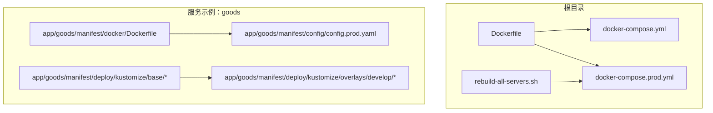
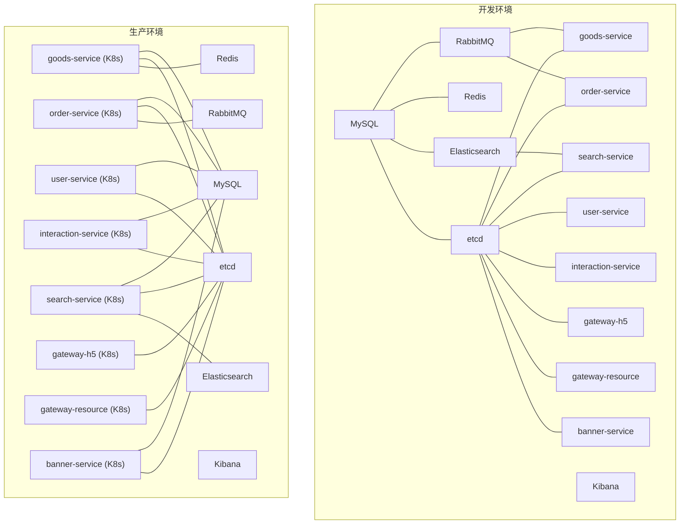
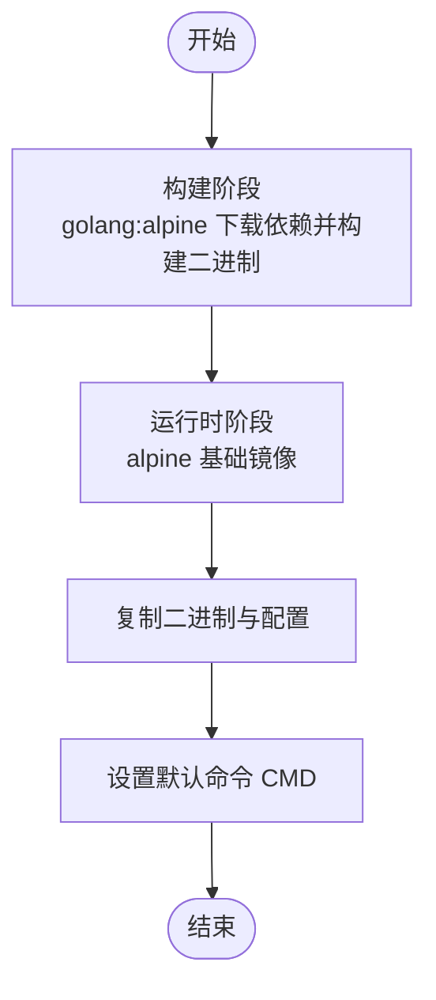
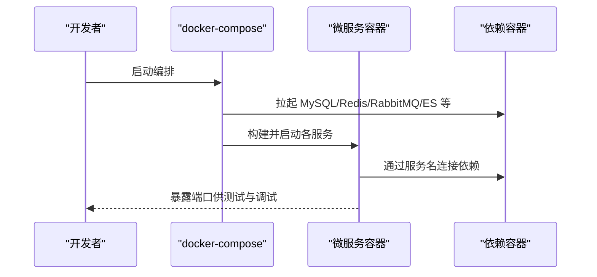
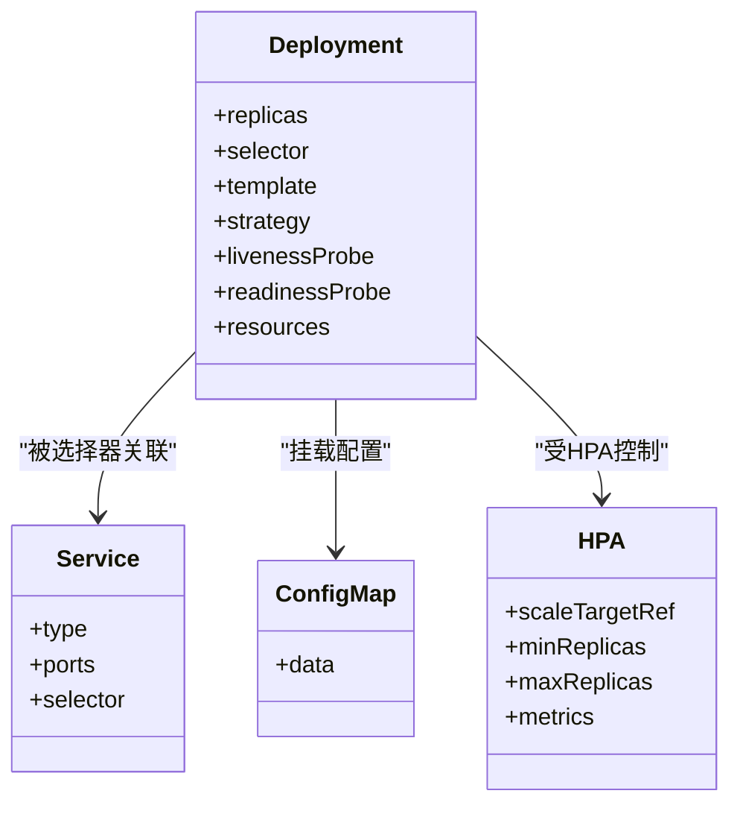
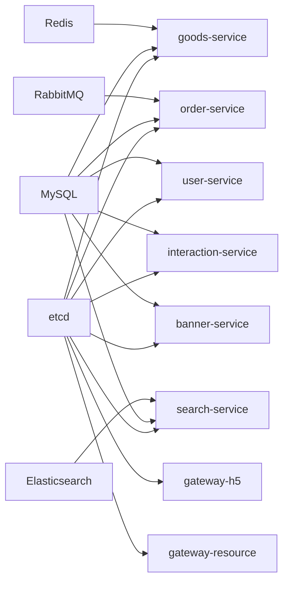

# 部署指南

<cite>
**本文引用的文件**
- [Dockerfile](file://Dockerfile)
- [docker-compose.yml](file://docker-compose.yml)
- [docker-compose.prod.yml](file://docker-compose.prod.yml)
- [Makefile](file://Makefile)
- [hack-cli.mk](file://hack/hack-cli.mk)
- [rebuild-all-servers.sh](file://rebuild-all-servers.sh)
- [app/goods/manifest/docker/Dockerfile](file://app/goods/manifest/docker/Dockerfile)
- [app/goods/manifest/config/config.prod.yaml](file://app/goods/manifest/config/config.prod.yaml)
- [app/goods/manifest/deploy/kustomize/base/kustomization.yaml](file://app/goods/manifest/deploy/kustomize/base/kustomization.yaml)
- [app/goods/manifest/deploy/kustomize/base/deployment.yaml](file://app/goods/manifest/deploy/kustomize/base/deployment.yaml)
- [app/goods/manifest/deploy/kustomize/base/service.yaml](file://app/goods/manifest/deploy/kustomize/base/service.yaml)
- [app/goods/manifest/deploy/kustomize/overlays/develop/kustomization.yaml](file://app/goods/manifest/deploy/kustomize/overlays/develop/kustomization.yaml)
- [app/goods/manifest/deploy/kustomize/overlays/develop/deployment.yaml](file://app/goods/manifest/deploy/kustomize/overlays/develop/deployment.yaml)
- [app/goods/manifest/deploy/kustomize/overlays/develop/configmap.yaml](file://app/goods/manifest/deploy/kustomize/overlays/develop/configmap.yaml)
</cite>

## 目录
1. [简介](#简介)
2. [项目结构](#项目结构)
3. [核心组件](#核心组件)
4. [架构总览](#架构总览)
5. [详细组件分析](#详细组件分析)
6. [依赖关系分析](#依赖关系分析)
7. [性能考量](#性能考量)
8. [故障排查指南](#故障排查指南)
9. [结论](#结论)
10. [附录](#附录)

## 简介
本指南面向生产与开发环境，提供基于 Docker 容器化与 Kustomize/Kubernetes 的微服务部署方案。内容涵盖：
- Dockerfile 编写与镜像构建最佳实践
- 多阶段构建与 Alpine 镜像优化
- Docker Compose 编排与生产级配置
- Kubernetes 部署策略、服务发现、负载均衡与滚动更新
- CI/CD 自动化与灰度发布思路
- 环境配置管理与故障恢复方案
- 部署脚本使用说明与自定义配置方法

## 项目结构
仓库采用“多服务单仓”的组织方式，每个业务服务（如 goods、order、user、gateway-* 等）均包含独立的 Dockerfile、配置与 Kustomize 清单。根目录提供统一的 Dockerfile 与 docker-compose 编排文件，便于一次性构建与运行。

图表来源
- [Dockerfile](file://Dockerfile#L1-L49)
- [docker-compose.yml](file://docker-compose.yml#L1-L355)
- [docker-compose.prod.yml](file://docker-compose.prod.yml#L1-L551)
- [rebuild-all-servers.sh](file://rebuild-all-servers.sh#L1-L129)
- [app/goods/manifest/docker/Dockerfile](file://app/goods/manifest/docker/Dockerfile#L1-L17)
- [app/goods/manifest/config/config.prod.yaml](file://app/goods/manifest/config/config.prod.yaml#L1-L60)
- [app/goods/manifest/deploy/kustomize/base/kustomization.yaml](file://app/goods/manifest/deploy/kustomize/base/kustomization.yaml#L1-L11)

章节来源
- [Dockerfile](file://Dockerfile#L1-L49)
- [docker-compose.yml](file://docker-compose.yml#L1-L355)
- [docker-compose.prod.yml](file://docker-compose.prod.yml#L1-L551)
- [rebuild-all-servers.sh](file://rebuild-all-servers.sh#L1-L129)

## 核心组件
- 统一 Dockerfile：多阶段构建，先在 golang:alpine 下下载依赖并构建所有服务二进制，再拷贝至 alpine 运行时，最终 CMD 指向 admin 服务。
- 服务独立 Dockerfile：以精简基础镜像加载二进制与资源，适合按服务单独构建与发布。
- Docker Compose 开发/生产编排：定义数据库、缓存、消息队列、搜索引擎与各微服务容器，含健康检查、资源限制与网络隔离。
- Kustomize 清单：为每个服务提供 base 与 overlay，支持通过 ConfigMap 注入配置、HPA 自动扩缩容、探针与滚动更新策略。

章节来源
- [Dockerfile](file://Dockerfile#L1-L49)
- [app/goods/manifest/docker/Dockerfile](file://app/goods/manifest/docker/Dockerfile#L1-L17)
- [docker-compose.yml](file://docker-compose.yml#L1-L355)
- [docker-compose.prod.yml](file://docker-compose.prod.yml#L1-L551)
- [app/goods/manifest/deploy/kustomize/base/kustomization.yaml](file://app/goods/manifest/deploy/kustomize/base/kustomization.yaml#L1-L11)

## 架构总览
下图展示开发与生产环境的容器编排与服务交互关系，以及 K8s 中的部署与服务暴露方式。

图表来源
- [docker-compose.yml](file://docker-compose.yml#L1-L355)
- [docker-compose.prod.yml](file://docker-compose.prod.yml#L1-L551)
- [app/goods/manifest/deploy/kustomize/base/deployment.yaml](file://app/goods/manifest/deploy/kustomize/base/deployment.yaml#L1-L60)
- [app/goods/manifest/deploy/kustomize/base/service.yaml](file://app/goods/manifest/deploy/kustomize/base/service.yaml#L1-L17)

## 详细组件分析

### Dockerfile 编写与镜像构建
- 多阶段构建：第一阶段使用 golang:alpine 下载依赖并构建所有服务二进制；第二阶段使用 alpine，仅拷贝二进制与配置，减小镜像体积。
- 运行时优化：安装证书与时区数据，设置工作目录与默认 CMD。
- 服务独立 Dockerfile：示例 goods 服务采用轻量基础镜像加载二进制，适合按服务独立构建与发布。

图表来源
- [Dockerfile](file://Dockerfile#L1-L49)
- [app/goods/manifest/docker/Dockerfile](file://app/goods/manifest/docker/Dockerfile#L1-L17)

章节来源
- [Dockerfile](file://Dockerfile#L1-L49)
- [app/goods/manifest/docker/Dockerfile](file://app/goods/manifest/docker/Dockerfile#L1-L17)

### Docker Compose 编排（开发与生产）
- 开发环境：定义 MySQL、etcd、Redis、RabbitMQ、Elasticsearch、Kibana 与各微服务容器，映射端口，挂载日志与配置卷，设置健康检查与重启策略。
- 生产环境：拆分各服务独立 Dockerfile，统一注入生产配置文件，启用健康检查与资源限制，使用网络隔离与只读挂载，增加备份容器。

图表来源
- [docker-compose.yml](file://docker-compose.yml#L1-L355)
- [docker-compose.prod.yml](file://docker-compose.prod.yml#L1-L551)

章节来源
- [docker-compose.yml](file://docker-compose.yml#L1-L355)
- [docker-compose.prod.yml](file://docker-compose.prod.yml#L1-L551)

### Kubernetes 部署（Kustomize）
- Base 清单：定义 Deployment、Service、ConfigMap 与 HPA，设置探针、资源请求/限制、镜像拉取密钥与配置挂载。
- Overlay：以 develop 为例，覆盖 base 并注入开发态配置与部署补丁。
- 服务发现与负载均衡：Service ClusterIP 对内暴露，配合探针保障流量只进入健康实例。
- 滚动更新：通过 Deployment 的滚动更新策略（如 MaxUnavailable/MaxSurge）实现平滑升级。

图表来源
- [app/goods/manifest/deploy/kustomize/base/deployment.yaml](file://app/goods/manifest/deploy/kustomize/base/deployment.yaml#L1-L60)
- [app/goods/manifest/deploy/kustomize/base/service.yaml](file://app/goods/manifest/deploy/kustomize/base/service.yaml#L1-L17)
- [app/goods/manifest/deploy/kustomize/base/kustomization.yaml](file://app/goods/manifest/deploy/kustomize/base/kustomization.yaml#L1-L11)
- [app/goods/manifest/deploy/kustomize/overlays/develop/kustomization.yaml](file://app/goods/manifest/deploy/kustomize/overlays/develop/kustomization.yaml#L1-L15)

章节来源
- [app/goods/manifest/deploy/kustomize/base/deployment.yaml](file://app/goods/manifest/deploy/kustomize/base/deployment.yaml#L1-L60)
- [app/goods/manifest/deploy/kustomize/base/service.yaml](file://app/goods/manifest/deploy/kustomize/base/service.yaml#L1-L17)
- [app/goods/manifest/deploy/kustomize/base/kustomization.yaml](file://app/goods/manifest/deploy/kustomize/base/kustomization.yaml#L1-L11)
- [app/goods/manifest/deploy/kustomize/overlays/develop/kustomization.yaml](file://app/goods/manifest/deploy/kustomize/overlays/develop/kustomization.yaml#L1-L15)
- [app/goods/manifest/deploy/kustomize/overlays/develop/deployment.yaml](file://app/goods/manifest/deploy/kustomize/overlays/develop/deployment.yaml#L1-L10)
- [app/goods/manifest/deploy/kustomize/overlays/develop/configmap.yaml](file://app/goods/manifest/deploy/kustomize/overlays/develop/configmap.yaml#L1-L15)

### 环境配置管理
- 生产配置：各服务通过挂载 config.prod.yaml 提供数据库、缓存、消息队列与 etcd 地址等参数。
- K8s ConfigMap：通过 Kustomize 将配置注入容器，避免硬编码与镜像重建。
- 环境变量：统一设置 ENV、TZ 等，确保日志与时区一致性。

章节来源
- [app/goods/manifest/config/config.prod.yaml](file://app/goods/manifest/config/config.prod.yaml#L1-L60)
- [docker-compose.prod.yml](file://docker-compose.prod.yml#L192-L463)
- [app/goods/manifest/deploy/kustomize/base/deployment.yaml](file://app/goods/manifest/deploy/kustomize/base/deployment.yaml#L30-L34)

### CI/CD 自动化与灰度发布
- 自动化构建：使用 docker-compose build 与 docker compose up -d 实现一键构建与启动。
- 回滚与健康检查：生产环境启用健康检查与重启策略，结合日志与探针快速定位异常。
- 灰度发布建议：在 K8s 中通过多版本 Deployment 与金丝雀策略，结合探针与 HPA 控制流量与扩缩容。

章节来源
- [rebuild-all-servers.sh](file://rebuild-all-servers.sh#L1-L129)
- [docker-compose.prod.yml](file://docker-compose.prod.yml#L36-L66)
- [app/goods/manifest/deploy/kustomize/base/deployment.yaml](file://app/goods/manifest/deploy/kustomize/base/deployment.yaml#L35-L44)

## 依赖关系分析
- 服务间依赖：goods 依赖 etcd、MySQL、Redis；order 依赖 etcd、MySQL、RabbitMQ；search 依赖 etcd、MySQL、Elasticsearch；gateway-* 依赖 etcd。
- 外部依赖：MySQL、Redis、RabbitMQ、etcd、Elasticsearch、Kibana 在开发与生产环境中均作为独立容器/服务运行。
- 配置依赖：各服务通过挂载配置文件或 ConfigMap 注入运行时参数。

图表来源
- [docker-compose.yml](file://docker-compose.yml#L134-L344)
- [docker-compose.prod.yml](file://docker-compose.prod.yml#L191-L463)

章节来源
- [docker-compose.yml](file://docker-compose.yml#L134-L344)
- [docker-compose.prod.yml](file://docker-compose.prod.yml#L191-L463)

## 性能考量
- 镜像体积：多阶段构建与 Alpine 基础镜像显著降低运行时镜像大小，缩短拉取与启动时间。
- 资源限制：生产编排中为各服务设置 CPU/内存上限与保留值，避免资源争抢。
- 探针与健康检查：TCP Socket 探针与健康检查减少不健康流量进入，提升整体稳定性。
- 存储与持久化：对 MySQL、Redis、RabbitMQ、ES 等关键数据使用命名卷，确保数据持久化与备份。

章节来源
- [Dockerfile](file://Dockerfile#L33-L49)
- [docker-compose.prod.yml](file://docker-compose.prod.yml#L37-L43)
- [app/goods/manifest/deploy/kustomize/base/deployment.yaml](file://app/goods/manifest/deploy/kustomize/base/deployment.yaml#L23-L29)

## 故障排查指南
- 健康检查失败：查看容器日志与探针输出，确认端口、服务名解析与依赖可用性。
- 配置错误：核对挂载路径与配置项，确保 ENV、TZ、数据库链接字符串正确。
- 网络连通：使用容器内 curl/nc/wget 验证依赖服务可达性。
- 备份与回滚：生产环境提供定时备份容器，异常时可回滚到最近备份。
- 日志与可观测性：结合 Kibana/Elasticsearch 与服务日志定位问题。

章节来源
- [docker-compose.yml](file://docker-compose.yml#L19-L23)
- [docker-compose.prod.yml](file://docker-compose.prod.yml#L117-L121)
- [app/goods/manifest/deploy/kustomize/base/deployment.yaml](file://app/goods/manifest/deploy/kustomize/base/deployment.yaml#L35-L44)
- [rebuild-all-servers.sh](file://rebuild-all-servers.sh#L74-L91)

## 结论
本指南提供了从单机开发到生产级容器化与 K8s 编排的完整路径。通过多阶段构建、独立服务镜像、健康检查与资源限制，结合 Kustomize 的配置注入与滚动更新策略，可在保证稳定性的同时实现快速迭代与弹性伸缩。

## 附录

### 部署脚本使用说明
- 一键重建与启动：执行脚本会停止服务、清理镜像、并行构建、启动服务，并输出服务状态与访问地址。
- 常用命令：查看日志、重启服务、停止服务、查看状态等。

章节来源
- [rebuild-all-servers.sh](file://rebuild-all-servers.sh#L1-L129)

### 自定义配置方法
- Docker Compose：通过 volumes 挂载本地配置文件覆盖容器内配置；设置环境变量如 TZ、ENV。
- K8s：通过 Kustomize 的 ConfigMap 与 overlay 注入配置，必要时在 overlay 中覆盖 Deployment 以调整镜像或探针。
- 生产配置：使用 config.prod.yaml 提供数据库、缓存、消息队列与 etcd 地址等关键参数。

章节来源
- [docker-compose.prod.yml](file://docker-compose.prod.yml#L202-L204)
- [app/goods/manifest/config/config.prod.yaml](file://app/goods/manifest/config/config.prod.yaml#L1-L60)
- [app/goods/manifest/deploy/kustomize/overlays/develop/configmap.yaml](file://app/goods/manifest/deploy/kustomize/overlays/develop/configmap.yaml#L1-L15)