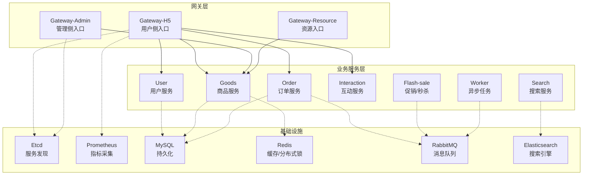
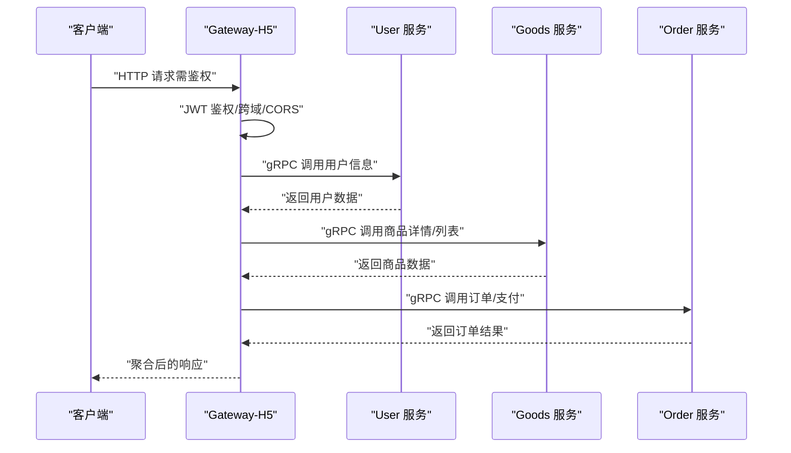
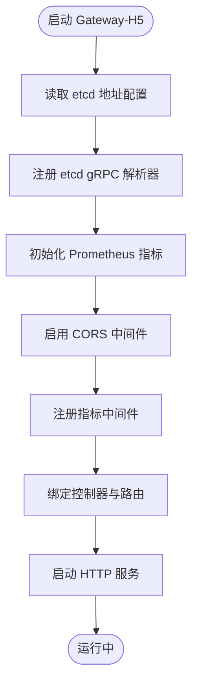
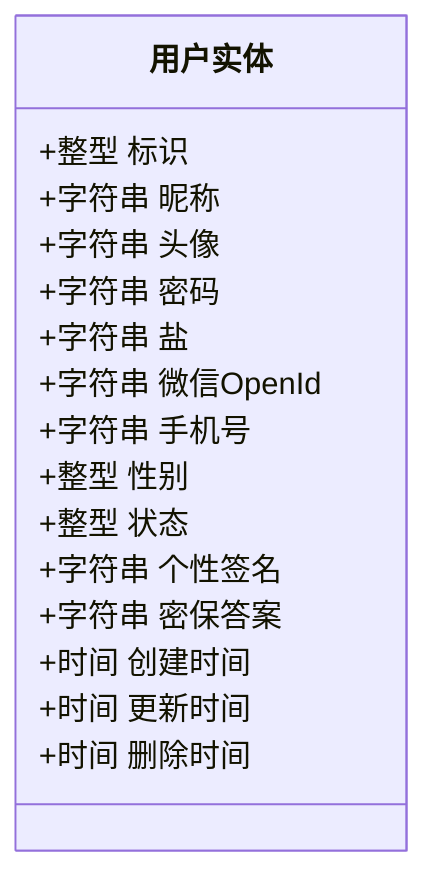
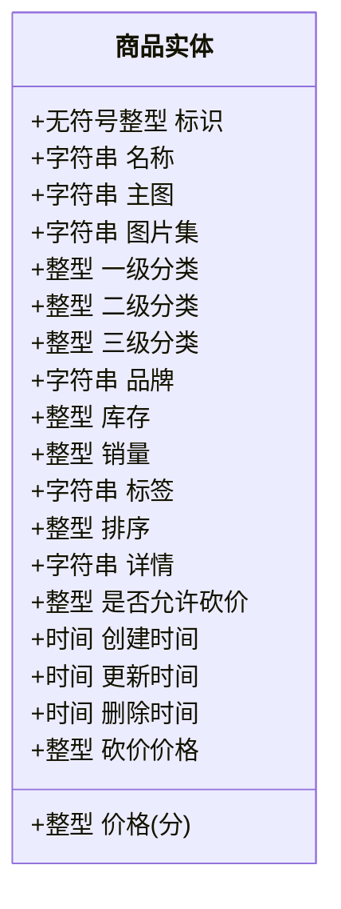
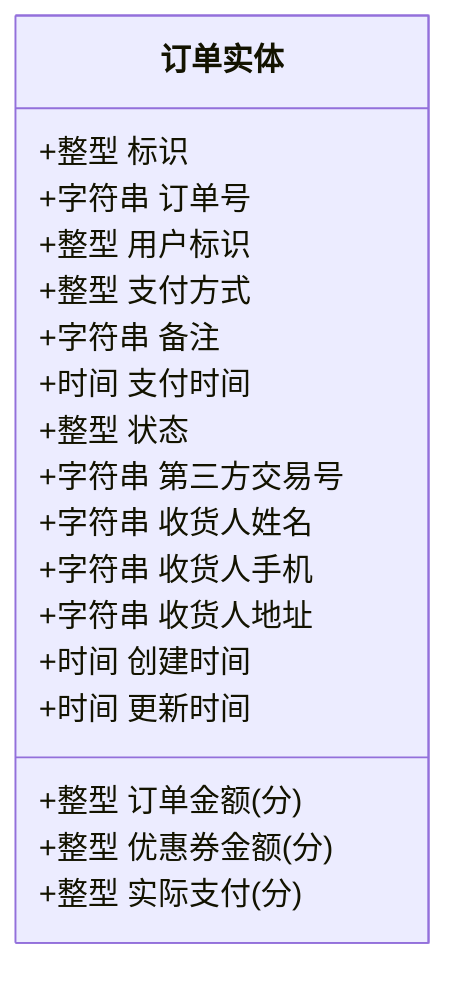
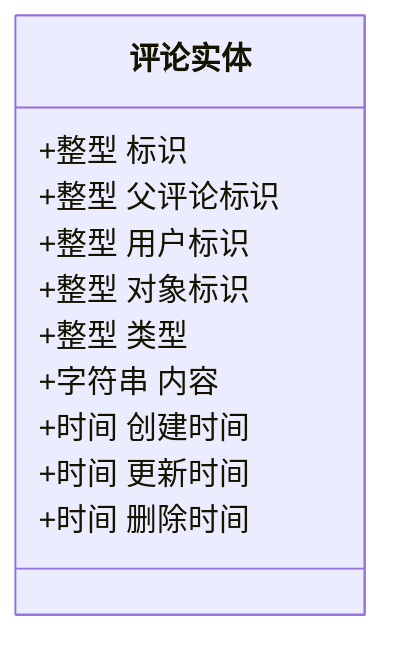
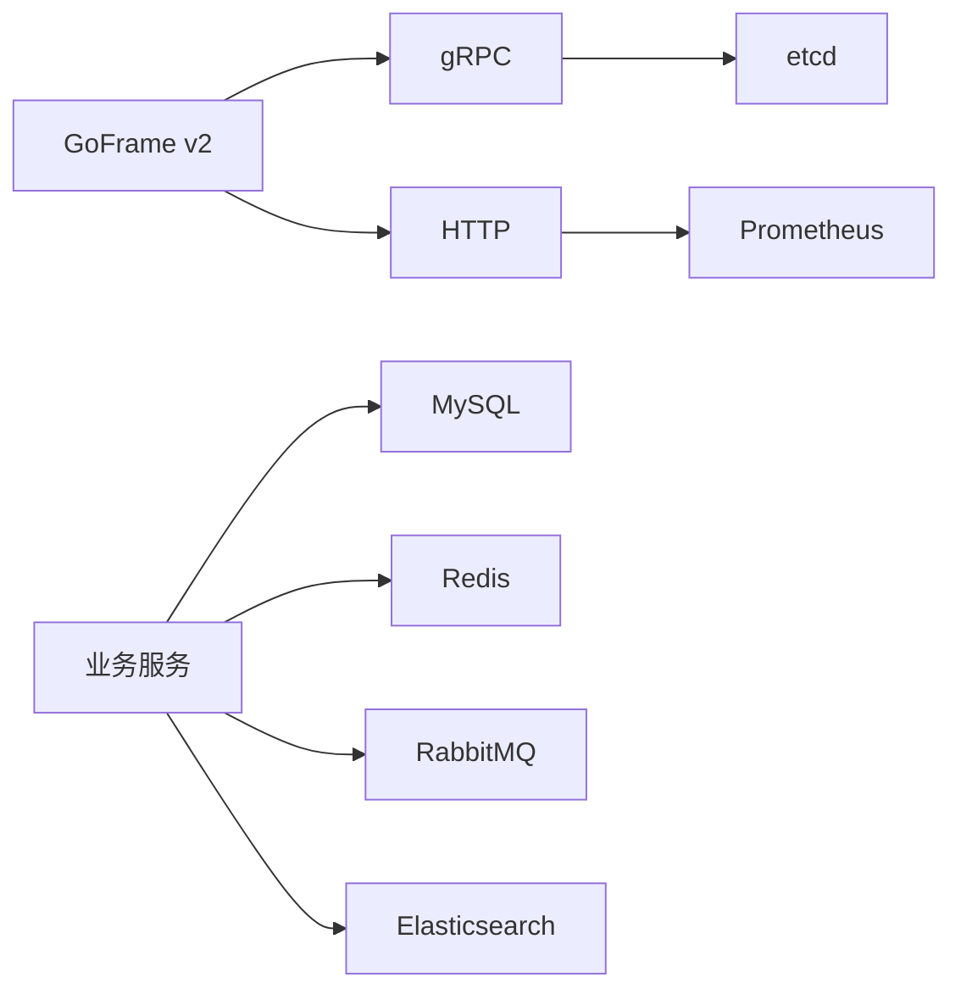

# 项目概述

<cite>
**本文引用的文件**
- [README.MD](file://README.MD)
- [go.mod](file://go.mod)
- [app/gateway-h5/main.go](file://app/gateway-h5/main.go)
- [app/gateway-admin/main.go](file://app/gateway-admin/main.go)
- [app/user/main.go](file://app/user/main.go)
- [app/goods/main.go](file://app/goods/main.go)
- [app/order/main.go](file://app/order/main.go)
- [app/interaction/main.go](file://app/interaction/main.go)
- [app/gateway-h5/internal/cmd/cmd.go](file://app/gateway-h5/internal/cmd/cmd.go)
- [utility/middleware/middleware.go](file://utility/middleware/middleware.go)
- [utility/metrics/metrics.go](file://utility/metrics/metrics.go)
- [app/gateway-h5/manifest/config/config.prod.yaml](file://app/gateway-h5/manifest/config/config.prod.yaml)
- [app/user/internal/model/entity/user_info.go](file://app/user/internal/model/entity/user_info.go)
- [app/goods/internal/model/entity/goods_info.go](file://app/goods/internal/model/entity/goods_info.go)
- [app/order/internal/model/entity/order_info.go](file://app/order/internal/model/entity/order_info.go)
- [app/interaction/internal/model/entity/comment_info.go](file://app/interaction/internal/model/entity/comment_info.go)
</cite>

## 目录
1. [引言](#引言)
2. [项目结构](#项目结构)
3. [核心组件](#核心组件)
4. [架构总览](#架构总览)
5. [详细组件分析](#详细组件分析)
6. [依赖分析](#依赖分析)
7. [性能考虑](#性能考虑)
8. [故障排查指南](#故障排查指南)
9. [结论](#结论)
10. [附录](#附录)

## 引言
本项目是一个基于 GoFrame 的微服务电商系统，采用多网关与多业务服务分离的设计理念，围绕“用户侧网关（Gateway-H5）、管理侧网关（Gateway-Admin）、资源网关（Gateway-Resource）”与“用户服务、商品服务、订单服务、交互服务、搜索服务、促销/秒杀服务、工作流服务（Worker）”等模块协同工作，形成前后端分离、服务自治、可观测与可扩展的电商中台能力。

项目目标：
- 提供清晰的服务边界与职责划分，便于团队并行开发与独立演进
- 通过网关统一接入、鉴权与限流，保障入口安全与稳定性
- 基于 gRPC/HTTP 混合协议与 etcd 服务发现，实现服务间通信与治理
- 以 Prometheus 指标与日志体系支撑可观测性，结合中间件与工具层提升可靠性

## 项目结构
项目采用按“应用域”划分的多模块组织方式，每个子模块包含独立的 main 入口、内部命令与配置，便于容器化与独立部署。

- 网关层
  - Gateway-H5：面向移动端/前端的统一入口，聚合用户、商品、订单、交互等能力
  - Gateway-Admin：面向后台管理的入口，提供商品管理、数据分析等能力
  - Gateway-Resource：文件上传与资源管理入口
- 业务服务层
  - User：用户中心，含用户信息、收货地址、优惠券等
  - Goods：商品中心，含类目、图片、推荐、购物车、砍价等
  - Order：订单中心，含订单、退款、支付回调等
  - Interaction：互动中心，含点赞、评论、收藏等
  - Search：搜索与同步，含 ES、Binlog 同步
  - Flash-sale：促销/秒杀，含库存、防刷、MQ 消费
  - Worker：异步任务与 MQ 消费者
- 工具与基础设施
  - 中间件：CORS、JWT、gRPC 超时拦截
  - 指标：Prometheus 指标采集与暴露
  - 配置：各服务独立配置，支持 etcd 服务发现

图表来源
- [app/gateway-h5/main.go](file://app/gateway-h5/main.go#L1-L38)
- [app/gateway-admin/main.go](file://app/gateway-admin/main.go#L1-L30)
- [app/user/main.go](file://app/user/main.go#L1-L25)
- [app/goods/main.go](file://app/goods/main.go#L1-L35)
- [app/order/main.go](file://app/order/main.go#L1-L23)
- [app/interaction/main.go](file://app/interaction/main.go#L1-L26)

章节来源
- [README.MD](file://README.MD#L1-L41)
- [go.mod](file://go.mod#L1-L107)

## 核心组件
- 网关服务
  - Gateway-H5：提供用户注册/登录、购物车、订单、支付、退款、互动、商品浏览等接口；内置 JWT 鉴权与 CORS 支持；集成 Prometheus 指标暴露
  - Gateway-Admin：提供管理端商品管理、数据统计等接口；统一跨域配置
  - Gateway-Resource：提供文件上传与资源管理接口
- 业务服务
  - User：用户信息、收货地址、优惠券等
  - Goods：商品信息、类目、图片、推荐、购物车、砍价、库存与缓存策略
  - Order：订单生命周期、退款、支付回调、超时处理
  - Interaction：点赞、评论、收藏等互动能力
  - Search：商品搜索、ES 同步、Binlog 订阅
  - Flash-sale：促销活动、库存扣减、防刷与 MQ 消费
  - Worker：MQ 消费者与异步任务调度
- 基础设施与工具
  - etcd 服务发现：所有服务通过 etcd 解析 gRPC 地址
  - 中间件：CORS、JWT、gRPC 超时拦截
  - 指标：HTTP 请求总量、延迟、错误计数，统一暴露 /metrics

章节来源
- [app/gateway-h5/internal/cmd/cmd.go](file://app/gateway-h5/internal/cmd/cmd.go#L17-L98)
- [utility/middleware/middleware.go](file://utility/middleware/middleware.go#L10-L34)
- [utility/metrics/metrics.go](file://utility/metrics/metrics.go#L14-L71)
- [app/gateway-h5/manifest/config/config.prod.yaml](file://app/gateway-h5/manifest/config/config.prod.yaml#L1-L18)

## 架构总览
系统采用“网关 + 微服务”的分层架构：
- 入口层：两个网关分别承载用户端与管理端流量，统一鉴权、限流与指标采集
- 服务层：按领域拆分用户、商品、订单、互动等服务，各自维护数据模型与业务逻辑
- 通信层：服务间通过 gRPC/HTTP 混合协议通信，结合 etcd 进行服务发现
- 存储层：MySQL 负责结构化数据，Redis 负责缓存与分布式锁，Elasticsearch 负责搜索，RabbitMQ 负责异步解耦
- 观测层：Prometheus 指标、日志与链路追踪贯穿全链路

图表来源
- [app/gateway-h5/main.go](file://app/gateway-h5/main.go#L13-L37)
- [app/gateway-h5/internal/cmd/cmd.go](file://app/gateway-h5/internal/cmd/cmd.go#L22-L90)
- [utility/middleware/middleware.go](file://utility/middleware/middleware.go#L10-L34)
- [utility/metrics/metrics.go](file://utility/metrics/metrics.go#L45-L71)

## 详细组件分析

### 网关组件（Gateway-H5）
- 职责
  - 统一对外 HTTP 入口，聚合用户、商品、订单、互动等能力
  - 分组路由：无需鉴权与需要 JWT 鉴权两类接口
  - 中间件：CORS、Prometheus 指标、错误指标、gRPC 超时控制
- 关键行为
  - 注册控制器实例并绑定路由
  - 通过 etcd 注册 gRPC 解析器，实现服务发现
  - 暴露 /metrics 端点用于监控

图表来源
- [app/gateway-h5/main.go](file://app/gateway-h5/main.go#L13-L37)
- [app/gateway-h5/internal/cmd/cmd.go](file://app/gateway-h5/internal/cmd/cmd.go#L22-L90)
- [utility/metrics/metrics.go](file://utility/metrics/metrics.go#L45-L71)

章节来源
- [app/gateway-h5/main.go](file://app/gateway-h5/main.go#L1-L38)
- [app/gateway-h5/internal/cmd/cmd.go](file://app/gateway-h5/internal/cmd/cmd.go#L17-L98)
- [utility/middleware/middleware.go](file://utility/middleware/middleware.go#L10-L34)
- [utility/metrics/metrics.go](file://utility/metrics/metrics.go#L14-L71)
- [app/gateway-h5/manifest/config/config.prod.yaml](file://app/gateway-h5/manifest/config/config.prod.yaml#L1-L18)

### 网关组件（Gateway-Admin）
- 职责
  - 管理端统一入口，提供商品管理、数据分析等能力
  - 集成 etcd 服务发现与 CORS 支持
- 关键行为
  - 通过 etcd 注册 gRPC 解析器
  - 统一跨域配置

章节来源
- [app/gateway-admin/main.go](file://app/gateway-admin/main.go#L1-L30)

### 用户服务（User）
- 职责
  - 用户注册/登录、密码修改、个人信息管理
  - 收货地址管理、优惠券发放与核销
- 数据模型
  - 用户实体包含基础字段、加密盐、微信 OpenId、状态等

图表来源
- [app/user/internal/model/entity/user_info.go](file://app/user/internal/model/entity/user_info.go#L11-L27)

章节来源
- [app/user/main.go](file://app/user/main.go#L1-L25)
- [app/user/internal/model/entity/user_info.go](file://app/user/internal/model/entity/user_info.go#L11-L27)

### 商品服务（Goods）
- 职责
  - 商品信息、类目、图片、推荐、购物车、砍价
  - 库存管理、缓存策略、分布式锁
- 数据模型
  - 商品实体包含名称、主图、价格、分类、品牌、库存、销量、标签、详情、是否允许砍价等

图表来源
- [app/goods/internal/model/entity/goods_info.go](file://app/goods/internal/model/entity/goods_info.go#L11-L32)

章节来源
- [app/goods/main.go](file://app/goods/main.go#L1-L35)
- [app/goods/internal/model/entity/goods_info.go](file://app/goods/internal/model/entity/goods_info.go#L11-L32)

### 订单服务（Order）
- 职责
  - 订单生命周期管理、退款处理、支付回调
  - 超时订单处理、与支付渠道对接
- 数据模型
  - 订单实体包含订单号、用户、支付方式、支付时间、状态、收货人信息、价格与优惠金额等

图表来源
- [app/order/internal/model/entity/order_info.go](file://app/order/internal/model/entity/order_info.go#L11-L29)

章节来源
- [app/order/main.go](file://app/order/main.go#L1-L23)
- [app/order/internal/model/entity/order_info.go](file://app/order/internal/model/entity/order_info.go#L11-L29)

### 互动服务（Interaction）
- 职责
  - 点赞、评论、收藏等互动能力
- 数据模型
  - 评论实体包含父评论、用户、对象、类型、内容等

图表来源
- [app/interaction/internal/model/entity/comment_info.go](file://app/interaction/internal/model/entity/comment_info.go#L11-L21)

章节来源
- [app/interaction/main.go](file://app/interaction/main.go#L1-L26)
- [app/interaction/internal/model/entity/comment_info.go](file://app/interaction/internal/model/entity/comment_info.go#L11-L21)

### 搜索服务（Search）
- 职责
  - 商品搜索、ES 同步、Binlog 订阅
- 关键点
  - 与 MySQL Binlog 集成，增量同步至 ES
  - 提供搜索接口与同步接口

章节来源
- [app/search/README.MD](file://app/search/README.MD)

### 促销/秒杀服务（Flash-sale）
- 职责
  - 促销活动、库存扣减、防刷策略、MQ 消费
- 关键点
  - Redis Lua 与分布式锁保证库存一致性
  - MQ 幂等消费与延迟队列处理订单超时

章节来源
- [app/flash-sale/README.MD](file://app/flash-sale/README.MD)

### 工作流服务（Worker）
- 职责
  - MQ 消费者与异步任务调度
- 关键点
  - 与 RabbitMQ 客户端集成，统一消费者管理

章节来源
- [app/worker/README.MD](file://app/worker/README.MD)

## 依赖分析
- 技术栈
  - 核心框架：GoFrame v2
  - 通信：gRPC、HTTP
  - 服务发现：etcd
  - 缓存：Redis
  - 搜索：Elasticsearch
  - 消息：RabbitMQ
  - 指标：Prometheus
  - 支付：微信支付 SDK
- 服务间耦合
  - 网关通过 etcd 发现服务，避免硬编码地址
  - 业务服务之间通过 gRPC/HTTP 调用，尽量保持低耦合
  - 异步解耦通过 MQ 实现，降低同步调用带来的延迟放大

图表来源
- [go.mod](file://go.mod#L5-L22)

章节来源
- [go.mod](file://go.mod#L1-L107)

## 性能考虑
- 服务发现与负载均衡
  - 通过 etcd 与 gRPC 解析器实现动态服务发现，配合客户端超时与重试策略
- 缓存与热点
  - 商品服务使用 Redis 缓存热点数据，Lua 与分布式锁保证高并发一致性
- 指标与可观测
  - 统一暴露 /metrics，记录请求量、延迟与错误，辅助容量规划与问题定位
- 异步化
  - 订单超时、退款、库存回滚等通过 MQ 异步处理，降低同步调用开销

## 故障排查指南
- 网关无法访问服务
  - 检查 etcd 地址配置与连通性
  - 确认服务是否在 etcd 中注册
- 跨域问题
  - 确认 CORS 中间件已启用且放行必要头部与方法
- 指标未显示
  - 确认 /metrics 路由已注册，Prometheus 抓取配置正确
- gRPC 调用超时
  - 检查 gRPC 超时拦截器配置与下游服务处理耗时
- 订单超时/库存不一致
  - 检查 MQ 消费幂等与死信队列配置
  - 核对 Redis Lua 与分布式锁使用是否正确

章节来源
- [utility/middleware/middleware.go](file://utility/middleware/middleware.go#L10-L34)
- [utility/metrics/metrics.go](file://utility/metrics/metrics.go#L45-L71)
- [app/gateway-h5/manifest/config/config.prod.yaml](file://app/gateway-h5/manifest/config/config.prod.yaml#L16-L17)

## 结论
本项目以 GoFrame 为基础，构建了清晰的微服务电商架构：网关统一接入、服务按域拆分、基础设施完善、可观测性健全。通过 etcd 服务发现、gRPC/HTTP 混合通信、Redis/ES/MQ 等中间件，满足高并发、可扩展与易运维的需求。建议在后续迭代中持续完善链路追踪、限流熔断与灰度发布能力，进一步提升系统的韧性与交付效率。

## 附录
- 启动指引
  - 进入各服务目录，执行服务入口启动命令
  - 网关层与业务层均支持独立启动与容器化部署
- 配置参考
  - 各服务独立配置文件，包含服务地址、日志、etcd 地址等

章节来源
- [README.MD](file://README.MD#L36-L41)