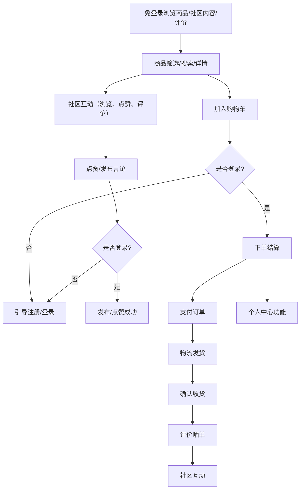
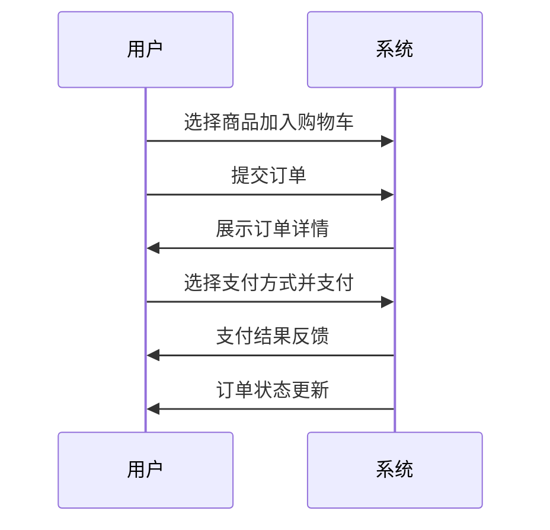
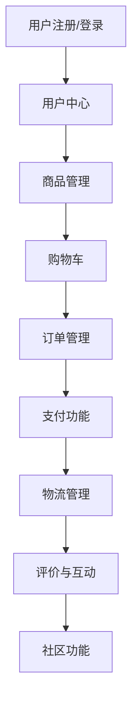

# Mobile WEB 电商系统需求文档

## 一、项目背景

本项目旨在开发一套面向移动端的电商系统，融合传统电商与社区互动功能，提升用户购物体验与平台粘性。系统支持多终端访问，满足用户购物、互动、分享等多元化需求。

## 二、系统整体流程

> **说明：**
>
> - 用户可直接浏览商品、社区内容、评价，无需登录。
> - 只有在“加入购物车”、“下单结算”、“点赞/发布言论”、“访问个人中心”等操作时，才会引导用户注册/登录。
> - 登录后自动回到原操作页面，减少中断，提升转化率。

## 三、主要功能模块

### 1. 用户注册/登录

- 支持邮箱、手机号、第三方登录（微信、QQ、Google 等）。
- 密码加密存储（如 bcrypt），支持 JWT 或 OAuth 认证。
- 验证码验证（短信/邮箱）、找回密码功能。

### 2. 用户中心

- 个人信息管理（头像、昵称、地址等）。
- 订单历史查看、物流跟踪。
- 收藏夹、浏览记录、优惠券管理。

### 3. 权限管理

- 区分普通用户、VIP 用户、管理员权限。
- 支持角色切换（如买家/卖家模式）。

### 4. 商品管理

#### 4.1 商品展示

- 商品列表页：支持分页、筛选（价格、分类、品牌）、排序（销量、价格、评价）。
- 商品详情页：展示图片、价格、规格、评价、库存等。
- 支持多 SKU（如颜色、尺寸选择）。

#### 4.2 搜索功能

- 关键词搜索、模糊匹配、自动补全。
- 高级筛选（如价格区间、品牌、属性）。

#### 4.3 分类管理

- 支持多级分类（如电子产品 > 手机 > 智能手机）。
- 动态加载分类导航。

#### 4.4 促销活动

- 秒杀、团购、满减、优惠券、积分兑换。
- 支持限时折扣和组合套餐。

### 5. 购物车与订单功能

#### 5.1 购物车

- 添加/删除商品、修改数量。
- 实时计算总价、优惠金额。
- 支持批量操作（如全选、清空）。

#### 5.2 订单流程

- 订单创建：选择收货地址、配送方式、支付方式。
- 订单确认：展示订单详情、优惠信息。
- 订单支付：支持多种支付方式（支付宝、微信、信用卡、货到付款）。
- 订单状态管理：待支付、待发货、待收货、已完成、退货/退款。

#### 5.3 物流管理

- 物流信息查询（对接第三方物流 API）。
- 实时更新物流状态。

### 6. 支付功能

#### 6.1 支付集成

- 集成主流支付网关（如：支付宝、微信支付）。
- 支持分期付款、余额支付。

#### 6.2 支付安全

- 使用 HTTPS 加密传输。
- 支付回调验证，防止篡改。

#### 6.3 发票管理

- 支持电子发票/纸质发票。
- 用户可选择开票类型和抬头。

### 7. 评价与互动功能

#### 7.1 商品评价

- 用户可提交文字、图片、评分。
- 支持回复和点赞评价。

#### 7.2 问答与客服

- 商品问答模块，买家可提问，卖家/客服回答。
- 在线客服（实时聊天，集成第三方工具如 LiveChat）。

#### 7.3 社区功能（可选）

- 用户分享、晒单。
- 商品推荐和社交分享（微信、微博等）。

## 四、系统流程说明

1. 用户通过注册/登录进入系统，完善个人信息。
2. 浏览商品或参与社区互动，挑选心仪商品。
3. 商品可通过分类、搜索、筛选等方式查找。
4. 商品详情页支持多 SKU 选择、评价查看。
5. 用户将商品加入购物车，进行批量管理。
6. 下单时选择收货地址、配送方式、支付方式，确认订单。
7. 完成支付后，系统对接物流，实时更新物流状态。
8. 用户收货后可进行评价、晒单，参与社区互动。
9. 用户可随时在个人中心管理订单、地址、优惠券等。
10. 管理员/卖家可通过后台管理商品、订单、促销活动等。

## 五、功能结构图

> 本文档为Mobile WEB电商系统的功能需求说明，后续可根据实际开发进度和业务需求进行补充和调整。
