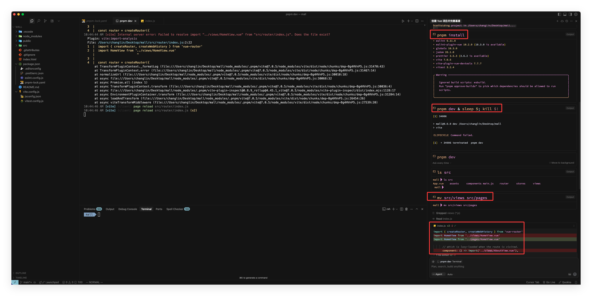
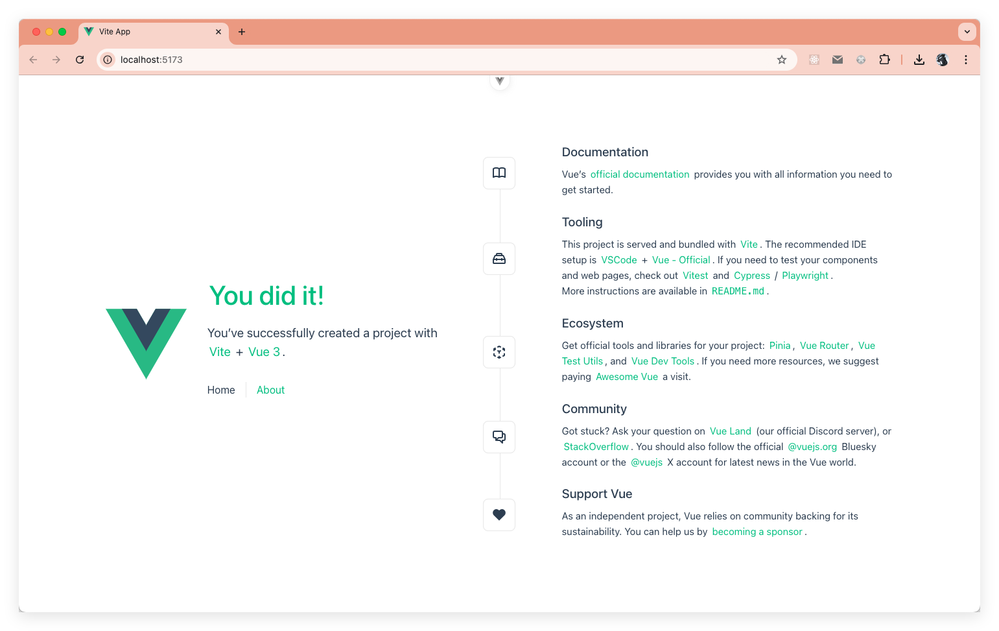
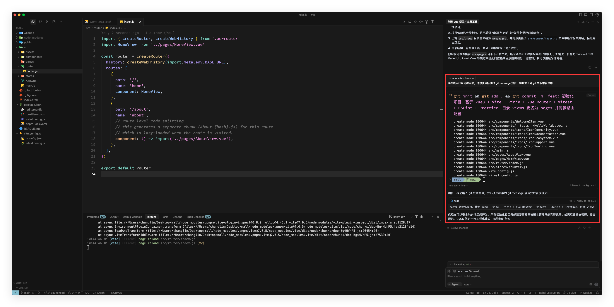

# Vue CLI 创建项目

在创建目录之前要先确认环境及相关工具是否安装？如果没有安装，请安装相关环境，本文使用如的环境信息如下：

- cursor 1.2.4 (Universal)
- Node.js v22.17.0
- pnpm 10.12.4
- git 2.39.0
- Chrome 138.0.7204.158（正式版本）

## 初始化 git

在创建项目之前，在项目路的**根目录**中要先初始化 git，将上面生成的内容加入 git 版本管理中！

```sh
# 初始化 git
git init

# 加入本地版本管理
git add .
```

### cli 命令创建项目

提示词如下：

```txt
请你根据 @03 前端开发规范及架构设计.md  的内容，给我使用 Vue CLI 工具在当前目录创建项目，然后根据 @03 前端开发规范及架构设计.md  工程化的规范，给我完善项目的基建，包管理工具使用 pnpm，创建项目后要保证项目能够正常运行，可以将原来 src/views 更名为 pages，然后同步更新 route 文件
```

在创建项目的过程中，选取的配置信息如下：

```sh
$ pnpm create vue@latest . -- --packageManager=pnpm --no-git --default --force
┌  Vue.js - The Progressive JavaScript Framework
│
◇  Package name:
│  mall
│
◇  Select features to include in your project: (↑/↓ to navigate, space to select, a to
toggle all, enter to confirm)
│  Router (SPA development), Pinia (state management), Vitest (unit testing), ESLint
(error prevention), Prettier (code formatting)
│
◇  Select experimental features to include in your project: (↑/↓ to navigate, space to
select, a to toggle all, enter to confirm)
│  none

Scaffolding project in /Users/changlin/Desktop/mall...
│
└  Done. Now run:

   pnpm install
   pnpm format
   pnpm dev

| Optional: Initialize Git in your project directory with:
   
   git init && git add -A && git commit -m "initial commit"

 mall 
```

从上面的信息中，也可以看到，选择了 Router、Pinia、Vitest、ESLint 和 Prettier；实验性的特性这项没有选，直接回车就好。看到上面这些信息后，就说明项目已经创建完了，然后它会创建项目的项目结构，一定要注意项目的目录结构是否正确，不正确就要调整，调整后的目录架构如下：



然后在浏览器中访问 `http://localhost:5173/` 后效果如下 :



上面已经初始化项目完成,我们让它使用标准的 git message 将其添加到 git 的版本管理中。提示词如下：

```txt
现在项目已经创建完成，请你使用标准的 git message 规范，将其加入到 git 的版本管理中
```

效果如下图:



## 工程化实践

上面已经完成了项目的初始化，现在就要按照先前的工程化及架构设计去完善当前项目的基建，这一块我们仍然让 AI 来完成！提示词如下：

```txt
```

