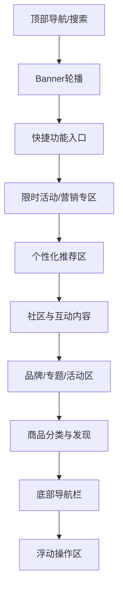

# 首页功能分布与模块设计

## 一、首页设计理念

- 移动优先，操作便捷，信息密度适中，突出主推商品与活动。
- 个性化推荐，结合用户行为、社区内容，提升转化与粘性。
- 强互动与促销氛围，融合社区、评价、限时活动，激发用户参与。
- 内容分区清晰，支持免登录浏览，重要操作引导注册/登录。

## 二、首页核心功能模块

1. **顶部导航与搜索区**
   - LOGO/品牌标识
   - 城市/定位切换（如有本地服务）
   - 搜索框（支持热搜、历史、自动补全）
   - 消息/客服入口
   - 扫码/拍照入口（可选）

2. **主Banner轮播区**
   - 重点活动、品牌、爆品推广
   - 支持多图轮播、跳转活动页/商品页
   - 可配合视频/动态Banner增强吸引力

3. **快捷功能入口区**
   - 分类导航（宫格/横滑，常见8-12项）
   - 频道入口（如秒杀、拼团、社区、签到、优惠券、充值等）
   - 支持自定义排序/编辑

4. **限时活动/营销专区**
   - 秒杀、团购、满减、爆款推荐
   - 倒计时、进度条、实时销量等强化紧迫感
   - 活动商品横滑/瀑布流展示

5. **个性化推荐区**
   - 根据用户画像、浏览/购买/社区行为推荐商品
   - 支持猜你喜欢、为你优选、热销榜单等
   - 商品卡片突出价格、促销、评价、标签

6. **社区与互动内容区**
   - 晒单/评价精选、社区热门话题
   - 用户晒单、短视频、图文内容
   - 点赞、评论、分享入口，提升互动
   - 社区活动/挑战赛入口

7. **品牌/专题/活动区**
   - 品牌馆、主题活动、品类专场
   - 支持Banner、宫格、横滑等多种形式

8. **商品分类与发现区**
   - 多级分类入口，支持横滑/下拉
   - 分类推荐、品牌推荐、榜单

9. **底部导航栏**
   - 首页、分类、社区、购物车、我的
   - 图标+文字，支持高亮、消息红点

10. **浮动操作区（可选）**
    - 返回顶部、客服、购物车快捷入口
    - 活动浮窗、红包雨等运营玩法

## 三、首页模块布局建议

## 四、首页体验优化要点

- 首屏秒开，骨架屏、图片懒加载，提升加载体验
- 活动氛围强，Banner、限时购、红包雨等提升转化
- 社区融合，内容与商品流无缝切换，增强用户停留
- 个性化推荐，动态调整内容顺序，提升点击率
- 操作便捷，底部导航、浮动入口、快捷客服
- 免登录浏览，仅在关键操作时引导注册/登录
- 响应式适配，适配主流手机屏幕，支持暗色模式

> 本文档为Mobile WEB电商系统首页功能与模块设计建议，后续可结合业务与数据持续优化。
