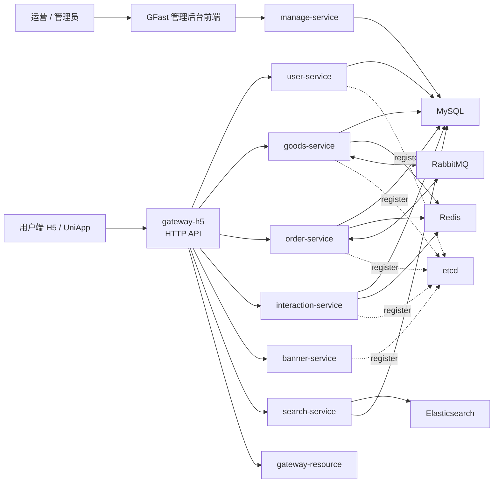

# GoFrame Micro Shop

GoFrame Micro Shop 是一个用于服务端能力训练和面试展示的微服务电商项目合集，覆盖用户、商品、订单、互动、搜索、秒杀、管理后台、H5 / UniApp 前端和 Docker Compose 本地生产形态部署。

项目从单体电商实践继续演进到微服务拆分，重点练习 gRPC 服务协作、HTTP Gateway、etcd 服务注册与发现、Redis 缓存治理、RabbitMQ 异步消息、Outbox 最终一致性、Elasticsearch 搜索同步和 Docker 多服务编排。

## 仓库结构

| 目录 | 说明 |
| --- | --- |
| [`shop-goframe-micro-service-refacotor`](./shop-goframe-micro-service-refacotor) | 微服务后端主仓库，包含用户、商品、订单、互动、搜索、秒杀、网关、中间件编排和学习文档 |
| [`shop-goframe-micro-manage`](./shop-goframe-micro-manage) | GFast 管理后台服务端 |
| [`shop-goframe-micro-service-manage-ui-gfast`](./shop-goframe-micro-service-manage-ui-gfast) | GFast 管理后台前端 |
| [`shop-goframe-micro-uniapp`](./shop-goframe-micro-uniapp) | 用户端 UniApp / H5 前端 |

## 总体架构



## 核心能力

- 微服务拆分：用户、商品、订单、互动、搜索、轮播图、资源网关、H5 网关、秒杀服务。
- 交易链路：商品浏览、购物车、订单预览、订单创建、取消订单、支付成功回调模拟、库存恢复、销量增加。
- 缓存治理：商品详情 Cache Aside、空值缓存、TTL 随机化、互斥重建、缓存穿透 / 击穿 / 雪崩治理。
- 消息一致性：RabbitMQ 异步消费、消费幂等、重试策略、Outbox 本地消息表、后台补偿任务。
- 搜索同步：MySQL 商品数据同步到 Elasticsearch，支持名称、品牌、标签、详情等多字段中文检索。
- 互动模块：评论、回复、点赞、收藏、用户隔离、Redis 旁路缓存、计数校准、分布式锁。
- 秒杀链路：活动校验、防重复下单、Redis Lua 原子扣库存、请求削峰、异步下单、结果缓存、失败补偿。
- 工程部署：Docker Compose 编排 MySQL、Redis、RabbitMQ、etcd、Elasticsearch、Kibana、后端服务和管理后台。

## 快速开始

后端主项目的启动、链路说明和架构图见：

[`shop-goframe-micro-service-refacotor/README.MD`](./shop-goframe-micro-service-refacotor/README.MD)

本地生产形态启动：

```bash
cd shop-goframe-micro-service-refacotor
docker compose -f docker-compose.prod.yml up -d
```

常用入口：

| 入口 | 地址 |
| --- | --- |
| 用户端网关 OpenAPI | http://localhost:8199/api.json |
| 搜索服务 Swagger | http://localhost:8499/swagger |
| 管理后台 | http://localhost:8808 |
| RabbitMQ 管理台 | http://localhost:15672 |
| Elasticsearch | http://localhost:9200 |
| Kibana | http://localhost:5601 |

## 项目定位

这个仓库主要用于展示从单体电商到微服务电商的工程实践过程。代码和文档更关注服务端核心链路、分布式系统常见问题和可运行部署闭环，而不是追求完整商业化产品形态。

适合作为以下能力的项目样例：

- GoFrame 服务端分层开发
- gRPC 微服务协作
- Redis 高并发缓存与秒杀库存扣减
- RabbitMQ 异步消息和最终一致性
- Elasticsearch 搜索接入
- Docker Compose 多服务部署
- 电商业务链路建模与问题排查
