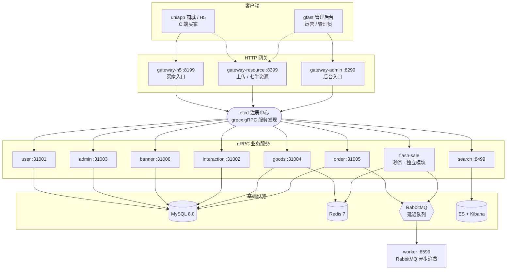
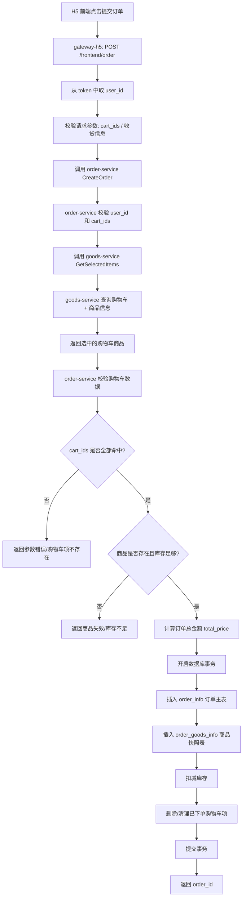

# 商品列表接口学习路径

当前学习分支：`learn/goods-list`

## 目标

先用“商品列表”作为第一条完整链路，理解小程序、HTTP 网关、gRPC 微服务、DAO、数据库之间怎么串起来。

## 整体架构

在钻进单条链路之前，先有一张全局图：客户端经三个 HTTP 网关进入，网关通过 etcd 发现并调用 gRPC 业务服务，服务读写 MySQL / Redis / RabbitMQ / Elasticsearch；订单、秒杀通过 RabbitMQ 由 worker 异步消费。

- 网关层（HTTP，GoFrame Server）：`gateway-h5:8199`（C 端）、`gateway-admin:8299`（后台）、`gateway-resource:8399`（上传/七牛）
- 业务层（gRPC，注册到 etcd）：`user:31001`、`interaction:31002`、`admin:31003`、`goods:31004`、`order:31005`、`banner:31006`、`search:8499`
- 异步/独立：`worker:8599`（RabbitMQ 消费者）；`flash-sale` 是带独立 `go.mod` 的子模块，未纳入 `docker-compose.yml`
- RPC 框架：`gogf/gf/contrib/rpc/grpcx`（gRPC）+ `registry/etcd` 服务发现



## 调用链路

1. 小程序页面发起请求

   文件：`shop-goframe-micro-uniapp/pages/more-goods/more-goods.js`

   入口：`loadGoodsData`

   关键逻辑：

   ```js
   const res = await api.getGoodsList({
     page: currentPage,
     size: this.data.size
   });
   ```

2. 小程序 API 封装

   文件：`shop-goframe-micro-uniapp/utils/api.js`

   入口：

   ```js
   getGoodsList: (params) => request('/frontend/goods', params, 'GET')
   ```

   注意：`config/index.js` 里也有 `PRODUCT_LIST: /goods`，但当前页面真正使用的是 `utils/api.js` 里的 `/frontend/goods`。

3. H5 网关注册路由

   文件：`shop-goframe-micro-service-refacotor/app/gateway-h5/internal/cmd/cmd.go`

   `GoodsInfoGetList` 被绑定到 `/frontend` 分组下，所以最终 HTTP 地址是：

   ```text
   GET /frontend/goods?page=1&size=10
   ```

4. H5 网关接口定义

   文件：`shop-goframe-micro-service-refacotor/app/gateway-h5/api/goods/v1/goods_info.go`

   这里定义 HTTP path、请求参数和返回结构：

   - `Page`
   - `Size`
   - `IsHot`
   - `List`
   - `Total`

5. H5 网关 controller

   文件：`shop-goframe-micro-service-refacotor/app/gateway-h5/internal/controller/goods/goods_v1_goods_info_get_list.go`

   作用：

   - 把 HTTP 请求结构转成 gRPC 请求结构
   - 调用 `GoodsInfoClient.GetList`
   - 把 gRPC 返回结构转成 HTTP 返回结构

6. goods-service gRPC 实现

   文件：`shop-goframe-micro-service-refacotor/app/goods/internal/controller/goods_info/goods_info.go`

   入口：`GetList`

   当前逻辑：

   - 用 `dao.GoodsInfo.Ctx(ctx)` 构建查询
   - `is_hot=1` 时增加 `sort > 0`
   - `Count()` 查询总数
   - `Page(page, size).OrderDesc("sort").All()` 查询分页数据
   - 转成 protobuf entity 返回

7. 数据库表

   文件：`shop-goframe-micro-service-refacotor/init-db/goods_info.sql`

   表名：`goods.goods_info`

   关键字段：

   - `id`
   - `name`
   - `pic_url`
   - `images`
   - `price`
   - `level1_category_id`
   - `level2_category_id`
   - `level3_category_id`
   - `brand`
   - `stock`
   - `sale`
   - `tags`
   - `sort`
   - `detail_info`

## 第一轮建议改造

不要一上来重写大模块。第一轮只做一个很小的功能：给商品列表增加 `keyword` 商品名称搜索。

推荐顺序：

1. 先在 HTTP 请求结构里加 `Keyword string`
2. 再确认 gRPC 请求结构是否已有对应字段；没有就补 proto/生成代码
3. 在 `goods-service` 的 `GetList` 查询里加 `name LIKE`
4. 用 curl 验证接口返回
5. 最后在小程序页面加搜索框或临时传参

## 第一轮完成记录

本轮已经完成：商品列表支持按商品名称 `keyword` 搜索。

最终请求示例：

```text
GET /frontend/goods?page=1&size=10&keyword=Redis
```

核心改动文件：

- `shop-goframe-micro-service-refacotor/app/gateway-h5/api/goods/v1/goods_info.go`
- `shop-goframe-micro-service-refacotor/app/goods/manifest/protobuf/goods_info/v1/goods_info.proto`
- `shop-goframe-micro-service-refacotor/app/goods/api/goods_info/v1/goods_info.pb.go`
- `shop-goframe-micro-service-refacotor/app/goods/api/goods_info/v1/goods_info_grpc.pb.go`
- `shop-goframe-micro-service-refacotor/app/goods/internal/controller/goods_info/goods_info.go`
- `shop-goframe-micro-service-refacotor/app/goods/utility/consumer/DEMO_WECHAT_OPEN_ID.go`

其中 `DEMO_WECHAT_OPEN_ID.go` 是顺手修复的已有日志格式问题，不属于商品搜索主链路。

验证结果：

```text
keyword=Redis
```

返回了 1 条商品：

```text
Mock Redis Coffee Mug
```

说明链路已经打通：

```text
Apifox/curl -> gateway-h5 -> goods-service gRPC -> goods.goods_info
```

## 常用验证和重启命令

改完 Go 后端代码后，不要单独进入某个服务目录执行 `go run main.go`，因为 Docker Compose 里已经启动了服务，单独运行容易端口冲突。

进入主后端仓库：

```bash
cd /Users/bytedance/GolandProjects/go_project_v1/goframe-micro-shop/shop-goframe-micro-service-refacotor
```

只改了 `goods-service`：

```bash
docker compose -f docker-compose.prod.yml build goods-service
docker compose -f docker-compose.prod.yml up -d goods-service
```

只改了 `gateway-h5`：

```bash
docker compose -f docker-compose.prod.yml build gateway-h5
docker compose -f docker-compose.prod.yml up -d gateway-h5
```

同时改了 `goods-service` 和 `gateway-h5`：

```bash
docker compose -f docker-compose.prod.yml build goods-service gateway-h5
docker compose -f docker-compose.prod.yml up -d goods-service gateway-h5
```

查看服务状态：

```bash
docker compose -f docker-compose.prod.yml ps
```

查看日志：

```bash
docker compose -f docker-compose.prod.yml logs --tail=100 goods-service
docker compose -f docker-compose.prod.yml logs --tail=100 gateway-h5
```

验证商品列表：

```bash
curl "http://127.0.0.1:8199/frontend/goods?page=1&size=10"
curl "http://127.0.0.1:8199/frontend/goods?page=1&size=10&keyword=Redis"
```

局部编译检查：

```bash
go test ./app/goods/internal/controller/goods_info ./app/gateway-h5/internal/controller/goods ./app/gateway-h5/api/goods/v1 ./app/goods/api/goods_info/v1
```

注意：`go test ./app/goods/...` 会跑到库存模块 Redis 测试，如果本地测试配置没加载 Redis，可能报 `no configuration found for creating Redis client`。这不是商品列表改造的问题。

## Apifox 同步方式

本地 GoFrame 文档页：

```text
http://127.0.0.1:8199/swagger
```

给 Apifox 同步用的 OpenAPI JSON：

```text
http://127.0.0.1:8199/api.json
```

接口变更后，先重建并重启相关服务，再到 Apifox 里选择：

```text
导入/同步数据 -> OpenAPI/Swagger -> 通过 URL 导入 -> http://127.0.0.1:8199/api.json
```

导入方式建议选择智能合并或覆盖当前接口，不要新建重复接口。

如果只是临时调试，也可以在 Apifox 的 Params 里手动添加：

```text
keyword  string  搜索关键词
```

## Git 保存建议

第一轮改造确认完成后，建议先保存成一次清晰提交。

查看改动：

```bash
git status
git diff
```

提交：

```bash
git add app/gateway-h5/api/goods/v1/goods_info.go app/goods/api/goods_info/v1/goods_info.pb.go app/goods/api/goods_info/v1/goods_info_grpc.pb.go app/goods/internal/controller/goods_info/goods_info.go app/goods/manifest/protobuf/goods_info/v1/goods_info.proto app/goods/utility/consumer/DEMO_WECHAT_OPEN_ID.go
git commit -m "feat: support keyword search for goods list"
```

## 第二轮建议改造

继续在商品列表上做，不要马上换模块。第二轮建议增加分类筛选参数：`category_id`。

目标请求：

```text
GET /frontend/goods?page=1&size=10&category_id=4
```

筛选逻辑：

```text
level1_category_id = category_id
OR level2_category_id = category_id
OR level3_category_id = category_id
```

推荐改造顺序：

1. 在 H5 网关请求结构 `GoodsInfoGetListReq` 增加 `CategoryId uint32`
2. 在 goods-service proto 的 `GoodsInfoGetListReq` 增加 `uint32 category_id`
3. 执行 `make pb` 生成 gRPC 代码
4. 清理无关 pb 文件变更，只保留本次相关文件
5. 在 goods-service 的 `GetList` 查询里增加分类条件
6. 重建并重启 `goods-service` 和 `gateway-h5`
7. 用 curl 验证 `category_id`
8. 用 `api.json` 同步 Apifox

这一轮主要练习：

- 继续扩展 query 参数
- proto 字段编号怎么递增
- SQL 里如何写 OR 条件
- 如何控制生成代码的 diff 不发散

## 后续宏观学习路线

当前阶段不要急着从零重写完整接口，先沿着现有项目做纵向小功能。目标是先建立“项目地图感”，熟悉这个微服务项目里一次接口改造到底要经过哪些层。

### 第一阶段：吃透商品列表

围绕同一个接口持续加小功能：

```text
GET /frontend/goods
```

建议顺序：

1. `keyword` 商品名称搜索，已完成
2. `category_id` 分类筛选
3. `price_min` / `price_max` 价格区间
4. `sort_type` 排序，例如 `0` 默认排序、`1` 价格升序、`2` 价格降序、`3` 销量降序
5. `only_in_stock` 只看有库存商品

这一阶段反复练同一套动作：

```text
HTTP Req -> proto -> make pb -> goods-service 查询 -> docker build/up -> curl -> Apifox 同步
```

### 第二阶段：商品详情

学习接口：

```text
GET /frontend/goods/detail?id=7
```

重点关注：

- 单条查询
- 参数校验
- 商品不存在时怎么返回错误
- Redis 缓存怎么读写
- 空值缓存如何防止缓存穿透

商品详情比商品列表多了缓存逻辑，适合放在列表之后学习。

### 第二阶段完成记录：商品详情

本轮已经完成：商品详情接口的正常查询、不存在处理和缓存路径错误码一致性。

最终请求示例：

```text
GET /frontend/goods/detail?id=5
GET /frontend/goods/detail?id=53
```

商品详情接口链路：

```text
Apifox/curl
-> gateway-h5: GET /frontend/goods/detail?id=5
-> gateway-h5 controller 转成 gRPC 请求
-> goods-service GetDetail
-> 先查 Redis 商品详情缓存
-> Redis 未命中时查 MySQL goods_info
-> 查到商品后写入 Redis 缓存
-> 查不到商品时写入空缓存 __EMPTY__
-> 返回 HTTP 响应
```

核心学习点：

- 商品详情是单条查询，核心参数是 `id`
- H5 层负责 HTTP 参数校验和 gRPC 转发
- goods-service 先查缓存，再查数据库
- 商品不存在时要返回明确的业务错误
- 数据库路径和缓存路径必须保持一致的错误码和 message
- 空缓存 `__EMPTY__` 可以防止缓存穿透

本轮修复的问题：

1. 商品不存在时，原逻辑使用 `gerror.WrapCode(..., err, ...)`，但此时 `err` 是 `nil`，会导致错误没有按预期返回。
2. 下游返回 `Data=nil` 时，gateway-h5 继续执行 `gconv.Struct`，会暴露 `convert params from nil failed` 这类技术错误。
3. 第一次查数据库返回 `CodeNotFound=65`，第二次命中 Redis 空缓存时返回普通错误 `code=2`，同一个业务错误表现不一致。

修复后的行为：

```text
GET /frontend/goods/detail?id=5
```

正常返回商品详情。

```text
GET /frontend/goods/detail?id=53
```

连续请求多次都稳定返回：

```json
{"code":65,"message":"商品不存在","data":null}
```

```text
GET /frontend/goods/detail
```

缺少 `id` 时由参数校验拦截。

核心改动文件：

- `shop-goframe-micro-service-refacotor/app/goods/internal/controller/goods_info/goods_info.go`
- `shop-goframe-micro-service-refacotor/app/gateway-h5/internal/controller/goods/goods_v1_goods_info_get_detail.go`

本轮重要经验：

```text
同一个业务错误，不管走数据库路径、缓存路径，还是网关兜底路径，错误码和 message 都应该一致。
```

### 下一轮建议：Redis 缓存学习

下一轮先不急着写新业务，专门把商品详情里的 Redis 缓存机制学清楚。

建议阅读文件：

- `shop-goframe-micro-service-refacotor/app/goods/utility/goodsRedis/goods.go`
- `shop-goframe-micro-service-refacotor/app/goods/utility/goodsRedis/redis.go`
- `shop-goframe-micro-service-refacotor/app/goods/internal/controller/goods_info/goods_info.go`

重点函数：

- `GetGoodsDetail`
- `SetGoodsDetail`
- `SetEmptyGoodsDetail`
- `DeleteGoodsDetail`

下一轮目标：

1. 看懂 Redis key 是怎么设计的，例如 `goods:detail:{id}`
2. 看懂商品详情缓存 TTL 是多久
3. 看懂空缓存 `__EMPTY__` 的过期时间
4. 用日志确认第一次请求查 MySQL，第二次请求命中 Redis
5. 理解商品更新、删除时为什么要删除详情缓存
6. 适当整理详情缓存代码，让缓存路径和数据库路径更清晰

### Redis 缓存学习完成记录

本轮已经完成：给商品详情缓存路径增加可观测日志，并验证正常缓存和空缓存两条路径。

商品详情缓存配置：

```text
配置文件：app/goods/manifest/config/config.prod.yaml
配置项：redis.goods
Redis DB：1
商品详情 key：goods:detail:{id}
正常商品详情缓存 TTL：1 小时
空缓存 TTL：1 分钟
空缓存值：__EMPTY__
```

注意：Docker 环境下 goods-service 使用的是 `redis.goods.db: 1`，所以查看或删除商品详情缓存时要指定 `-n 1`。

常用 Redis 验证命令：

```bash
docker compose -f docker-compose.prod.yml exec -T redis redis-cli -n 1 --scan
docker compose -f docker-compose.prod.yml exec -T redis redis-cli -n 1 GET goods:detail:5
docker compose -f docker-compose.prod.yml exec -T redis redis-cli -n 1 TTL goods:detail:5
docker compose -f docker-compose.prod.yml exec -T redis redis-cli -n 1 DEL goods:detail:5
```

正常商品详情缓存验证：

```text
先删除缓存：DEL goods:detail:5
第一次请求：GET /frontend/goods/detail?id=5
日志：商品详情缓存未命中，查询MySQL
日志：MySQL查询到商品详情
日志：商品详情已写入缓存

第二次请求：GET /frontend/goods/detail?id=5
日志：商品详情命中缓存
```

不存在商品的空缓存验证：

```text
先删除空缓存：DEL goods:detail:53
第一次请求：GET /frontend/goods/detail?id=53
日志：商品详情缓存未命中，查询MySQL
日志：MySQL未查询到商品，写入空缓存
响应：{"code":65,"message":"商品不存在","data":null}

第二次请求：GET /frontend/goods/detail?id=53
日志：商品详情命中空缓存
响应：{"code":65,"message":"商品不存在","data":null}
```

本轮重要经验：

```text
验证缓存时，请求要按顺序执行。
如果并发发送两次请求，第二个请求可能发生在第一个请求写缓存完成之前，日志看起来就像缓存没有生效。
```

### 第三阶段：购物车

学习接口：

```text
GET    /frontend/cart
POST   /frontend/cart
PUT    /frontend/cart
DELETE /frontend/cart
```

重点关注：

- 哪些接口需要登录
- JWT 中间件怎么生效
- 当前用户 ID 从哪里拿
- 写数据库和更新数据库
- 前端购物车状态如何刷新

这一阶段从“查数据”进入“改数据”。

### 购物车加购学习记录

本轮学习接口：

```text
POST /frontend/cart
```

已经完成的能力：

- H5 HTTP 层校验 `goods_id` 和 `count`
- `user_id` 不从前端传，而是从 JWT token 解析后放到 context 中
- `gateway-h5` 只负责参数适配、取当前用户 ID、转发到 goods-service
- goods-service 加购前校验商品是否存在
- goods-service 校验商品库存是否足够
- 同一用户重复加购同一商品时，不新增购物车记录，而是合并数量
- `cart_info` 表增加 `uk_user_goods(user_id, goods_id)` 唯一索引，防止并发插入重复购物车记录

关键理解：

```text
HTTP 层校验是入口保护。
goods-service 层校验是业务边界兜底。
数据库唯一索引是并发场景下的数据底线。
```

为什么 `user_id` 不从前端传：

```text
前端传来的 user_id 可以被伪造。
购物车属于用户私有数据，必须以后端解析 token 得到的 userId 为准。
```

为什么要先查 `cart_info`：

```text
同一个用户对同一个商品只能有一个购物车项。
如果已存在，就更新 count。
如果不存在，就插入新记录。
```

为什么不能只靠 Go 代码判断重复：

```text
两个并发请求可能同时查到“不存在”，然后同时 insert。
Go 代码的查询只能表示查询那一刻的状态，不能阻止另一个请求随后写入。
数据库唯一索引可以保证同一个 user_id + goods_id 最多只有一条记录。
```

唯一索引冲突的业务含义：

```text
Insert 因 uk_user_goods 失败，不一定是系统错误。
它通常表示另一个并发请求已经帮我们创建了购物车记录。
这时应该重新查询 cart_info，然后继续走“已有购物车项累加数量”的逻辑。
```

当前正在学习的并发问题：

```text
oldCount = 1
请求 A 加 1，读到 oldCount=1，准备写 2
请求 B 加 1，也读到 oldCount=1，准备写 2
最终 count 变成 2，但正确结果应该是 3
```

这叫“丢失更新”。

下一步改造目标：

```sql
UPDATE cart_info
SET count = count + 本次加购数量
WHERE id = ?
  AND count <= 库存 - 本次加购数量
```

也就是把：

```text
Go 读 count -> Go 计算 newCount -> DB 写 newCount
```

改成：

```text
DB 原子执行 count = count + addCount
```

改造时要注意：

- `Update()` 后先判断 `err`
- 再调用 `RowsAffected()`
- 如果 `RowsAffected() == 0`，说明库存不足或条件不满足
- 不要让 `RowsAffected()` 覆盖 `Update()` 返回的 `err`

### 购物车更新数量学习记录

本轮学习接口：

```text
PUT /frontend/cart
```

请求参数：

```json
{
  "id": 购物车项ID,
  "count": 新数量
}
```

关键理解：

```text
创建购物车项时用 goods_id + count，因为购物车记录可能还不存在。
更新购物车项时用 id + count，因为前端已经从购物车列表拿到了 cart_info.id。
```

为什么更新数量不能只传 `goods_id`：

```text
PUT 的语义是修改一条已经存在的购物车记录。
用 cart_info.id 可以直接定位要修改的购物车项。
同时还必须带上 user_id 条件，防止用户修改别人的购物车项。
```

goods-service 的更新流程：

```text
1. 校验 id / count / user_id
2. 按 id + user_id 查询 cart_info
3. 如果不存在，返回“购物车中没有该商品或无权更新”
4. 用 cart_info.goods_id 查询商品
5. 校验商品存在
6. 校验新 count 不超过库存
7. 更新 cart_info.count = req.Count
```

一个容易踩坑的点：

```text
PUT 是“设置为指定数量”，不是“累加数量”。
如果用户把 count 从 3 改成 3，本质上也应该算成功。
所以这里不要简单用 RowsAffected == 0 判断失败。
```

### 购物车列表汇总学习记录

本轮学习接口：

```text
GET /frontend/cart
```

已经完成的能力：

- 返回购物车分页列表
- 返回购物车记录总数 `total`
- 返回全量购物车商品总金额 `total_price`
- 返回全量购物车商品总件数 `total_count`

返回示例：

```json
{
  "list": [],
  "page": 1,
  "size": 10,
  "total": 0,
  "total_price": 0,
  "total_count": 0
}
```

`total` 和 `total_count` 的区别：

```text
total 表示购物车记录条数。
total_count 表示购物车里商品的总件数。

例如：
购物车里有 2 条记录：
- 商品 A，count = 3
- 商品 B，count = 2

那么 total = 2，total_count = 5。
```

为什么不能用分页 list 来算全量汇总：

```text
分页查询只返回当前页数据。
如果 page=1,size=10，而购物车共有 25 条记录，
直接遍历当前页 list 只能算当前页前 10 条的金额和数量。

真实购物车页面通常需要展示全量合计，
所以 total_price / total_count 应该单独做一条不带 Page 的聚合查询。
```

聚合查询思路：

```sql
SELECT
  COALESCE(SUM(goods_info.price * cart_info.count), 0) AS total_price,
  COALESCE(SUM(cart_info.count), 0) AS total_count
FROM cart_info
LEFT JOIN goods_info ON goods_info.id = cart_info.goods_id
WHERE cart_info.user_id = ?
```

为什么要用 `COALESCE`：

```text
SQL 中，如果没有任何行参与 SUM，SUM(...) 的结果是 NULL，不是 0。
但业务上，空购物车的金额和数量应该是 0。

COALESCE(SUM(...), 0) 的意思是：
如果 SUM 有结果，就用 SUM 的结果；
如果 SUM 是 NULL，就返回 0。
```

这一阶段的服务边界理解：

```text
gateway-h5 负责 HTTP 入参、JWT 用户身份、调用 gRPC、响应转换。
goods-service 负责购物车业务规则、商品库存校验、金额汇总、数据库读写。
前端传来的 user_id、price、subtotal 都不能作为可信业务数据。
```

### 购物车阶段小结

购物车模块已经完成一个可学习的后端闭环：

```text
列表查询 -> 加购 -> 重复加购合并 -> 并发插入保护 -> 原子累加数量
        -> 更新数量 -> 删除 -> 全量汇总
```

这一阶段重点学到的是：

- 用户私有数据必须以后端 token 解析出的 user_id 为准
- HTTP 层校验和 service 层校验职责不同
- 数据库唯一索引是并发下的数据底线
- 重复插入冲突不一定是系统错误，也可能是可恢复的并发状态
- 金额使用“分”的整数表示，不使用 float
- 分页列表和全量汇总是两类查询，不能混在一起理解
- SQL 聚合空结果要考虑 `NULL` 到业务默认值的转换

下一步可以进入订单模块，但建议先做“订单确认页预览接口”，不要一上来就创建订单。

### 第四阶段：订单

订单是电商系统最核心、也最复杂的部分。

### 订单确认页预览接口学习记录

这一轮先做“订单确认页预览接口”，不要直接进入创建订单。

接口目标：

```text
POST /frontend/order/preview
```

请求参数：

```json
{
  "cart_ids": [4, 5, 6, 7, 8]
}
```

返回目标：

```json
{
  "items": [
    {
      "cart_id": 8,
      "goods_id": 4,
      "goods_name": "Mock Microservice Backpack",
      "goods_price": 25900,
      "count": 4,
      "sub_total": 103600
    }
  ],
  "total_price": 103600,
  "total_count": 4
}
```

这一轮的服务边界设计：

```text
gateway-h5
  -> 从 token 中取 user_id
  -> 接收 cart_ids
  -> 调用 order-service Preview
  -> 把 gRPC 响应转换成 HTTP 响应

order-service
  -> 负责订单预览业务编排
  -> 调用 goods-service 查询购物车商品快照
  -> 使用后端价格计算 sub_total、total_price、total_count
  -> 后续负责库存校验、商品有效性校验、订单创建

goods-service
  -> 提供 GetSelectedItems 内部 RPC
  -> 按 user_id + cart_ids 查询当前用户购物车项
  -> 联表 goods_info 返回商品名称、价格、库存等快照信息
```

这一轮新增的关键链路：

```text
Apifox
  -> POST /frontend/order/preview
  -> gateway-h5 OrderInfoPreview
  -> order-service Preview
  -> goods-service GetSelectedItems
  -> cart_info left join goods_info
  -> order-service 汇总金额和数量
  -> gateway-h5 返回 JSON
```

为什么 `user_id` 仍然不能从前端传：

```text
订单预览属于用户私有数据。
前端只传 cart_ids，当前用户是谁必须由 token 解析得到。
order-service 再把 user_id 传给 goods-service，goods-service 用 user_id + cart_ids 查询，防止用户预览别人的购物车。
```

为什么 order-service 要单独定义 `OrderInfoPreviewItem`：

```text
购物车列表项、商品项、订单预览项不是同一个业务语义。
订单预览项只保留确认订单需要的字段，例如 cart_id、goods_id、goods_name、goods_price、count、sub_total。
不要为了少写字段而复用 CartInfoItem 或 GoodsInfoItem，否则接口之间会互相耦合。
```

这轮调试时遇到的关键问题：

1. `unknown method Preview for service order_info.v1.order_info`

含义：

```text
gateway-h5 已经在调用新的 gRPC 方法，但正在运行的 order-service 还是旧代码。
```

解决：

```text
执行 make pb 后，需要重新启动 / rebuild order-service 和 gateway-h5。
```

2. `connect ECONNREFUSED 127.0.0.1:8199`

含义：

```text
Apifox 连不上 gateway-h5，说明 8199 端口没有稳定监听。
```

本次根因：

```text
Docker 容器里使用 127.0.0.1 连接 Redis / etcd。
容器内的 127.0.0.1 是当前容器自己，不是 Redis / etcd 容器。
```

解决：

```text
本机运行 Go 服务时可以用 127.0.0.1。
Docker Compose 容器内运行服务时，要用 mysql、redis、etcd、rabbitmq 这些服务名。
```

3. 单独测试 goods-service logic 时找不到 MySQL driver

含义：

```text
go test 不会执行 main.go，main.go 里的匿名 import 不会生效。
```

解决：

```go
import _ "github.com/gogf/gf/contrib/drivers/mysql/v2"
```

这一轮暂时先不改、但需要知道的边界风险：

1. 请求的 `cart_ids` 没有全部命中时，现在可能只返回命中的部分。

例如用户请求：

```json
{
  "cart_ids": [4, 5, 999]
}
```

如果 `999` 不存在或不属于当前用户，goods-service 只会返回查到的购物车项。
更严谨的做法是在 order-service 中校验：

```text
len(cartRes.Items) == len(req.CartIds)
```

或者建立 map，逐个确认每个请求 cart_id 都被命中。

2. 如果购物车关联的商品不存在，`left join goods_info` 可能返回商品字段为空或 0。

更严谨的做法是在 order-service 中校验：

```text
goods_id != 0
goods_name != ""
count > 0
count <= goods_stock
```

这两个问题这轮先不处理，原因是当前学习目标是先跑通订单预览主链路。后面进入“创建订单”之前必须补上，因为创建订单不能接受部分商品、失效商品或库存不足商品。

### 创建订单前的流程设计

创建订单不是简单插入一条 `order_info`，而是一次跨表、跨服务、带一致性要求的业务动作。

主流程：



创建订单可以拆成 5 层理解：

1. `gateway-h5`

只做 HTTP 入口：

- 接收前端参数
- 从 token 取 `user_id`
- 调用 `order-service`
- 返回结果

它不应该算价格、不应该查数据库、不应该自己判断库存。

2. `order-service`

这是创建订单的主角，负责下单编排：

- 根据 `cart_ids` 获取购物车商品
- 校验购物车归属当前用户
- 校验商品有效性
- 校验库存
- 计算金额
- 开启事务
- 创建订单主表
- 创建订单商品快照
- 清理购物车

3. `goods-service`

提供商品和购物车数据能力：

- 根据 `user_id + cart_ids` 查询购物车项
- 联查商品信息
- 后续也可能提供扣库存接口

4. `order_info`

订单主表，只记录一笔订单的总体信息：

- 用户是谁
- 总金额多少
- 状态是什么
- 收货信息是什么
- 创建时间等

5. `order_goods_info`

订单商品快照表，记录下单那一刻商品是什么样子：

- 商品 ID
- 商品名称
- 下单价格
- 数量
- 小计
- 图片等

商品以后可能改名、改价、下架，但订单历史不能跟着变化，所以订单里必须保存商品快照。

下一轮建议先设计创建订单接口，不要急着写完整业务逻辑。

最小版请求可以先这样：

```json
{
  "cart_ids": [4, 5, 6],
  "consignee_name": "张三",
  "consignee_phone": "13800000000",
  "consignee_address": "北京市xxx"
}
```

最小版返回：

```json
{
  "order_id": 123
}
```

这一步先重点学习：

- 创建订单请求为什么不能传价格
- 为什么 `user_id` 仍然要从 token 里取
- 为什么要保存订单商品快照
- 为什么创建订单需要事务
- 扣库存和清购物车应该放在哪一步

建议学习：

- 创建订单
- 订单商品快照
- 扣库存
- 支付回调
- 取消订单
- 返还库存

重点关注：

- 事务
- 库存一致性
- RabbitMQ 消息
- 服务之间如何协作
- 失败后如何补偿

这一阶段不要太早做，等商品和购物车走顺后再进入。

### 第五阶段：管理后台

管理后台适合练完整的后台业务链路：

- 商品新增
- 商品编辑
- 商品上下架
- 分类维护
- 图片上传

这里会串起：

```text
管理后台 Web -> manage-service -> goods-service -> MySQL
```

同时也能练前端表单、后端接口、文件上传、数据校验。

## 是否需要从零实现一遍 list

建议不要一开始就从零写完整 `list` 接口。

当前更适合的方式是：

```text
先模仿 -> 再扩展 -> 最后独立实现
```

也就是先在现有 `GoodsInfoGetList` 上完成：

```text
keyword
category_id
price_min / price_max
sort_type
only_in_stock
```

等这些都完成后，再做一个“半从零实现”的练习接口：

```text
GET /frontend/goods/simple-list
```

这个接口只保留最小能力：

- `page`
- `size`
- `keyword`

到那时再自己完整走一遍：

1. 写 H5 网关 API Req/Res
2. 写 gateway controller
3. 写 goods-service proto
4. 执行 `make pb`
5. 写 goods-service `GetSimpleList`
6. 通过 DAO 查询数据库
7. 用 curl 验证
8. 用 `api.json` 同步 Apifox

这个练习放在熟悉项目惯例之后做，效果会比一开始从零写更好。

## 当前观察

`goods-service` 的商品列表逻辑现在直接写在 controller 里，没有拆到 logic 层。学习阶段可以先接受这个结构；等理解链路后，再考虑把查询逻辑抽到 `internal/logic/goods_info`。

## 订单创建接入扣库存学习记录

本轮完成了从购物车创建订单时接入商品库存扣减，当前学习版主链路是：

```text
gateway-h5
  -> order-service CreateFromCart
  -> goods-service GetSelectedItems
  -> goods-service DeductStock
  -> order-service 创建订单主表
  -> order-service 创建订单商品快照
  -> goods-service DeleteSelectedItems
  -> 返回订单号
```

### 为什么要先单独写 DeductStock

扣库存是订单链路里风险最高的动作之一，不能只靠 API Fox 最后测一下订单接口。

本轮先给 `DeductStock` 写了集成测试，覆盖了：

- 参数错误：商品 ID 和数量为空、长度不一致、数量为 0
- 正常扣减：库存按传入数量减少
- 重复商品合并：同一个商品出现多次时，先合并成总扣减数量
- 库存不足回滚：多个商品一起扣时，只要有一个库存不足，前面已扣的也要回滚

这里重点学习的是：库存扣减必须是原子动作，不能出现只扣了一部分商品库存的中间状态。

### needMap 的作用

`needMap` 用来把同一个商品的扣减数量先聚合起来。

例如：

```text
goods_ids = [1, 1, 2]
counts    = [2, 3, 1]
```

聚合后变成：

```text
商品 1 扣 5
商品 2 扣 1
```

这样同一个商品只更新一次，库存判断更清楚，也方便后续按商品 ID 排序。

### 为什么要排序后扣库存

多个订单并发扣多个商品时，如果不同事务的加锁顺序不一致，可能出现死锁。

例如：

```text
事务 A：先锁商品 1，再锁商品 2
事务 B：先锁商品 2，再锁商品 1
```

这时可能出现 A 等 B、B 等 A 的循环等待。

所以扣库存前需要把商品 ID 排序，统一所有事务的加锁顺序：

```text
所有事务都按 goods_id 升序扣库存
```

排序不能保证完全没有死锁，但可以消除“多行更新顺序不一致”导致的常见死锁来源。

### DeductStock 的核心 SQL 思路

扣库存不能先查库存再更新，因为并发下查到的库存可能很快变旧。

更好的方式是条件更新：

```sql
UPDATE goods_info
SET stock = stock - ?
WHERE id = ? AND stock >= ?
```

然后通过 `RowsAffected` 判断是否扣减成功：

- `RowsAffected = 1`：扣减成功
- `RowsAffected = 0`：商品不存在或库存不足

这种写法把“判断库存够不够”和“扣减库存”合成一次数据库原子更新。

### 缓存失效的降级处理

库存扣减成功后，需要删除商品详情缓存，避免后续读到旧库存。

但缓存删除失败不应该影响主流程，因为此时数据库库存已经扣成功了。

本轮测试时发现：如果 `goodsCache` 没初始化，删除缓存会 panic。已改成先判断缓存是否初始化，让它返回错误，由 `DeductStock` 记录 warning。

这体现一个原则：

```text
数据库主流程成功后，缓存失效失败可以降级，但不能让主流程 panic。
```

### 接入订单创建后的风险

当前学习版采用：

```text
先扣库存 -> 再创建订单 -> 再删除购物车
```

这个流程简单清楚，适合当前阶段先跑通完整链路。

但它有一个一致性风险：

```text
扣库存成功后，如果创建订单失败，库存已经少了，但订单没有生成。
```

后续可以学习几种优化方向：

- 创建订单失败时补偿库存
- 订单先创建为待确认状态，再异步扣库存
- 使用本地消息表或 MQ 做最终一致性
- 订单取消或超时未支付时返还库存

当前阶段先把风险记录下来，不急着一次性做复杂。

### 本轮 API Fox 验证场景

已通过 API Fox 验证订单创建接入扣库存链路，当前没发现问题。

建议保留以下手动验证场景：

- 正常从购物车创建订单成功
- 创建订单后商品库存减少
- 创建订单后购物车对应项被删除
- 库存不足时创建订单失败
- 传不存在或不属于当前用户的 `cart_id` 时创建订单失败

### Docker 改代码后的重启方式

如果服务是通过 Docker 镜像运行的，代码改完后只执行 `up` 通常不够，因为容器可能继续使用旧镜像。

需要带 `--build`：

```bash
docker compose up -d --build goods-service order-service gateway-h5
```

含义：

```text
--build  重新构建镜像
-d       后台启动
后面的服务名  只重启这些业务服务，不动 mysql/redis/etcd/rabbitmq
```

如果只改了商品服务和订单服务，可以只重启：

```bash
docker compose up -d --build goods-service order-service
```

## 取消订单与恢复库存学习记录

本轮完成了取消订单链路的重构，目标不是简单把订单状态改成已取消，而是把“订单状态”和“商品库存”之间的补偿关系理清楚。

当前主链路是：

```text
gateway-h5 获取 user_id
  -> 调 order-service CancelOrder
  -> order-service 校验订单存在
  -> 查询 order_goods_info 商品快照
  -> 待支付订单改为已取消
  -> 调 goods-service RestoreStock 恢复库存
  -> 成功返回取消结果
```

### 为什么取消订单要带用户校验

取消订单是用户私有操作，不能只靠 `order_id`。

如果只传 `order_id`，用户 A 可能尝试取消用户 B 的订单。

所以 gateway-h5 只接收前端传来的订单 ID，`user_id` 从 token 解析，然后传给 order-service：

```text
前端只传 order_id
gateway-h5 从 token 取 user_id
order-service 使用 order_id + user_id 定位订单
```

### 为什么只允许待支付订单取消

当前学习版先支持最基础的取消场景：

```text
待支付 -> 已取消
```

如果订单已经支付、发货、完成，取消订单就不只是改状态，还会涉及退款、物流、售后等流程。

所以本轮只允许 `OrderStatusPendingPayment` 取消。

核心写法是条件更新：

```text
WHERE id = ? AND user_id = ? AND status = 待支付
UPDATE status = 已取消
```

然后通过 `RowsAffected` 判断是否真的更新成功：

- `RowsAffected = 1`：状态流转成功
- `RowsAffected = 0`：订单不存在、用户不匹配、或状态已经不是待支付

### 为什么要抽 UpdateOrderStatusIfMatch

普通状态更新只表达：

```text
把订单改成某个状态
```

但取消订单需要表达：

```text
只有当前状态是 A，才允许改成 B
```

所以新增了一个更明确的状态流转方法：

```text
FromStatus -> ToStatus
```

它解决两个问题：

- 防止重复取消、并发取消导致状态乱跳
- 恢复库存失败时，可以把 `已取消 -> 待支付` 作为明确的补偿动作

### 为什么恢复库存失败要回滚订单状态

当前流程是：

```text
先把订单改成已取消
再调用 goods-service 恢复库存
```

如果库存恢复失败，但订单已经是已取消，就会出现不一致：

```text
订单取消了，但库存没有加回去
```

所以本轮采用简单补偿：

```text
恢复库存失败
  -> 尝试把订单状态从已取消回滚为待支付
```

这不是分布式事务，只是当前学习阶段更容易理解的一种补偿思路。

后续可以继续学习：

- 本地消息表
- MQ 可靠事件
- 定时补偿任务
- 订单超时自动取消

### 为什么 order-service 不应该在 Res 里塞 code/message/data

一开始取消订单的 gRPC 响应是：

```json
{
  "code": 0,
  "message": "订单取消成功",
  "data": ""
}
```

gateway-h5 又启用了 GoFrame 的统一响应包装：

```json
{
  "code": 0,
  "message": "OK",
  "data": ...
}
```

这样就变成了双层响应：

```json
{
  "code": 0,
  "message": "OK",
  "data": {
    "code": 0,
    "message": "订单取消成功",
    "data": ""
  }
}
```

这会让 Apifox 校验、前端解析、接口语义都变得混乱。

本轮统一成：

```text
order-service:
  成功返回业务数据
  失败返回 error

gateway-h5:
  成功返回 Res 结构体
  失败交给 GoFrame 统一错误响应
```

最终 HTTP 成功响应是：

```json
{
  "code": 0,
  "message": "OK",
  "data": {
    "message": "订单取消成功"
  }
}
```

### 本轮 API Fox 验证场景

建议保留以下验证场景：

- 待支付订单取消成功
- 不存在的订单返回错误
- 非待支付订单不能取消
- 取消成功后商品库存恢复
- 恢复库存失败时订单状态尝试回滚

## 后续学习计划

接下来继续保持“每轮一个小能力”的节奏，不要一次性把订单系统全写完。

### 订单主线学习路线图

后续如果学着学着有点乱，就先回到这张主线图。

当前主线不是为了“把所有功能都堆完”，而是围绕订单链路逐步学清楚：

```text
同步业务链路
  -> 状态流转
  -> 补偿机制
  -> 后台任务
  -> MQ 最终一致性
  -> Binlog / CDC
  -> Redis 高并发缓存
  -> 前端端到端联调
```

建议顺序：

1. 补偿任务健壮性
   - 处理 `sales_status=3 同步中` 卡住的问题。
   - 学习“抢占后服务挂了怎么办”。
   - 目标：能把超时同步中的订单重新拉回可补偿状态。

2. 订单状态机整理
   - 梳理待支付、已支付、已取消、已发货、已完成等状态。
   - 学习 `FromStatus -> ToStatus` 条件更新。
   - 目标：知道哪些状态允许流转，哪些状态不能乱改。

3. 订单超时未支付自动取消
   - 扫描超过一定时间还没支付的订单。
   - 自动取消订单并恢复库存。
   - 目标：串联状态流转、库存恢复、补偿思想。

4. 补偿任务入口升级
   - 当前是手动 API 触发。
   - 后续升级为定时任务或后台任务。
   - 目标：理解后台任务如何启动、如何避免多实例重复执行、如何观察日志。

5. MQ / RabbitMQ 最终一致性
   - 把部分同步 RPC 改成异步事件。
   - 例如 `OrderPaidEvent` 增加销量、`OrderCancelledEvent` 恢复库存。
   - 目标：理解生产者、交换机、队列、消费者、消息重试和幂等。

6. 本地消息表 / Outbox 模式
   - 解决“本地事务成功但消息没发出去”的一致性缺口。
   - 目标：知道为什么仅仅 `tx.Commit()` 后直接发 MQ 还不够可靠。

7. Binlog / CDC
   - 学习 Binlog 和 MQ 的区别。
   - 目标：知道 Binlog 更适合数据同步、搜索索引、报表，不适合替代核心业务事件。

8. Redis 高并发缓存专题
   - 系统补缓存穿透、击穿、雪崩、热点 key、缓存一致性、分布式锁。
   - 目标：能判断一个接口该不该加缓存，以及缓存失效怎么处理。

9. 前端适配与端到端联调
   - 后端接口稳定后再适配 H5 / 小程序 / 管理后台。
   - 目标：统一接口契约、响应结构、token 传递和页面联调。

当前最近一轮建议：

```text
先做“补偿任务健壮性”，处理 sales_status=同步中 卡住的问题。
```

### 下一轮：支付成功后的销量增加

本轮我们已经有：

```text
创建订单 -> 扣库存
取消订单 -> 还库存
```

下一轮建议学习：

```text
支付成功 -> 增加商品销量
```

重点问题：

- 为什么创建订单时不应该立刻增加销量
- 为什么支付成功后才增加销量
- 增加销量放在 order-service 还是 goods-service
- 支付成功后状态流转和销量增加谁先做
- 如果销量增加失败，订单状态要不要回滚

### 支付成功加销量与补偿机制学习记录

这一轮我们把“支付成功后增加商品销量”拆成了两条链路：

```text
正常链路：
支付回调成功
  -> order-service 把订单改成已支付
  -> 调 goods-service 增加商品销量
  -> 成功后 sales_status = 已同步
  -> 失败后 sales_status = 同步失败，后续补偿

补偿链路：
扫描已支付且销量同步失败的订单
  -> 抢占订单：同步失败 -> 同步中
  -> 调 goods-service 增加商品销量
  -> 成功：同步中 -> 已同步
  -> 失败：同步中 -> 同步失败
```

#### 为什么需要 `sales_status`

订单状态 `status` 只表示订单本身的业务状态，例如待支付、已支付、已取消。

但“商品销量是否已经同步成功”是另一个维度，不能混在订单状态里。

所以增加了 `sales_status`：

```text
0 未同步
1 已同步
2 同步失败
3 同步中
```

这样可以清楚表达：

- 订单已经支付了
- 但销量同步可能成功、失败、正在补偿中

#### 为什么支付回调失败时不回滚订单状态

支付平台回调成功，说明用户的钱已经付了。

如果这时商品销量增加失败，不能把订单从已支付回滚成待支付或取消，否则会出现：

```text
用户已经付款
系统却认为订单没支付或已取消
```

所以正确做法是：

```text
订单保持已支付
销量同步失败单独记录为 sales_status = 同步失败
后续补偿任务再处理
```

#### 为什么 `UpdateOrderSalesStatusByNumber` 和 `TryUpdateOrderSalesStatus` 要分开

这两个方法语义不一样。

`UpdateOrderSalesStatusByNumber` 是普通更新：

```text
按订单号更新销量同步状态
适合支付回调主链路使用
```

它只要求：

```text
number = ?
status = 已支付
```

`TryUpdateOrderSalesStatus` 是条件更新：

```text
只有当前 sales_status 符合预期时才允许更新
适合补偿任务抢占使用
```

它要求：

```text
number = ?
status = 已支付
sales_status = fromStatus
```

并返回：

```text
RowsAffected > 0 表示抢占成功
RowsAffected = 0 表示被别人处理过了，当前任务跳过
```

#### 这是不是一种锁

这种设计可以理解成“状态字段版乐观锁”。

它不是传统意义上的锁，但效果类似：

```sql
UPDATE order_info
SET sales_status = 3
WHERE number = ?
  AND status = 已支付
  AND sales_status = 2
```

如果两个补偿任务同时处理同一笔订单：

```text
任务 A：2 同步失败 -> 3 同步中，RowsAffected = 1，抢占成功
任务 B：再执行时发现已经不是 2，RowsAffected = 0，抢占失败
```

所以：

```text
谁先把 Failed 改成 Syncing，谁就获得处理权。
```

#### 为什么不直接用悲观锁

悲观锁通常是：

```sql
SELECT ... FOR UPDATE
```

它适合在一个本地数据库事务里锁住一行，然后完成本地更新。

但当前补偿流程中间要调远程服务：

```text
order-service
  -> goods-service 增加销量
```

如果 order-service 开事务并锁住订单行，再去调 goods-service，会有几个问题：

- RPC 可能很慢，数据库锁会持有很久
- goods-service 卡住时，order 表这一行一直被锁
- 未来如果 goods-service 又反向依赖 order-service，可能出现复杂等待
- 本地数据库事务本来就管不住远程 RPC 成功或失败

所以这里不适合用长事务加悲观锁。

#### 为什么暂时不用单独的 version 乐观锁

标准乐观锁常见写法是：

```sql
UPDATE order_info
SET sales_status = ?, version = version + 1
WHERE id = ? AND version = ?
```

但当前场景关心的不是“这行任意字段有没有被改过”，而是：

```text
这个订单是否仍然处于可补偿状态
```

`sales_status` 本身已经表达了状态版本：

```text
同步失败 -> 同步中 -> 已同步
同步失败 -> 同步中 -> 同步失败
```

所以当前用：

```sql
WHERE sales_status = 同步失败
```

已经足够表达业务并发控制。

如果后面订单状态流转变得非常复杂，比如退款、售后、人工干预、补偿任务都同时改同一行，再考虑加 `version` 字段。

#### 当前方案还要注意什么

最大风险是：

```text
任务已经把订单从同步失败改成同步中
但是服务突然挂了
订单可能一直停在同步中
```

后续可以继续增强：

```text
sales_status = 同步中
并且 updated_at 超过一段时间
认为上一次补偿任务异常中断
允许重新拉回同步失败或重新补偿
```

这一点可以放到后面的“补偿任务健壮性”学习里。

当前先记住：

```text
状态字段 + 条件更新 + RowsAffected 判断
是业务系统里非常常见的一种轻量级并发控制方式。
```

### 再下一轮：订单支付状态流转整理

当前已有支付回调和订单状态更新逻辑，后续可以整理成更清晰的状态机：

```text
待确认 -> 待支付 -> 已支付 -> 已发货 -> 已收货 -> 已完成
待支付 -> 已取消
```

这一轮重点学习：

- 哪些状态允许流转到哪些状态
- 为什么不能任意更新订单状态
- 状态流转为什么要加 FromStatus 条件
- 支付回调为什么要幂等

### 第三轮：订单超时未支付自动取消

这个能力可以把前面学过的扣库存、恢复库存、状态流转串起来。

目标：

```text
订单创建后超过一段时间未支付
  -> 自动取消订单
  -> 恢复库存
```

重点学习：

- 定时任务怎么扫订单
- 怎么避免重复取消
- 超时取消和用户主动取消能不能复用逻辑
- 分布式部署下定时任务并发执行怎么控制

### 第四轮：MQ 与最终一致性

MQ 不建议一开始就学，也不建议等项目全部写完才学。

比较合适的位置是：

```text
支付成功后增加销量
  -> 订单状态流转整理
  -> 订单超时未支付自动取消
  -> MQ / 最终一致性
  -> Binlog / CDC / 数据同步
  -> 前端适配和端到端联调
```

原因是 MQ 最好接在真实业务问题后面学，而不是为了学 RabbitMQ 而学 RabbitMQ。

前面几轮会先用同步调用把业务链路跑通：

```text
创建订单 -> 扣库存 -> 删除购物车
支付成功 -> 增加销量
取消订单 -> 恢复库存
超时未支付 -> 自动取消 -> 恢复库存
```

当这些同步链路都理解之后，再学习 MQ，就会自然遇到这些问题：

- 跨服务动作不能都放进一个本地事务里
- 下游服务失败时，上游不能无限等待
- 有些动作可以异步完成，比如日志、通知、释放资源
- 消息可能重复消费，所以消费者要幂等
- 消息发送成功但本地事务失败，或者本地事务成功但消息发送失败，都会造成一致性问题

这一轮建议先从两个事件入手：

```text
OrderPaidEvent
  -> goods-service 增加商品销量
  -> 后续可扩展为通知发货、发送站内信

OrderCancelledEvent
  -> goods-service 恢复商品库存
  -> 后续可扩展为释放优惠券、记录订单日志
```

重点学习：

- 生产者、交换机、队列、消费者分别是什么
- 为什么消息体要设计成事件，而不是直接传数据库表结构
- 消费者为什么必须幂等
- 消息失败后如何重试
- 什么是最终一致性
- 本地事务和 MQ 之间为什么会有一致性缺口
- 后续如何引入本地消息表或 outbox 模式

当前阶段先记住结论：

```text
先用同步调用学清楚业务边界，再用 MQ 改造跨服务副作用。
```

### 第五轮：Binlog / CDC / 数据同步

Binlog 建议放在 MQ 后面学。

因为 MQ 和 Binlog 都和“事件”有关，但它们的出发点不一样：

```text
MQ:
  业务主动发事件
  例如 OrderPaidEvent、OrderCancelledEvent

Binlog:
  数据库被动吐变更
  例如 order_info.status 从待支付变成已支付
```

先学 MQ，可以理解什么是业务事件、什么是最终一致性；再学 Binlog，就能更清楚它适合做什么、不适合做什么。

这一轮可以从几个问题入手：

- MySQL binlog 是什么
- row / statement / mixed 三种模式有什么区别
- 为什么业务监听通常更适合 row 模式
- CDC 是什么
- Canal / Debezium 这类工具解决什么问题
- 如何用 binlog 同步 ES、Redis、数据仓库
- Binlog 事件和 MQ 业务事件有什么区别
- 为什么核心业务流程不能只依赖 binlog

典型使用场景：

```text
订单状态变化
  -> binlog 捕获 order_info 表变更
  -> 同步到搜索系统、数据分析系统、缓存刷新系统
```

但核心业务动作仍然更建议先通过业务代码或 MQ 明确表达：

```text
支付成功
  -> 业务代码明确发 OrderPaidEvent
  -> 下游消费者增加销量、通知发货、发送消息
```

当前阶段先记住结论：

```text
MQ 是业务主动发事件；Binlog 是数据库被动吐变更。
核心业务流程优先用业务事件表达，Binlog 更适合数据同步、异构索引、审计分析。
```

### 第六轮：订单详情和订单列表补齐

等核心写链路稳定后，再补查询类接口。

重点学习：

- 订单主表和订单商品快照如何组装返回
- 分页查询如何避免 N+1 查询
- 不同状态的订单列表如何筛选
- 前端页面需要什么字段，后端就返回什么字段

### 第七轮：互动模块：多级评论、回复、点赞与计数

订单主链路稳定后，建议专门进入 `interaction-service` 学一轮互动模块。

这块面试很容易被问到，而且比普通 CRUD 更能体现后端设计能力。

目标不是一次性做复杂社区系统，而是围绕“商品评论/回复/点赞”学清楚几类高频问题：

```text
评论怎么建模
回复怎么查询
点赞怎么防重复
点赞计数怎么维护
高并发点赞怎么抗压
```

#### 1. 评论表设计

先看现有 `comment_info` 表，再判断它是否能支撑多级评论。

重点字段通常包括：

```text
id
user_id
goods_id / biz_id
content
parent_id
root_id
reply_user_id
like_count
reply_count
status
created_at
updated_at
```

核心理解：

- `parent_id` 表示当前评论直接回复的是哪条评论
- `root_id` 表示当前评论属于哪条一级评论下面
- 一级评论：`parent_id = 0`，`root_id = 0` 或 `root_id = id`
- 二级回复：`parent_id = 被回复评论ID`，`root_id = 一级评论ID`

面试里要能讲清楚：

```text
为什么需要 root_id？
```

因为只靠 `parent_id` 查询一棵评论树，容易递归查询；有了 `root_id`，可以快速查某个一级评论下面的所有回复。

#### 2. 评论列表查询

推荐先做两层展示，不急着支持无限层级完整展开。

典型接口：

```text
GET /frontend/comments?goods_id=51&page=1&size=10
```

返回：

```json
{
  "list": [
    {
      "id": 1,
      "content": "这个商品不错",
      "like_count": 10,
      "reply_count": 3,
      "replies": [
        {
          "id": 11,
          "content": "我也觉得",
          "reply_user_id": 2
        }
      ]
    }
  ],
  "total": 100
}
```

查询思路：

1. 分页查一级评论：`parent_id = 0`
2. 收集一级评论 ID
3. 批量查这些一级评论下的前 N 条回复：`root_id IN (...)`
4. 在 Go 里按 `root_id` 分组，挂回一级评论

要避免：

```text
查 10 条一级评论，然后循环查 10 次回复
```

这就是典型 N+1 查询问题。

#### 3. 点赞/取消点赞设计

点赞不是简单 `like_count + 1`。

需要一张点赞记录表，例如 `praise_info`：

```text
id
user_id
biz_type
biz_id
status
created_at
updated_at
```

`biz_type` 用来区分点赞对象：

```text
1 商品
2 评论
3 回复
```

必须加唯一约束：

```sql
UNIQUE KEY uk_user_biz (user_id, biz_type, biz_id)
```

这样才能防止同一个用户重复点赞同一个对象。

点赞接口要做到幂等：

```text
用户已经点赞，再点点赞：返回成功，不重复 +1
用户未点赞，点点赞：写点赞记录，like_count +1
```

取消点赞也要幂等：

```text
用户已经取消，再取消：返回成功，不重复 -1
用户已点赞，取消：更新点赞状态，like_count -1
```

#### 4. 点赞计数维护

有三种方案需要理解：

方案 A：实时 `COUNT(*)`

```sql
SELECT COUNT(*) FROM praise_info WHERE biz_type = 2 AND biz_id = ? AND status = 1
```

优点：准确。

缺点：每次列表都 count，数据大了慢。

方案 B：评论表冗余 `like_count`

```sql
UPDATE comment_info
SET like_count = like_count + 1
WHERE id = ?
```

优点：列表查询快。

缺点：要处理重复点赞、并发、事务一致性。

方案 C：Redis 计数 + 异步落库

```text
Redis INCR comment:like_count:{comment_id}
后台定时同步到 MySQL
```

优点：抗热点能力强。

缺点：一致性更复杂，需要补偿和定时校准。

当前学习建议：

```text
先用 MySQL 唯一索引 + 冗余 like_count。
等点赞链路跑通后，再学习 Redis 计数优化。
```

#### 5. 并发和一致性问题

面试常问：

```text
两个请求同时点赞同一条评论，会不会重复加计数？
```

要能回答：

1. `praise_info` 用唯一索引防重复记录
2. 插入成功才允许 `like_count + 1`
3. 如果插入失败是重复点赞，不加计数，返回成功
4. 计数更新使用数据库原子更新：`like_count = like_count + 1`

取消点赞也类似：

```text
只有从 已点赞 -> 已取消 的状态变更成功，才允许 like_count - 1
```

可以用条件更新：

```sql
UPDATE praise_info
SET status = 0
WHERE user_id = ?
  AND biz_type = ?
  AND biz_id = ?
  AND status = 1
```

如果 `RowsAffected = 1`，再扣减计数。

#### 6. 删除评论

评论删除不要一上来物理删除。

建议先学软删除：

```text
status = 0 正常
status = 1 已删除
```

展示时可以：

```text
该评论已删除
```

而不是直接删掉整棵回复树。

这样能避免：

- 子回复找不到父评论
- 评论计数错乱
- 审计和风控无法追溯

#### 7. 这一轮的实现顺序

建议按这个顺序练：

```text
1. 看懂 interaction-service 现有 comment_info / praise_info 表
2. 设计评论列表接口
3. 实现一级评论分页
4. 实现一级评论下的回复列表
5. 实现点赞接口
6. 实现取消点赞接口
7. 给点赞加唯一索引和幂等逻辑
8. 给评论列表返回 like_count / reply_count
9. 最后总结一版面试回答
```

#### 8. 面试回答模板

如果面试问：

```text
多级评论和点赞计数你怎么设计？
```

可以这样答：

```text
评论我会用 parent_id + root_id 建模。
parent_id 表示直接回复谁，root_id 表示属于哪条一级评论。
列表查询时先分页查一级评论，再批量查这些一级评论下的前几条回复，避免 N+1 查询。

点赞单独建 praise_info 表，用 user_id + biz_type + biz_id 唯一索引防重复点赞。
点赞成功后再原子更新 comment_info.like_count = like_count + 1。
取消点赞时用 status 条件更新，只有从已点赞变成已取消才扣减计数。

如果点赞量很高，可以把计数放到 Redis，用 INCR/DECR 扛热点，再异步落库或定时校准。
但基础版本我会先保证 MySQL 唯一索引、幂等和原子计数正确。
```

### 第八轮：前端适配和端到端联调

后端接口稳定后，再进入前端适配。

重点学习：

- H5 前端如何调用订单预览、创建订单、取消订单
- API 响应结构调整后前端怎么统一处理
- 登录态 token 如何贯穿前后端
- Apifox、前端页面、数据库三方如何一起验证

### Redis 与微服务阶段目标

Redis 和微服务不是独立背概念，而是要结合当前电商链路一点点学。

#### Redis 已经学过的内容

当前已经接触过：

- 商品详情缓存：`goods:detail:{id}`
- 正常商品详情缓存 TTL
- 空缓存：`__EMPTY__`
- 空缓存短 TTL，用于防止缓存穿透
- Docker 环境下 Redis DB 选择，例如商品详情缓存使用 DB1
- 使用 `redis-cli -n 1 GET/TTL/DEL/SCAN` 验证缓存
- 第一次请求查 MySQL，第二次请求命中 Redis
- 商品库存变化后删除商品详情缓存
- 缓存删除失败不能影响数据库主流程，只记录 warning 或降级处理

当前 Redis 水平可以理解为：

```text
已经会读缓存、写缓存、删缓存、查空缓存，但还没有系统学习高并发缓存问题。
```

#### Redis 后续需要强化的内容

Redis 后面建议单独补一轮，但不用现在立刻深入。

后续重点：

- 缓存穿透：查询不存在数据，用空缓存挡住
- 缓存击穿：热点 key 过期后，大量请求同时打到数据库
- 缓存雪崩：大量 key 同时过期
- 缓存一致性：更新数据库后缓存怎么处理
- 分布式锁：什么时候能用，什么时候不要乱用
- 计数类场景：库存、销量、浏览量能不能放 Redis

当前阶段 Redis 要达到的水平：

```text
能看懂项目里 Redis 用在哪里
能判断一个接口该不该加缓存
能设计 key、TTL、空缓存
能知道修改数据库后缓存怎么处理
能用 redis-cli 和日志验证缓存是否生效
```

暂时不急着深入：

- Redis 集群
- 哨兵
- 持久化
- Lua 脚本
- Redlock

这些可以放到后面高并发专题里。

#### 微服务已经涉及的内容

当前已经接触过不少微服务核心骨架：

- `gateway-h5` 负责 HTTP 入口、JWT、参数转换、统一响应
- `goods-service` 负责商品、购物车、库存、销量等商品域能力
- `order-service` 负责订单创建、取消、支付回调等订单域能力
- gRPC 负责服务之间通信
- proto 定义跨服务接口
- `make pb` 根据 proto 生成客户端和服务端代码
- etcd 负责服务注册发现
- Docker Compose 负责本地多服务编排
- 容器内连接依赖服务要使用 `mysql`、`redis`、`etcd`、`rabbitmq` 等服务名，不能用 `127.0.0.1`
- 跨服务一致性问题：创建订单扣库存、取消订单还库存、支付成功加销量
- gateway 和 service 的职责边界：gateway 不承载核心业务逻辑

#### 微服务阶段目标

第一阶段，也就是当前阶段，要达到：

```text
能从 Apifox 请求一路追到 gateway、gRPC、service、DAO、数据库
能新增一个小接口
能改 proto 并执行 make pb
能知道 gateway 和 service 分别负责什么
能看日志定位是 gateway 错、service 错，还是依赖服务没起来
```

第二阶段，订单模块做完后，要达到：

```text
能设计一个跨服务业务流程
知道哪些动作能放本地事务里，哪些不能
知道跨服务失败要补偿
知道接口要幂等
知道状态流转要带 FromStatus 条件
知道不能让 gateway 承担业务核心逻辑
```

第三阶段，MQ / Binlog 学完后，要达到：

```text
能解释同步 RPC、MQ 事件、Binlog CDC 各自适合什么
能设计最终一致性方案
知道消息重复消费怎么处理
知道本地事务和消息发送之间的一致性缺口
能把一个同步副作用改造成异步事件
```

当前学习建议：

```text
Redis 先不急着开大专题，继续围绕订单链路强化微服务。
等订单核心写链路完成后，再补一轮缓存一致性与高并发缓存问题。
```

### 当前阶段的学习原则

后面继续按这个节奏来：

```text
先画流程
再定接口
再写 service 逻辑
再手动验证
最后记录文档
```

每轮只抓一个核心知识点，不追求一次性把系统做完整。
