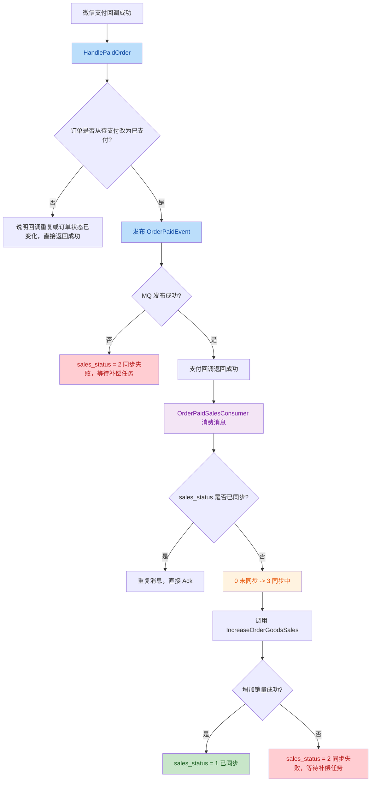
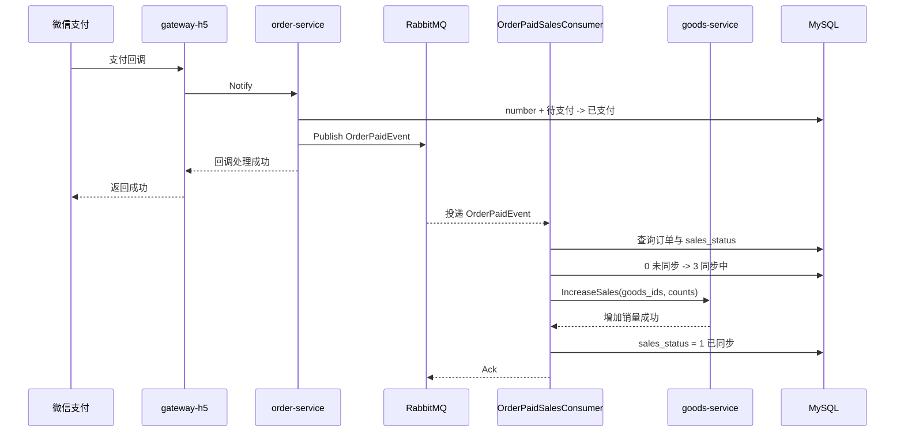
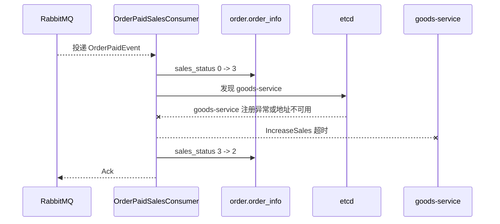
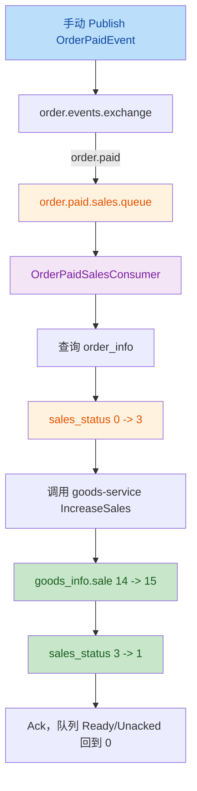
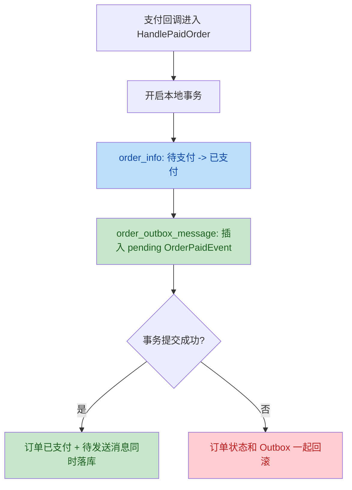
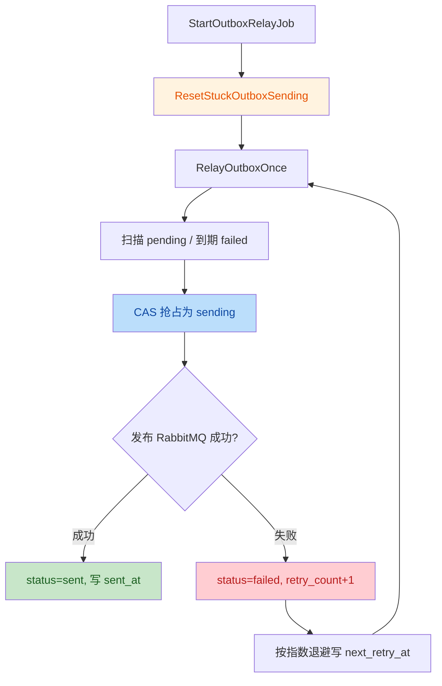
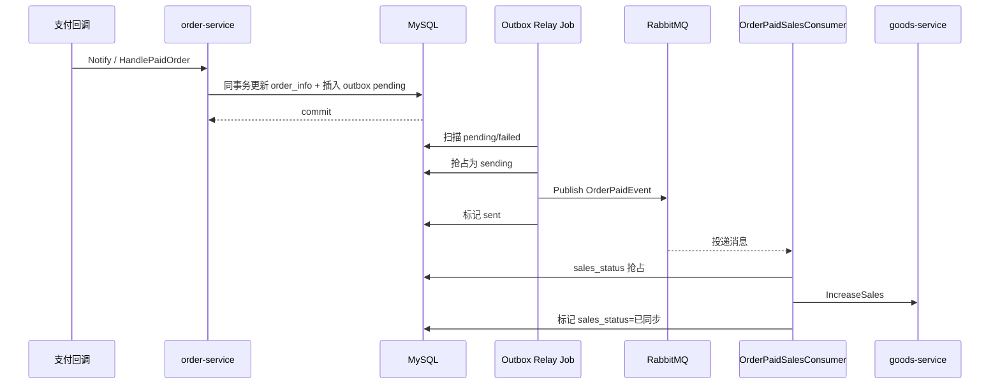
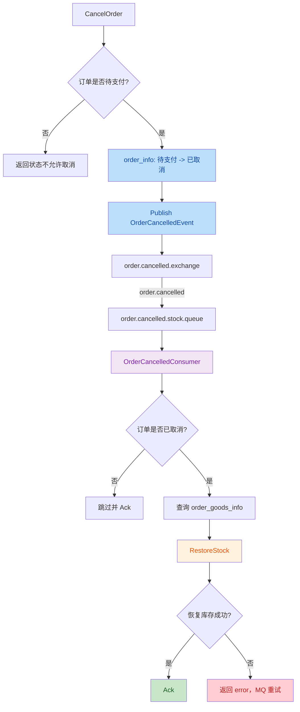

# 订单模块学习记录

订单模块是当前主线的核心。

后续订单相关内容优先记录到这个文件，不再继续堆到旧的综合文档里。

## 当前已完成

### 1. 订单预览

```text
Apifox
  -> gateway-h5 POST /frontend/order/preview
  -> order-service Preview
  -> goods-service GetSelectedItems
  -> cart_info left join goods_info
  -> order-service 汇总金额和数量
```

关键点：

- `user_id` 从 token 里取，不能由前端传
- order-service 负责编排订单预览
- goods-service 负责返回购物车商品快照
- 订单预览 item 不复用购物车 item，避免接口语义耦合

### 2. 从购物车创建订单

```text
gateway-h5
  -> order-service CreateFromCart
  -> goods-service GetSelectedItems
  -> goods-service DeductStock
  -> order-service 创建订单主表
  -> order-service 创建订单商品快照
  -> goods-service DeleteSelectedItems
```

关键点：

- 创建订单不能信任前端传价格
- 订单商品快照要保存下单当时的商品信息
- 扣库存要用条件更新：`stock >= need`
- 多商品扣库存前要按 goods_id 排序，减少死锁
- 删除购物车是跨服务后置动作，不能放进 order-service 本地事务

### 3. 取消订单与恢复库存

```text
gateway-h5 获取 user_id
  -> order-service CancelOrder
  -> 校验订单存在且属于当前用户
  -> 待支付 -> 已取消
  -> 发布 OrderCancelledEvent
  -> OrderCancelledConsumer 异步恢复库存
```

关键点：

- 取消订单必须带用户校验
- 当前学习版只允许待支付订单取消
- 状态更新要用 `FromStatus -> ToStatus`
- 当前 MQ 版恢复库存失败时不要把订单状态回滚为待支付，要保留已取消状态并交给 MQ 重试
- gRPC response 不要再包一层 `code/message/data`

### 4. 支付成功加销量

```text
支付回调成功
  -> order-service 把订单改为已支付
  -> 调 goods-service IncreaseSales
  -> 成功：sales_status = 1 已同步
  -> 失败：sales_status = 2 同步失败
```

关键点：

- 创建订单时不增加销量，支付成功后才增加销量
- 支付已经成功时，销量增加失败不能回滚订单支付状态
- 用 `sales_status` 单独记录销量同步状态
- 失败后走补偿，而不是让支付平台无限重试

### 5. 销量补偿

当前已有手动触发入口：

```text
POST /frontend/order/sales/compensate
```

```text
gateway-h5
  -> order-service Compensate
  -> order-service CompensateFailedSales
  -> 抢占订单：2 同步失败 -> 3 同步中
  -> goods-service IncreaseSales
  -> 成功：3 同步中 -> 1 已同步
  -> 失败：3 同步中 -> 2 同步失败
```

关键点：

- `TryUpdateOrderSalesStatus` 是状态字段版乐观锁
- `RowsAffected = 1` 表示抢占成功
- `RowsAffected = 0` 表示已经被别的任务处理
- 不使用悲观锁长时间包住跨服务 RPC

### 6. 补偿任务健壮性

补偿接口现在会先恢复卡住的同步中订单，再补偿同步失败订单：

```text
POST /frontend/order/sales/compensate
  -> gateway-h5
  -> order-service Compensate
  -> ResetStuckSalesSyncing
  -> CompensateFailedSales
```

恢复卡住订单：

```text
查询：
status = 已支付
AND sales_status = 3 同步中
AND updated_at < 当前时间 - 超时时间

恢复：
3 同步中 -> 2 同步失败
```

继续补偿失败订单：

```text
2 同步失败 -> 3 同步中
  -> goods-service IncreaseSales
  -> 成功：3 同步中 -> 1 已同步
  -> 失败：3 同步中 -> 2 同步失败
```

关键点：

- `sales_status=3` 代表任务已经被抢占，但业务动作还没有可靠完成
- 服务在同步中崩溃时，订单不能永久卡在 `3 同步中`
- 用 `updated_at` 判断是否超时，只恢复“卡住很久”的同步中订单
- 恢复状态也要用条件更新：`3 同步中 -> 2 同步失败`
- 手动补偿接口返回 `reset_count` 和 `compensate_count`，便于 API Fox 验证

### 7. 订单状态机整理

订单主状态已经开始收口到统一状态流转判断：

```text
待支付 -> 已支付
待支付 -> 已取消
```

关键点：

- 支付回调、用户取消、超时取消都不应该直接随意改 `status`
- 状态更新要带 `FromStatus -> ToStatus`，避免并发下重复处理
- `RowsAffected = 1` 表示本次抢到状态流转，后续业务动作才应该继续执行
- `RowsAffected = 0` 表示订单已经被其他流程处理，例如支付回调和超时取消竞争
- `sales_status` 是销量同步副状态，不要混进订单主状态机

### 8. 订单超时未支付自动取消

当前实现了手动触发入口：

```text
POST /frontend/order/timeout/cancel
```

链路：

```text
gateway-h5
  -> order-service CancelTimeout
  -> CancelTimeoutPendingOrders
  -> 扫描超时待支付订单
  -> 待支付 -> 已取消
  -> 查询订单商品快照
  -> goods-service RestoreStock
```

关键点：

- 超时取消解决的是“订单待支付但库存长期被占用”的问题
- 扫描条件是 `status = 待支付` 且 `created_at < 当前时间 - 超时时间`
- 取消订单先用条件更新抢占状态，抢占成功后才恢复库存
- 恢复库存失败时尝试把订单从已取消回滚到待支付
- 多实例同时扫描时，条件更新可以避免同一订单被重复取消
- 当前 API 入口适合学习和手动验证，后续要升级为后台任务
- 代码里已有 MQ 延迟消息版超时取消雏形，后面学习 MQ 时可以和扫描式方案对比

### 9. 补偿任务入口升级

当前把销量补偿能力整理成了 order-service 内部后台任务入口：

```text
order-service 启动
  -> 启动补偿后台任务
  -> 定时执行 ResetStuckSalesSyncing
  -> 定时执行 CompensateFailedSales
```

关键点：

- 后台任务应该放在 order-service，而不是 gateway-h5
- gateway-h5 负责 HTTP 入口，order-service 才拥有订单表和补偿逻辑
- 手动补偿 API 可以保留，作为管理端排障入口
- 后台任务需要有日志，方便观察每轮执行结果
- 单实例内可以用 `running` 防止上一轮没跑完又启动下一轮
- 多实例部署时仍然要依赖数据库条件更新抢占数据，不能只靠进程内锁

### 10. MQ 改造支付成功加销量

这一轮把“支付成功后同步调用 goods-service 增加销量”改成了 RabbitMQ 异步事件。

原来的链路：

```text
微信支付回调
  -> order-service Notify
  -> HandlePaidOrder
  -> 订单：待支付 -> 已支付
  -> 同步调用 goods-service IncreaseSales
  -> 成功：sales_status = 1 已同步
  -> 失败：sales_status = 2 同步失败
```

现在的链路：

```text
微信支付回调
  -> order-service Notify
  -> HandlePaidOrder
  -> 订单：待支付 -> 已支付
  -> 发布 OrderPaidEvent
  -> 支付回调返回成功

order-service MQ 消费者
  -> OrderPaidSalesConsumer
  -> 消费 OrderPaidEvent
  -> 抢占订单：sales_status 0 未同步 -> 3 同步中
  -> 调用 IncreaseOrderGoodsSales
  -> goods-service IncreaseSales
  -> 成功：sales_status 3 同步中 -> 1 已同步
  -> 失败：sales_status 3 同步中 -> 2 同步失败
```

这轮重点不是“用了 RabbitMQ API”，而是理解同步链路和异步链路的职责变化：

- 支付回调只负责确认“订单已经支付”这个主事实
- 增加销量是支付成功后的副作用，可以异步做
- MQ 负责推动副作用执行，不应该决定订单是否支付成功
- `sales_status` 负责记录副作用执行进度
- 补偿任务负责兜底 MQ 发布失败、消费失败、服务重启等异常情况

#### RabbitMQ 基础模型

这轮用到的几个概念：

```text
Producer 生产者：
  order-service 的 HandlePaidOrder，负责发布 OrderPaidEvent

Exchange 交换机：
  order.events.exchange，负责按 routing key 分发消息

RoutingKey 路由键：
  order.paid，表示订单支付成功事件

Queue 队列：
  order.paid.sales.queue，真正保存待消费消息

Consumer 消费者：
  OrderPaidSalesConsumer，负责消费事件并增加销量
```

对应配置：

```yaml
rabbitmq:
  exchange:
    orderExchange: "order.events.exchange"
  queue:
    orderPaidSalesQueue: "order.paid.sales.queue"
  routingKey:
    orderPaid: "order.paid"
```

#### 业务流程图



#### 技术调用时序



#### 为什么要用 sales_status 抢占

RabbitMQ 常见语义是“至少一次投递”：

```text
消息一般不会轻易丢，但可能重复投递。
```

所以消费者不能写成：

```text
收到 OrderPaidEvent
  -> 直接 IncreaseSales
```

否则重复消息会导致：

```text
sale + count
sale + count
sale + count
```

这一轮用 `sales_status` 做业务幂等：

```text
0 未同步：
  可以抢占，改成 3 同步中，然后执行增加销量

3 同步中：
  说明已有任务抢占过，不能让多个消费者同时执行副作用

1 已同步：
  说明销量已经加过，重复消息直接跳过

2 同步失败：
  交给补偿任务处理
```

关键代码思想：

```text
TryUpdateOrderSalesStatus(
  orderNumber,
  OrderSalesStatusPending,
  OrderSalesStatusSyncing,
)
```

只有 `RowsAffected = 1` 的消费者才真正拿到执行权。

#### 失败场景怎么兜底

这轮先不用本地消息表，先用 `sales_status` 和补偿任务兜底。

```text
MQ 发布失败：
  订单已经支付成功
  sales_status = 2 同步失败
  后台补偿任务后续扫描处理

消费者增加销量失败：
  sales_status = 3 同步中 -> 2 同步失败
  后台补偿任务后续扫描处理

消费者处理成功但重复收到消息：
  看到 sales_status = 1 已同步
  直接跳过，不重复加销量
```

还没有完全解决的问题：

```text
订单状态已经改成已支付，但 MQ 发送和业务事务不在同一个本地事务里。
如果本地事务成功后 MQ 投递出现边界问题，严格可靠性还不够。
```

这个问题就是下一阶段“本地消息表 / Outbox”要解决的核心。

#### API Fox / 数据库 / 日志验证

建议验证四条路径。

正常路径：

```text
触发支付回调
  -> order_info.status = 2 已支付
  -> RabbitMQ 收到 order.paid 消息
  -> OrderPaidSalesConsumer 打印收到事件日志
  -> goods_info.sale 增加
  -> order_info.sales_status = 1 已同步
```

重复消息：

```text
重复投递同一个 OrderPaidEvent
  -> 消费者看到 sales_status = 1
  -> 日志显示重复消息跳过
  -> goods_info.sale 不再增加
```

MQ 发布失败：

```text
关闭 RabbitMQ 或配置错误
  -> 支付回调仍然不应该失败
  -> order_info.status = 2
  -> order_info.sales_status = 2
  -> 等补偿任务处理
```

消费者处理失败：

```text
让 goods-service 不可用
  -> OrderPaidSalesConsumer 消费到消息
  -> IncreaseSales 失败
  -> order_info.sales_status = 2
  -> 补偿任务恢复后重试
```

### 11. MQ 验证与故障演练

这一轮不是继续写新功能，而是专门验证 `OrderPaidEvent` 的真实消息链路。

#### 手动发布 OrderPaidEvent

RabbitMQ 控制台入口：

```text
http://localhost:15672
账号：root
密码：root
```

发布位置：

```text
Exchanges
  -> order.events.exchange
  -> Publish message
```

关键填写：

```text
Routing key: order.paid
Payload encoding: String
```

消息体格式来自代码里的 `rabbitmq.OrderPaidEvent`：

```json
{
  "order_number": "订单编号",
  "transaction_id": "支付交易号",
  "paid_at": "2026-06-19 21:06:00"
}
```

这三个 JSON 字段必须和结构体 tag 对齐：

```go
type OrderPaidEvent struct {
    OrderNumber   string `json:"order_number"`
    TransactionId string `json:"transaction_id"`
    PaidAt        string `json:"paid_at"`
}
```

#### 控制台里要看什么

队列页面：

```text
Queues
  -> order.paid.sales.queue
```

核心指标：

```text
Consumers:
  应该是 1，说明 order-service 的 OrderPaidSalesConsumer 正在消费

Ready:
  等待消费的消息数量。正常消费完应该回到 0

Unacked:
  已投递给消费者但还没 Ack 的消息数量。正常消费完应该回到 0

ack:
  消费者成功确认的消息计数
```

这几个指标和代码的关系：

```mermaid
flowchart LR
    A["Publish OrderPaidEvent"] --> B["Exchange: order.events.exchange"]
    B -->|"routing key = order.paid"| C["Queue: order.paid.sales.queue"]
    C -->|"Ready -> Deliver"| D["OrderPaidSalesConsumer"]
    D --> E["HandleMessage"]
    E -->|"return nil"| F["Ack"]
    F --> G["Ready=0, Unacked=0"]

    style A fill:#bbdefb,color:#0d47a1
    style B fill:#f3e5f5,color:#7b1fa2
    style C fill:#fff3e0,color:#e65100
    style D fill:#c8e6c9,color:#1a5e20
    style F fill:#c8e6c9,color:#1a5e20
```



#### 演练 1：不存在订单

先发一条不存在的订单：

```json
{
  "order_number": "MQ_DEMO_NOT_EXIST_20260619",
  "transaction_id": "TX_DEMO_20260619",
  "paid_at": "2026-06-19 19:30:00"
}
```

预期结果：

```text
OrderPaidSalesConsumer 收到消息
  -> 查询 order_info
  -> 订单不存在
  -> 打日志
  -> return nil
  -> RabbitMQ Ack
```

这条演练的意义：

```text
验证 producer -> exchange -> queue -> consumer 链路是通的。
它不验证加销量，因为订单不存在。
```

#### 演练 2：真实订单消费失败

真实订单：

```text
order_number = TEST_STUCK_SALES_20260618_001
status       = 2 已支付
sales_status = 0 未同步
goods_id     = 4
count        = 1
```

发布消息后，order-service 日志出现：

```text
收到订单支付成功事件:
OrderNumber: TEST_STUCK_SALES_20260618_001

增加商品销售量失败: context deadline exceeded
```

这说明：

```text
RabbitMQ 消息已经成功投递给 OrderPaidSalesConsumer。
失败点不是 MQ，也不是 payload 格式，而是消费者调用 goods-service IncreaseSales 超时。
```

继续查 goods-service 日志，看到：

```text
lookup etcd on 127.0.0.11:53: no such host
```

根因：

```text
Docker 网络被拆成了两张：

order-service / rabbitmq / mysql / etcd 在 shop-goframe-micro-service-refacotor_app-network
goods-service 在 shop-micro-network

goods-service 解析不到 etcd，无法注册服务发现。
order-service 通过 etcd 找 goods-service 时超时。
```

当时链路实际卡点：



注意最后一步：

```text
消费者把 sales_status 写成 2 同步失败后，HandleMessage 返回 nil。
所以 RabbitMQ 会 Ack 这条消息，不再靠 MQ 重试。
后续由订单补偿任务扫描 sales_status=2 来恢复。
```

这就是本项目当前学习版的职责划分：

```text
MQ 负责把事件推给消费者。
业务表 sales_status 负责记录副作用有没有真正成功。
补偿任务负责恢复业务失败。
```

#### 演练 3：修复服务发现后成功消费

运行时修复：

```bash
docker network connect shop-goframe-micro-service-refacotor_app-network goods-service
docker restart goods-service
```

重启后 goods-service 日志出现：

```text
goods-service service register
etcd put success
grpc server started listening on [:31004]
```

再发另一笔干净订单：

```text
order_number = TEST_SALES_COMP_20260618013004
status       = 2 已支付
sales_status = 0 未同步
goods_id     = 4
count        = 1
```

发布 payload：

```json
{
  "order_number": "TEST_SALES_COMP_20260618013004",
  "transaction_id": "TEST_TX_MQ_RETRY_20260619",
  "paid_at": "2026-06-19 21:06:00"
}
```

验证结果：

```text
RabbitMQ: routed = true
order-service: 收到订单支付成功事件
order-service: 订单销量已同步
order_info.sales_status: 0 -> 1
goods_info.sale: 14 -> 15
Queue Ready: 0
Queue Unacked: 0
```

这一轮真正跑通的完整链路：



#### 这轮 review 记住一个坑

当前代码能覆盖“消费者调用 goods-service 失败”：

```text
sales_status 3 -> 2
后续补偿
```

但还要意识到另一个更深的边界：

```text
如果 goods-service IncreaseSales 已经成功，
但 order-service 把 sales_status 更新成 1 的数据库操作失败，
系统会出现“副作用已经成功，但业务进度状态没有成功落库”的尴尬状态。
```

这个状态后续如果被当成失败重新补偿，可能导致重复加销量。

所以现在要记住：

```text
sales_status 能解决大部分重复消费和失败补偿问题，
但它还不是严格的 exactly-once。
更强的方案需要后续继续学习：
  - goods-service 侧按 order_number 做消费幂等
  - order_sales_sync_log 之类的副作用执行日志
  - 本地消息表 / Outbox
  - 更清晰地区分 MQ 重试和业务补偿
```

这不是本轮必须马上做完的功能，但它是进入 Outbox 前必须理解的坑。

## 后续学习关注点

### MQ / RabbitMQ 巩固

问题：

```text
当前已经手动验证了 OrderPaidEvent 的投递、消费、真实失败和恢复后的成功链路。
下一步要把失败订单补偿回来，并验证重复消息不会重复增加销量。
```

目标：

```text
能自己画出 producer -> exchange -> queue -> consumer 的链路，
能解释 sales_status 为什么能防重复消费，
能通过日志、数据库、RabbitMQ 控制台验证每一步。
能解释“MQ 已 Ack 但业务失败”为什么要靠 sales_status=2 和补偿任务兜底。
```

建议先回答这些问题：

```text
同步 RPC 和 MQ 异步消息有什么区别？
支付成功加销量适合先改成 MQ 吗？
消息重复消费怎么办？
消费者处理失败怎么办？
业务表更新成功但消息发送失败怎么办？
```

这轮重点学习：

- RabbitMQ 基础模型
- 生产者和消费者职责划分
- 消费幂等
- 失败重试和补偿
- 同步 RPC 到异步事件的改造边界
- RabbitMQ 控制台里 exchange、queue、routing key 怎么对应到代码
- 为什么更严格的可靠性需要本地消息表 / Outbox

## 模块路线参考

1. MQ 补偿恢复与重复消费验证：已完成
2. 本地消息表 / Outbox：已完成
3. MQ 改造取消订单恢复库存：已完成
4. 订单详情和订单列表补齐：暂时跳过，作为普通查询组装模块后续需要时再补

### 12. 本地消息表 / Outbox

这一轮解决的是 MQ producer 侧的可靠性缺口。

之前的支付成功链路大概是：

```text
支付回调
  -> order_info.status 改为已支付
  -> 直接 Publish OrderPaidEvent 到 RabbitMQ
```

这个写法的问题是：

```text
订单状态更新成功
  -> 服务刚好重启 / 进程崩溃 / RabbitMQ 发布边界失败
  -> RabbitMQ 没有可靠收到 OrderPaidEvent
  -> 消费者不会自动增加销量
```

`sales_status` 能兜住 consumer 侧失败，但它不能完全兜住 producer 侧“业务事务已经成功、消息事实没有可靠落地”的问题。

Outbox 的核心做法是：

```text
把业务状态变更和待发送消息写进同一个本地事务。
```

也就是说，支付成功时不再直接把 MQ 发布当成业务函数的一部分，而是先把“我要发一条消息”作为数据库事实保存下来。

#### 表结构

新增表：

```text
order_outbox_message
```

核心字段：

```text
event_id:
  事件唯一 ID，用于定位和幂等排查。

event_type:
  事件类型，比如 order.paid。

aggregate_id:
  聚合根 ID，这里存 order_number。

exchange / routing_key:
  后台中继任务发布 RabbitMQ 时需要用到的投递位置。

payload:
  真正要发给 RabbitMQ 的 JSON 消息体。

status:
  0 pending  待发送
  1 sending  发送中
  2 sent     已发送
  3 failed   发送失败，等待重试

retry_count:
  已重试次数。

next_retry_at:
  下一次允许重试的时间。

last_error:
  最近一次发送失败原因。

sent_at:
  成功发送时间。
```

#### 支付成功写 Outbox

`HandlePaidOrder` 现在的职责变成：

```text
开启本地事务
  -> 把 order_info 从待支付改为已支付
  -> 插入一条 order_outbox_message，status=pending
提交事务
```

流程图：



这里要特别注意：

```text
Outbox 解决的是 producer 侧可靠落库。
它不等于 RabbitMQ 一定只投递一次。
```

后面 MQ 仍然可能重复投递，所以消费者侧的 `sales_status` 幂等仍然必须保留。

#### Outbox 中继任务

新增后台任务：

```text
StartOutboxRelayJob(ctx)
```

启动位置：

```text
app/order/internal/cmd/cmd.go
```

它会随着 order-service 启动自动运行，每 5 秒执行一轮：

```text
先恢复卡住的 sending 消息
  -> 扫描 pending / 到期 failed 消息
  -> CAS 抢占为 sending
  -> 发布到 RabbitMQ
  -> 成功标记 sent
  -> 失败标记 failed，并写 retry_count / next_retry_at / last_error
```

中继流程：



#### 为什么要有 sending 恢复

Outbox relay 发送前会先抢占：

```text
pending / failed
  -> sending
```

如果服务刚好在这里崩溃：

```text
消息已经变成 sending
但还没来得及标记 sent 或 failed
```

那这条消息就会卡住。

所以需要：

```text
ResetStuckOutboxSending(ctx, timeoutMinutes, limit)
```

它会把超时的 `sending` 恢复为 `failed`，并设置 `next_retry_at=now`，让后续 relay 重新投递。

这和之前处理 `sales_status=3 同步中卡住` 是同一种思想：

```text
中间状态不能永久停留。
只要有 syncing / sending 这种状态，就要考虑超时恢复。
```

#### 最终链路



#### 这一轮学到的边界

```text
Outbox 不是替代 MQ。
Outbox 是让“本地业务状态”和“待发消息”在数据库里同生共死。
```

```text
Outbox 不是替代消费者幂等。
消息发送成功但标记 sent 失败时，后续可能再次发送，所以消费者仍要能挡重复。
```

```text
Outbox 不是分布式事务。
它是最终一致性方案：先保证消息事实可靠落库，再由后台任务慢慢投递。
```

#### 下一轮验证重点

下一轮不要急着进入新功能，先做 Outbox 验证与故障演练：

```text
正常路径：
  支付成功
  -> order_outbox_message 出现 pending
  -> relay 发送后变 sent
  -> RabbitMQ 消费者增加销量

RabbitMQ 不可用：
  relay 发送失败
  -> status=failed
  -> retry_count 增加
  -> next_retry_at 后再次重试

sending 卡住：
  手动把一条消息改成 sending 且 updated_at 调早
  -> ResetStuckOutboxSending 恢复为 failed
  -> relay 重新投递
```

### 13. MySQL 测试数据中文乱码问题

这一轮发现一个长期容易踩的坑：

```text
通过 docker exec mysql mysql ... -e "INSERT ... 中文 ..." 插入测试数据时，
中文会变成 测试用户 这种乱码。
```

这不是表结构的问题。

当前 order 库和表字段是 `utf8mb4`，真正的问题在 MySQL 客户端连接字符集：

```text
不加参数时：

character_set_client     = latin1
character_set_connection = latin1
character_set_results    = latin1
```

也就是说：

```text
终端里输入的是 UTF-8 中文
  -> mysql 客户端按 latin1 解释
  -> 再写进 utf8mb4 表
  -> 数据已经在写入时变成乱码
```

证据：

```text
错误写入后：
测试用户 显示成 测试用户
HEX(consignee_name) = C3A6C2B5...

正确 UTF-8 应该是：
测试用户
HEX = E6B58BE8AF95E794A8E688B7
```

#### 以后插测试数据的固定规则

优先规则：

```text
学习测试数据优先用 ASCII。
比如：
  TEST_USER
  TEST_ADDRESS
  MQ compensation drill
```

如果确实需要中文，必须加：

```bash
--default-character-set=utf8mb4
```

标准命令：

```bash
docker exec mysql mysql \
  -uroot -pCHANGE_ME_MYSQL_ROOT_PASSWORD \
  --database=order \
  --default-character-set=utf8mb4 \
  -e "INSERT INTO order_info (...) VALUES ('测试用户', '测试地址', ...)"
```

查询中文时也建议带上：

```bash
docker exec mysql mysql \
  -uroot -pCHANGE_ME_MYSQL_ROOT_PASSWORD \
  --database=order \
  --default-character-set=utf8mb4 \
  -e "SELECT number, consignee_name, consignee_address FROM order_info LIMIT 5"
```

#### 更稳的工程化办法

可以后续加一个脚本，避免每次靠记忆：

```text
scripts/mysql-order.sh
scripts/mysql-goods.sh
```

脚本内部固定带：

```bash
--default-character-set=utf8mb4
```

这样以后执行手动 SQL 时就走：

```bash
scripts/mysql-order.sh -e "SELECT ..."
```

这条规则要当成学习项目里的操作规范：

```text
凡是 Codex 往 MySQL 插入测试数据：
  1. 能用 ASCII 就用 ASCII
  2. 必须中文时加 --default-character-set=utf8mb4
  3. 不再直接用裸 mysql -e 插中文
```

### 14. MQ 改造取消订单恢复库存

这一轮把“取消订单后同步调用 goods-service 恢复库存”改成了 RabbitMQ 异步事件。

这条链路只处理一种业务场景：

```text
待支付订单取消。
```

它和“已支付后退款/退货”不是一件事。

```text
待支付取消：
  下单时已经扣/占库存
  还没有支付成功
  没有增加销量
  所以取消后只需要恢复库存

已支付后退款：
  支付成功后可能已经增加销量
  后续才需要考虑退款、恢复库存、回滚销量或记录退款销量
```

所以当前这轮不用做“取消后回调销量”。销量回滚应该留到后面的支付与退款专题。

#### 当前取消链路

```text
用户取消订单
  -> gateway-h5 获取 user_id
  -> order-service CancelOrder
  -> 查询 order_info
  -> 条件更新：待支付 -> 已取消
  -> 发布 OrderCancelledEvent
  -> API 返回取消成功

RabbitMQ
  -> order.cancelled.exchange
  -> routing key: order.cancelled
  -> order.cancelled.stock.queue

order-service 消费者
  -> OrderCancelledConsumer
  -> 解析 OrderCancelledEvent
  -> 查询 order_info
  -> 确认订单仍是已取消
  -> 查询 order_goods_info 商品快照
  -> goods-service RestoreStock(goods_ids, counts)
  -> 成功 Ack
```

流程图：



#### 为什么失败时不能回滚订单状态

之前同步版里有一个直觉写法：

```text
订单已取消
  -> RestoreStock 失败
  -> 把订单从已取消回滚成待支付
```

MQ 版不能这么做。

如果消费者里恢复库存失败后把订单回滚成待支付，再返回 error，下一次 MQ 重试时消费者会看到：

```text
订单不是已取消状态
  -> 认为这条取消事件不该处理
  -> 直接跳过并 Ack
  -> 库存永远没有恢复
```

所以当前正确策略是：

```text
RestoreStock 失败：
  保持订单为已取消
  HandleMessage 返回 error
  交给 MQ 重试
```

这个点很重要：

```text
异步消费者失败时，不要随便把主状态改回去。
主状态代表业务事实，副作用失败应该靠重试、补偿、状态字段或流水兜底。
```

#### 这轮踩到的幂等重试坑

当前通用消费者框架有一层 Redis 消息幂等：

```text
收到消息
  -> 根据 message_id + business_id 写幂等 key
  -> 再执行 HandleMessage
```

这个设计能挡住重复消息，但对“业务失败后希望 MQ 重试”的场景有一个坑：

```text
第一次消费：
  写入幂等 key
  RestoreStock 失败
  返回 error
  MQ Nack requeue

第二次消费：
  先检查幂等 key
  发现消息已处理过
  直接 Ack
  RestoreStock 不会再执行
```

修复方式：

```text
业务失败并且准备重新入队时：
  释放本次拿到的幂等 key
  再 Nack(requeue=true)
```

这样下一次投递才能重新进入 `HandleMessage`。

注意这仍然只是学习版方案。

更严格的库存恢复幂等，后续应该靠业务状态或业务流水，比如：

```text
stock_return_status
order_stock_return_log
按 order_number 做 RestoreStock 幂等
```

当前为了保持进度，只做核心链路，不引入这些表。

#### 配置也属于功能的一部分

这轮还补了 `config.prod.yaml`：

```yaml
rabbitmq:
  exchange:
    orderCancelledExchange: "order.cancelled.exchange"
  queue:
    orderCancelledQueue: "order.cancelled.stock.queue"
  routingKey:
    orderCancelled: "order.cancelled"
```

原因是 `docker-compose.prod.yml` 会把：

```text
app/order/manifest/config/config.prod.yaml
```

挂载成容器里的实际配置：

```text
/app/config/config.yaml
```

所以只改本地 `config.yaml` 不够。配置缺失时，取消消费者拿不到 exchange / queue / routing key，服务启动后这条链路不会真正可用。

#### 本轮边界

这一轮只做核心能力：

```text
待支付取消
  -> 发 OrderCancelledEvent
  -> 异步 RestoreStock
  -> 失败交给 MQ 重试
```

暂时不做：

```text
取消事件 Outbox
stock_return_status
库存恢复业务流水
死信队列
退款后回滚销量
```

这些不是不重要，而是现在继续加会把学习切片拉太大。当前最重要的是先把同步 RPC 改异步 MQ 的核心模式吃透。
