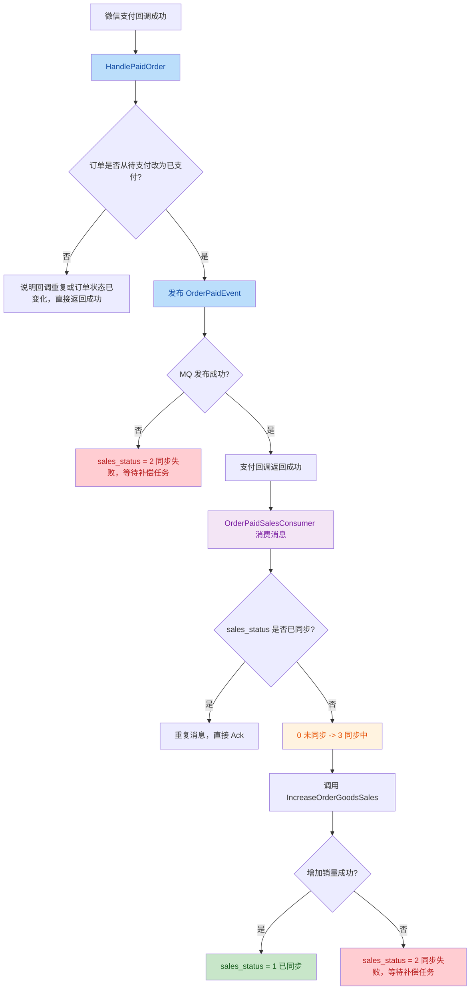
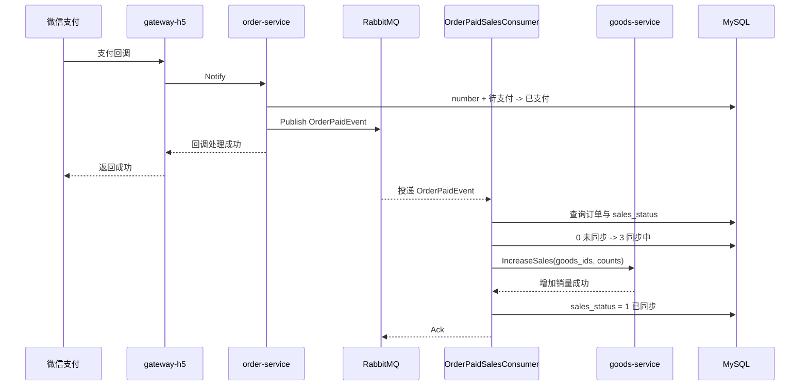

# 订单模块学习记录

订单模块是当前主线的核心。

后续订单相关内容优先记录到这个文件，不再继续堆到旧的综合文档里。

## 当前已完成

### 1. 订单预览

```text
Apifox
  -> gateway-h5 POST /frontend/order/preview
  -> order-service Preview
  -> goods-service GetSelectedItems
  -> cart_info left join goods_info
  -> order-service 汇总金额和数量
```

关键点：

- `user_id` 从 token 里取，不能由前端传
- order-service 负责编排订单预览
- goods-service 负责返回购物车商品快照
- 订单预览 item 不复用购物车 item，避免接口语义耦合

### 2. 从购物车创建订单

```text
gateway-h5
  -> order-service CreateFromCart
  -> goods-service GetSelectedItems
  -> goods-service DeductStock
  -> order-service 创建订单主表
  -> order-service 创建订单商品快照
  -> goods-service DeleteSelectedItems
```

关键点：

- 创建订单不能信任前端传价格
- 订单商品快照要保存下单当时的商品信息
- 扣库存要用条件更新：`stock >= need`
- 多商品扣库存前要按 goods_id 排序，减少死锁
- 删除购物车是跨服务后置动作，不能放进 order-service 本地事务

### 3. 取消订单与恢复库存

```text
gateway-h5 获取 user_id
  -> order-service CancelOrder
  -> 校验订单存在且属于当前用户
  -> 待支付 -> 已取消
  -> goods-service RestoreStock
```

关键点：

- 取消订单必须带用户校验
- 当前学习版只允许待支付订单取消
- 状态更新要用 `FromStatus -> ToStatus`
- 恢复库存失败时尝试把订单状态回滚为待支付
- gRPC response 不要再包一层 `code/message/data`

### 4. 支付成功加销量

```text
支付回调成功
  -> order-service 把订单改为已支付
  -> 调 goods-service IncreaseSales
  -> 成功：sales_status = 1 已同步
  -> 失败：sales_status = 2 同步失败
```

关键点：

- 创建订单时不增加销量，支付成功后才增加销量
- 支付已经成功时，销量增加失败不能回滚订单支付状态
- 用 `sales_status` 单独记录销量同步状态
- 失败后走补偿，而不是让支付平台无限重试

### 5. 销量补偿

当前已有手动触发入口：

```text
POST /frontend/order/sales/compensate
```

```text
gateway-h5
  -> order-service Compensate
  -> order-service CompensateFailedSales
  -> 抢占订单：2 同步失败 -> 3 同步中
  -> goods-service IncreaseSales
  -> 成功：3 同步中 -> 1 已同步
  -> 失败：3 同步中 -> 2 同步失败
```

关键点：

- `TryUpdateOrderSalesStatus` 是状态字段版乐观锁
- `RowsAffected = 1` 表示抢占成功
- `RowsAffected = 0` 表示已经被别的任务处理
- 不使用悲观锁长时间包住跨服务 RPC

### 6. 补偿任务健壮性

补偿接口现在会先恢复卡住的同步中订单，再补偿同步失败订单：

```text
POST /frontend/order/sales/compensate
  -> gateway-h5
  -> order-service Compensate
  -> ResetStuckSalesSyncing
  -> CompensateFailedSales
```

恢复卡住订单：

```text
查询：
status = 已支付
AND sales_status = 3 同步中
AND updated_at < 当前时间 - 超时时间

恢复：
3 同步中 -> 2 同步失败
```

继续补偿失败订单：

```text
2 同步失败 -> 3 同步中
  -> goods-service IncreaseSales
  -> 成功：3 同步中 -> 1 已同步
  -> 失败：3 同步中 -> 2 同步失败
```

关键点：

- `sales_status=3` 代表任务已经被抢占，但业务动作还没有可靠完成
- 服务在同步中崩溃时，订单不能永久卡在 `3 同步中`
- 用 `updated_at` 判断是否超时，只恢复“卡住很久”的同步中订单
- 恢复状态也要用条件更新：`3 同步中 -> 2 同步失败`
- 手动补偿接口返回 `reset_count` 和 `compensate_count`，便于 API Fox 验证

### 7. 订单状态机整理

订单主状态已经开始收口到统一状态流转判断：

```text
待支付 -> 已支付
待支付 -> 已取消
已取消 -> 待支付（仅用于恢复库存失败后的回滚）
```

关键点：

- 支付回调、用户取消、超时取消都不应该直接随意改 `status`
- 状态更新要带 `FromStatus -> ToStatus`，避免并发下重复处理
- `RowsAffected = 1` 表示本次抢到状态流转，后续业务动作才应该继续执行
- `RowsAffected = 0` 表示订单已经被其他流程处理，例如支付回调和超时取消竞争
- `sales_status` 是销量同步副状态，不要混进订单主状态机

### 8. 订单超时未支付自动取消

当前实现了手动触发入口：

```text
POST /frontend/order/timeout/cancel
```

链路：

```text
gateway-h5
  -> order-service CancelTimeout
  -> CancelTimeoutPendingOrders
  -> 扫描超时待支付订单
  -> 待支付 -> 已取消
  -> 查询订单商品快照
  -> goods-service RestoreStock
```

关键点：

- 超时取消解决的是“订单待支付但库存长期被占用”的问题
- 扫描条件是 `status = 待支付` 且 `created_at < 当前时间 - 超时时间`
- 取消订单先用条件更新抢占状态，抢占成功后才恢复库存
- 恢复库存失败时尝试把订单从已取消回滚到待支付
- 多实例同时扫描时，条件更新可以避免同一订单被重复取消
- 当前 API 入口适合学习和手动验证，后续要升级为后台任务
- 代码里已有 MQ 延迟消息版超时取消雏形，后面学习 MQ 时可以和扫描式方案对比

### 9. 补偿任务入口升级

当前把销量补偿能力整理成了 order-service 内部后台任务入口：

```text
order-service 启动
  -> 启动补偿后台任务
  -> 定时执行 ResetStuckSalesSyncing
  -> 定时执行 CompensateFailedSales
```

关键点：

- 后台任务应该放在 order-service，而不是 gateway-h5
- gateway-h5 负责 HTTP 入口，order-service 才拥有订单表和补偿逻辑
- 手动补偿 API 可以保留，作为管理端排障入口
- 后台任务需要有日志，方便观察每轮执行结果
- 单实例内可以用 `running` 防止上一轮没跑完又启动下一轮
- 多实例部署时仍然要依赖数据库条件更新抢占数据，不能只靠进程内锁

### 10. MQ 改造支付成功加销量

这一轮把“支付成功后同步调用 goods-service 增加销量”改成了 RabbitMQ 异步事件。

原来的链路：

```text
微信支付回调
  -> order-service Notify
  -> HandlePaidOrder
  -> 订单：待支付 -> 已支付
  -> 同步调用 goods-service IncreaseSales
  -> 成功：sales_status = 1 已同步
  -> 失败：sales_status = 2 同步失败
```

现在的链路：

```text
微信支付回调
  -> order-service Notify
  -> HandlePaidOrder
  -> 订单：待支付 -> 已支付
  -> 发布 OrderPaidEvent
  -> 支付回调返回成功

order-service MQ 消费者
  -> OrderPaidSalesConsumer
  -> 消费 OrderPaidEvent
  -> 抢占订单：sales_status 0 未同步 -> 3 同步中
  -> 调用 IncreaseOrderGoodsSales
  -> goods-service IncreaseSales
  -> 成功：sales_status 3 同步中 -> 1 已同步
  -> 失败：sales_status 3 同步中 -> 2 同步失败
```

这轮重点不是“用了 RabbitMQ API”，而是理解同步链路和异步链路的职责变化：

- 支付回调只负责确认“订单已经支付”这个主事实
- 增加销量是支付成功后的副作用，可以异步做
- MQ 负责推动副作用执行，不应该决定订单是否支付成功
- `sales_status` 负责记录副作用执行进度
- 补偿任务负责兜底 MQ 发布失败、消费失败、服务重启等异常情况

#### RabbitMQ 基础模型

这轮用到的几个概念：

```text
Producer 生产者：
  order-service 的 HandlePaidOrder，负责发布 OrderPaidEvent

Exchange 交换机：
  order.events.exchange，负责按 routing key 分发消息

RoutingKey 路由键：
  order.paid，表示订单支付成功事件

Queue 队列：
  order.paid.sales.queue，真正保存待消费消息

Consumer 消费者：
  OrderPaidSalesConsumer，负责消费事件并增加销量
```

对应配置：

```yaml
rabbitmq:
  exchange:
    orderExchange: "order.events.exchange"
  queue:
    orderPaidSalesQueue: "order.paid.sales.queue"
  routingKey:
    orderPaid: "order.paid"
```

#### 业务流程图



#### 技术调用时序



#### 为什么要用 sales_status 抢占

RabbitMQ 常见语义是“至少一次投递”：

```text
消息一般不会轻易丢，但可能重复投递。
```

所以消费者不能写成：

```text
收到 OrderPaidEvent
  -> 直接 IncreaseSales
```

否则重复消息会导致：

```text
sale + count
sale + count
sale + count
```

这一轮用 `sales_status` 做业务幂等：

```text
0 未同步：
  可以抢占，改成 3 同步中，然后执行增加销量

3 同步中：
  说明已有任务抢占过，不能让多个消费者同时执行副作用

1 已同步：
  说明销量已经加过，重复消息直接跳过

2 同步失败：
  交给补偿任务处理
```

关键代码思想：

```text
TryUpdateOrderSalesStatus(
  orderNumber,
  OrderSalesStatusPending,
  OrderSalesStatusSyncing,
)
```

只有 `RowsAffected = 1` 的消费者才真正拿到执行权。

#### 失败场景怎么兜底

这轮先不用本地消息表，先用 `sales_status` 和补偿任务兜底。

```text
MQ 发布失败：
  订单已经支付成功
  sales_status = 2 同步失败
  后台补偿任务后续扫描处理

消费者增加销量失败：
  sales_status = 3 同步中 -> 2 同步失败
  后台补偿任务后续扫描处理

消费者处理成功但重复收到消息：
  看到 sales_status = 1 已同步
  直接跳过，不重复加销量
```

还没有完全解决的问题：

```text
订单状态已经改成已支付，但 MQ 发送和业务事务不在同一个本地事务里。
如果本地事务成功后 MQ 投递出现边界问题，严格可靠性还不够。
```

这个问题就是下一阶段“本地消息表 / Outbox”要解决的核心。

#### API Fox / 数据库 / 日志验证

建议验证四条路径。

正常路径：

```text
触发支付回调
  -> order_info.status = 2 已支付
  -> RabbitMQ 收到 order.paid 消息
  -> OrderPaidSalesConsumer 打印收到事件日志
  -> goods_info.sale 增加
  -> order_info.sales_status = 1 已同步
```

重复消息：

```text
重复投递同一个 OrderPaidEvent
  -> 消费者看到 sales_status = 1
  -> 日志显示重复消息跳过
  -> goods_info.sale 不再增加
```

MQ 发布失败：

```text
关闭 RabbitMQ 或配置错误
  -> 支付回调仍然不应该失败
  -> order_info.status = 2
  -> order_info.sales_status = 2
  -> 等补偿任务处理
```

消费者处理失败：

```text
让 goods-service 不可用
  -> OrderPaidSalesConsumer 消费到消息
  -> IncreaseSales 失败
  -> order_info.sales_status = 2
  -> 补偿任务恢复后重试
```

## 后续学习关注点

### MQ / RabbitMQ 巩固

问题：

```text
当前已经把支付成功加销量改成了 OrderPaidEvent 异步消费。
但 MQ 还是第一次接触，需要先把消息流、重复消费、失败恢复验证透。
```

目标：

```text
能自己画出 producer -> exchange -> queue -> consumer 的链路，
能解释 sales_status 为什么能防重复消费，
能通过日志、数据库、RabbitMQ 控制台验证每一步。
```

建议先回答这些问题：

```text
同步 RPC 和 MQ 异步消息有什么区别？
支付成功加销量适合先改成 MQ 吗？
消息重复消费怎么办？
消费者处理失败怎么办？
业务表更新成功但消息发送失败怎么办？
```

这轮重点学习：

- RabbitMQ 基础模型
- 生产者和消费者职责划分
- 消费幂等
- 失败重试和补偿
- 同步 RPC 到异步事件的改造边界
- RabbitMQ 控制台里 exchange、queue、routing key 怎么对应到代码
- 为什么更严格的可靠性需要本地消息表 / Outbox

## 模块路线参考

1. MQ 验证与故障演练：重复消息、消费失败、发布失败、补偿恢复
2. 本地消息表 / Outbox
3. MQ 改造取消订单恢复库存
4. 订单详情和订单列表补齐
