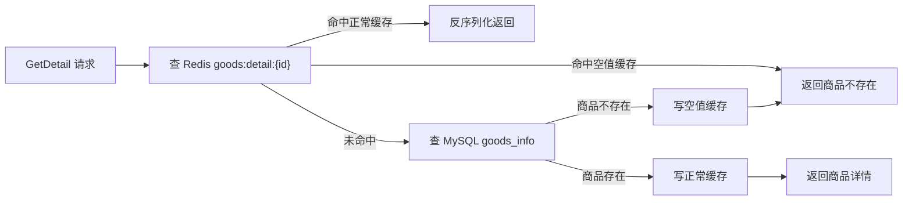
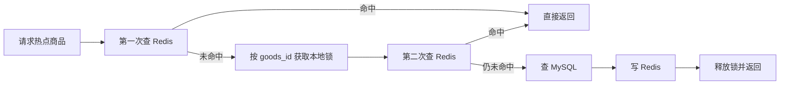

# Redis 高并发缓存

这份文档记录 Redis 缓存专题的关键学习点。当前阶段不追求把 Redis 做成完整缓存平台，只掌握电商项目里最常见、最实用的几类问题。

## 1. 本轮目标

这一轮用商品详情接口学习 Redis 缓存基础模式：

- Cache Aside：先查缓存，未命中再查 MySQL。
- 空值缓存：MySQL 查不到时也写短 TTL 空值，防止缓存穿透。
- 缓存失效：更新或删除商品后删除 Redis 缓存。
- 缓存击穿：热点 key 过期时，用本地互斥锁控制回源。
- 缓存雪崩：正常缓存和空值缓存都加随机 TTL。
- Redis 计数边界：知道哪些计数可以用 Redis，哪些核心状态不能只靠 Redis。

## 2. 商品详情 Cache Aside

商品详情是典型的读多写少接口，适合先做 Redis 缓存。

当前 key 设计：

```text
goods:detail:{goods_id}
```

读取流程：



核心认知：

```text
Redis 是读缓存，不是主库。
MySQL 才是商品详情的真实数据来源。
```

## 3. 空值缓存防穿透

缓存穿透指的是：请求查询一个根本不存在的数据，Redis 查不到，MySQL 也查不到，但每次请求都会继续打 MySQL。

解决方式：

```text
MySQL 查不到商品时，写入空值缓存。
```

当前空值标记：

```text
__EMPTY__
```

当前空值缓存 TTL：

```text
1 分钟 + 0~30 秒随机值
```

为什么空值 TTL 要短：

```text
空值缓存只是为了保护数据库；
如果后面真的创建了这个 id 的商品，不应该被旧空值缓存挡太久。
```

## 4. 更新和删除后的缓存失效

本轮确认并补齐了商品写操作后的缓存失效。

原则：

```text
先更新 MySQL，再删除 Redis 缓存。
下一次读请求回源 MySQL，并重建缓存。
```

为什么是删除缓存，不是直接更新缓存：

```text
MySQL 是主数据；
Redis 是读模型；
删除缓存比双写缓存更简单，也更不容易产生脏缓存。
```

当前代码点：

- `Update`：更新商品后删除 `goods:detail:{id}`。
- `Delete`：删除商品后删除 `goods:detail:{id}`。

删除缓存失败时只打 warning，不阻断主业务：

```text
商品更新/删除已经成功，缓存删除失败属于旁路问题；
可以通过 TTL 过期、后续补偿或人工排障恢复。
```

## 5. 缓存击穿和本地互斥

缓存击穿指的是：某个热点商品缓存刚好过期，大量请求同时发现 Redis miss，然后一起打到 MySQL。

本轮做的是单实例本地互斥版本：



为什么要查两次 Redis：

```text
第一次查：正常快路径。
第二次查：拿到锁后再确认一次，防止前一个请求已经回源并写好了缓存。
```

当前做法的边界：

```text
本地锁只保护当前 goods-service 进程。
如果部署多个 goods-service 实例，不同实例之间仍然可能同时回源 MySQL。
```

多实例版本后面再学：

```text
Redis SET NX EX 分布式锁
锁值唯一 token
释放锁时校验 token
锁过期时间
Lua 原子释放锁
```

## 6. 缓存雪崩和 TTL 随机化

缓存雪崩指的是：大量缓存 key 在同一时间过期，导致请求集中打到 MySQL。

本轮处理方式：

```text
TTL = 基础过期时间 + 随机抖动
```

当前策略：

```text
正常商品详情缓存：1 小时 + 0~10 分钟随机值
空值缓存：1 分钟 + 0~30 秒随机值
```

核心认知：

```text
TTL 随机化不是为了更精确；
它是为了错开过期时间，避免大量 key 同时失效。
```

## 7. Redis 计数边界

Redis 计数适合展示型、高频读写、允许异步校准的数据。

适合：

```text
浏览量
点赞数展示
收藏数展示
评论数展示
商品展示销量
```

不适合只靠 Redis：

```text
库存扣减
订单状态
支付状态
退款状态
```

原因：

```text
库存、订单、支付都是核心业务状态；
它们需要 MySQL 持久化、事务、幂等和补偿，不能只依赖 Redis 内存值。
```

面试表达：

```text
点赞数、浏览量这类展示型计数可以用 Redis INCR 扛高并发，再异步落库或定时校准；
但库存、订单状态、支付状态必须以数据库状态机为准，Redis 只能做缓存或辅助读模型。
```

## 8. 本轮验证

代码验证：

```bash
go test ./app/goods/internal/controller/goods_info ./app/goods/utility/goodsRedis
```

预期：

```text
goods_info controller 测试通过
goodsRedis 无测试文件但能编译通过
```

接口/日志验证建议：

```text
第一次查存在商品：Redis miss -> MySQL hit -> 写缓存
第二次查同商品：Redis hit
第一次查不存在商品：MySQL empty -> 写空值缓存
第二次查不存在商品：命中空值缓存
更新商品：删除商品详情缓存
删除商品：删除商品详情缓存
```

Redis key 验证：

```bash
docker exec redis redis-cli -n 1 keys 'goods:detail:*'
docker exec redis redis-cli -n 1 ttl 'goods:detail:{id}'
```

## 9. 后续不在本轮展开

为了提速，下面内容先不深入：

- Redis Cluster
- 布隆过滤器
- 多级缓存
- 生产级分布式锁
- Lua 扣库存
- 秒杀库存预热
- Redis 计数异步落库

这些分别放到后面的互动模块和秒杀专题里再学。
