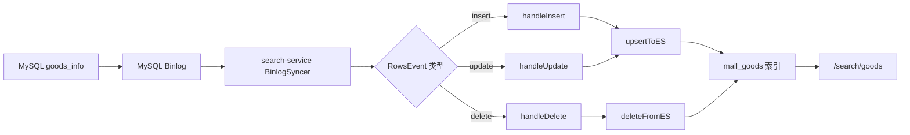

# 搜索模块

这份文档记录搜索服务相关学习：MySQL 到 ES 的数据同步、ES 商品搜索、常见过滤和排序。

## 1. Binlog / CDC 最小闭环

这一轮只学最实用的部分，不深入位点、GTID、断点续传、全量同步。

核心链路：



这条链路要解决的问题是：商品数据以 MySQL 为准，但搜索读取 ES。MySQL 发生变化后，CDC 把变化同步到 ES，让 ES 成为搜索读模型。

## 2. MQ / Outbox / CDC 的边界

三者不要混在一起：

- MQ：表达业务事件，例如订单已支付、订单已取消。
- Outbox：解决本地事务成功但 MQ 发送失败的一致性缺口。
- CDC：监听数据库变更，适合同步 ES、报表、审计，不适合替代核心业务事件。

判断方式：

```text
需要驱动业务动作 -> 优先 MQ
需要保证事务和消息一起成功 -> Outbox
需要把数据库变化同步到搜索/报表 -> CDC
```

## 3. 这轮动手实战

为了看懂 Binlog 事件，我们给 `handleInsert`、`handleUpdate`、`handleDelete` 加了观察日志。

关键点：

- `insert`：RowsEvent 里每行都是新数据。
- `delete`：RowsEvent 里每行都是被删除前的旧数据。
- `update`：RowsEvent 是旧行、新行成对出现，形如 `[oldRow, newRow, oldRow, newRow...]`。

所以 update 要这样理解：

```text
rows[i]     = 修改前
rows[i + 1] = 修改后
```

## 4. 字段顺序坑

当前实现用 `parseRowData(row)` 按表字段顺序把 Binlog 行解析成 map。

这很直观，但有一个常见风险：

```text
代码里的 fields 顺序必须和 goods_info 表结构一致。
如果表中间新增字段，但 fields 没补，后面的 created_at / updated_at / deleted_at 会整体错位。
```

这轮已经补齐：

```text
enable_bargain
bargain_price
```

## 5. 验证方式

执行一组 SQL：

```sql
INSERT INTO goods_info (...) VALUES (...);
UPDATE goods_info SET name = '...', price = ... WHERE id = ...;
DELETE FROM goods_info WHERE id = ...;
```

观察 `search-service` 日志：

```bash
docker logs -f search-service | grep 'CDC'
```

预期看到：

```text
CDC INSERT goods_info id=...
CDC UPDATE goods_info id=... old_name=... new_name=...
CDC DELETE goods_info id=...
```

## 6. 暂不深入的内容

为了保持效率，下面这些先知道名字，不在当前阶段实现：

- Binlog 位点 checkpoint
- GTID
- Canal / Debezium
- 全量同步
- ES 写失败重试
- schema 自动识别

这些是把 CDC 做成生产级同步系统时才需要继续补的内容。

## 7. 下一步：ES 商品搜索实战

下一轮只做最常见的搜索能力：

- 关键词从只搜 `name` 扩展到搜 `name`、`tags`、`brand`、`detail_info`
- 保留品牌过滤、价格区间、销量/价格排序、分页
- 理解 `match` 和 `term` 的区别
- 看懂高亮为什么只对参与搜索的字段生效

目标不是学完 ES，而是能改一个真实商品搜索接口。
