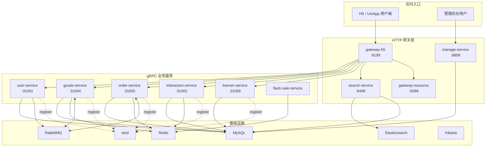
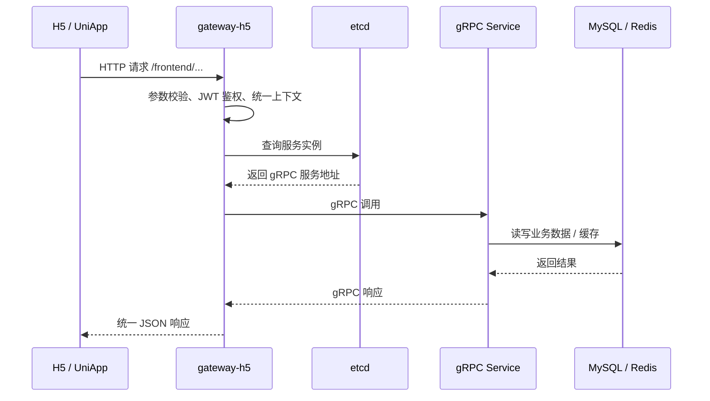
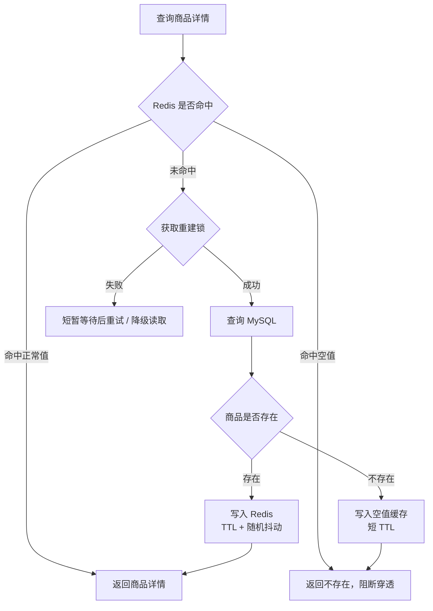
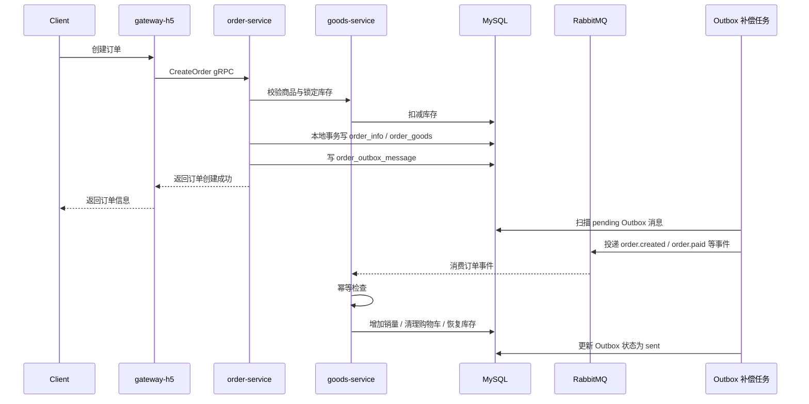
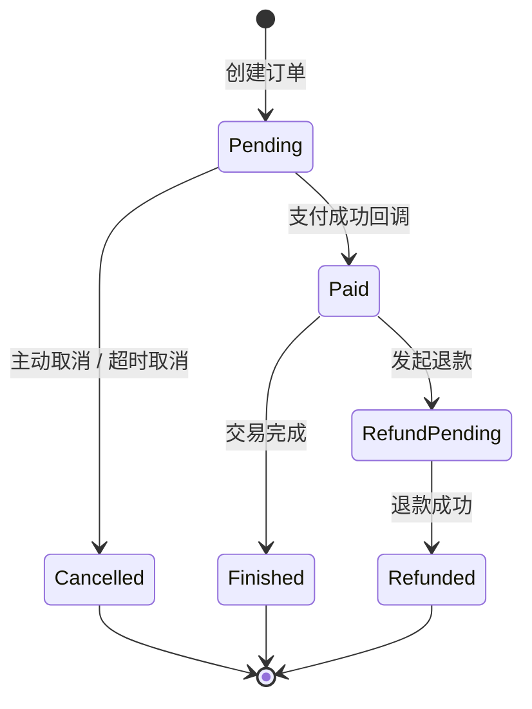
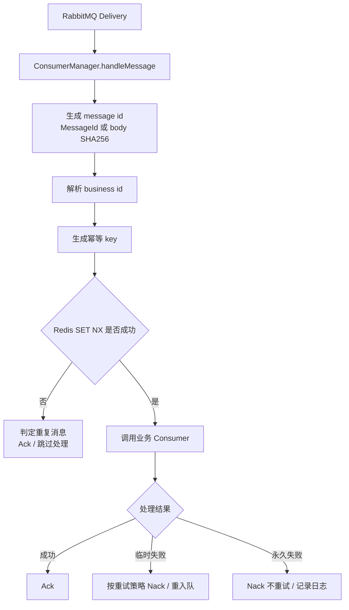
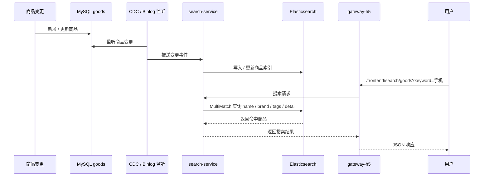
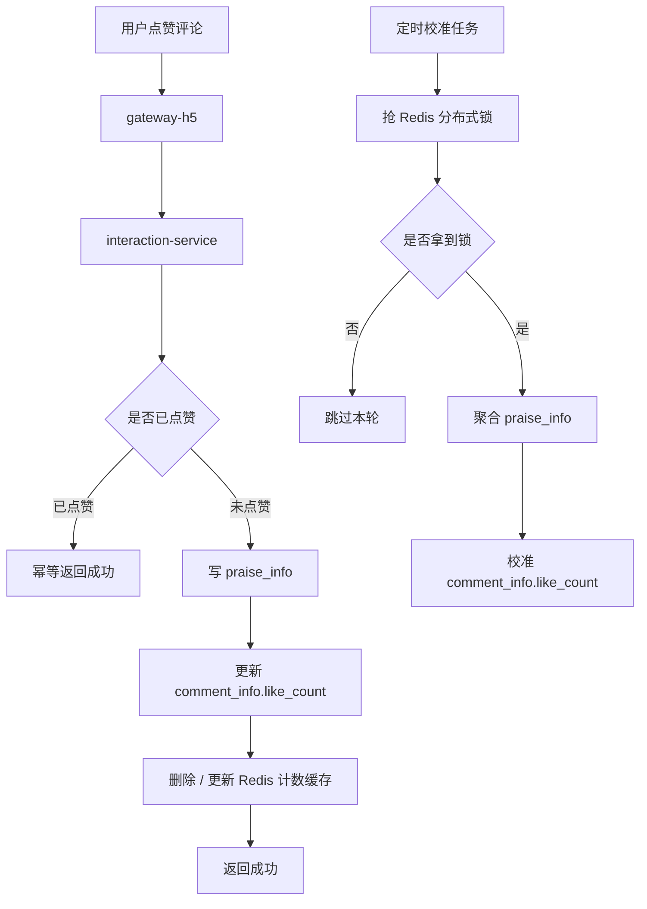
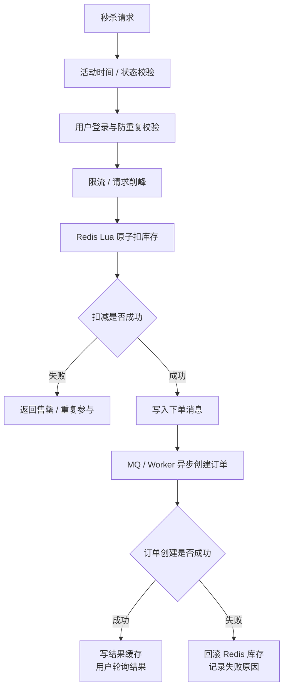
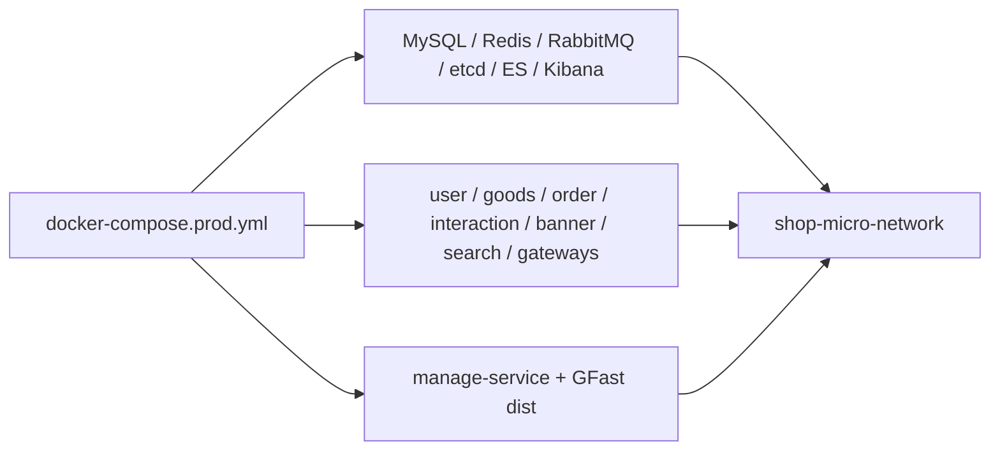

# GoFrame 微服务电商后端

这是一个基于 GoFrame v2 的微服务电商后端项目，围绕用户、商品、订单、互动、搜索、秒杀和网关进行服务拆分，使用 gRPC 完成服务间调用，使用 HTTP Gateway 对外提供接口，并通过 Docker Compose 编排 MySQL、Redis、RabbitMQ、etcd、Elasticsearch、Kibana 和业务服务。

项目重点不是简单 CRUD，而是把电商系统里常见的工程问题串起来：缓存一致性、订单最终一致性、消息幂等、库存防超卖、搜索数据同步、评论点赞计数、服务注册发现和本地生产形态部署。

## 技术栈

| 分类 | 技术 |
| --- | --- |
| 后端框架 | GoFrame v2 |
| 服务通信 | gRPC、HTTP Gateway |
| 注册发现 | etcd |
| 数据库 | MySQL 8.0 |
| 缓存与并发 | Redis、Redis Lua、分布式锁 |
| 消息队列 | RabbitMQ、延迟消息插件、消费幂等、重试 |
| 搜索 | Elasticsearch 8.11、IK 分词 |
| 部署 | Docker、Docker Compose |
| 管理端 | GFast 管理后台 |

## 服务划分

| 服务 | 端口 | 类型 | 说明 |
| --- | --- | --- | --- |
| `gateway-h5` | `8199` | HTTP | 用户端网关，聚合用户、商品、订单、互动、搜索等接口 |
| `gateway-resource` | `8399` | HTTP | 文件上传与资源访问 |
| `search-service` | `8499` | HTTP | 商品搜索、ES 索引写入和查询 |
| `user-service` | `31001` | gRPC | 注册、登录、用户信息、收货地址 |
| `interaction-service` | `31002` | gRPC | 评论、回复、点赞、收藏、计数校准 |
| `goods-service` | `31004` | gRPC | 商品、分类、库存、购物车、优惠券、用户注册发券 |
| `order-service` | `31005` | gRPC | 订单预览、创建、取消、支付回调、Outbox、补偿任务 |
| `banner-service` | `31006` | gRPC | 轮播图 |
| `flash-sale-service` | - | gRPC / worker | 秒杀活动、库存扣减、异步下单链路 |
| `manage-service` | `8808` | HTTP | GFast 管理后台服务端，位于相邻仓库 `../shop-goframe-micro-manage` |

## 总体架构图



## 请求调用链路

用户端请求统一进入 `gateway-h5`。网关完成参数绑定、鉴权和响应封装后，通过 etcd 发现目标 gRPC 服务，再调用对应业务服务。



典型路径：

| 场景 | HTTP 入口 | 后端链路 |
| --- | --- | --- |
| 商品列表 | `/frontend/goods` | gateway-h5 -> goods-service -> MySQL |
| 商品搜索 | `/frontend/search/goods` | gateway-h5 -> search-service -> Elasticsearch |
| 登录注册 | `/frontend/user/login`、`/frontend/user/register` | gateway-h5 -> user-service -> MySQL / RabbitMQ |
| 购物车 | `/frontend/cart` | gateway-h5 -> goods-service -> MySQL |
| 订单 | `/frontend/order` | gateway-h5 -> order-service -> goods-service / MySQL / RabbitMQ |
| 评论点赞收藏 | `/frontend/comment`、`/frontend/praise`、`/frontend/collect` | gateway-h5 -> interaction-service -> MySQL / Redis |

## 商品缓存链路

商品详情使用 Cache Aside 模式，配合空值缓存、TTL 随机化和互斥重建处理缓存穿透、击穿和雪崩。



## 订单与最终一致性链路

订单模块重点处理库存、订单状态、销量、优惠券和消息投递之间的一致性问题。核心思路是：本地事务保证订单主数据一致，Outbox 保证关键事件可靠投递，RabbitMQ 消费者通过幂等锁避免重复处理，后台补偿任务兜底异常状态。



订单状态和补偿：



## RabbitMQ 消费幂等与重试

消息消费统一经过 ConsumerManager。若消息没有 `MessageId`，使用消息体 SHA256 作为稳定兜底 ID；幂等 key 写入 Redis，避免重复消费导致重复加销量、重复发券或重复恢复库存。



## 搜索同步链路

商品搜索由 `search-service` 接入 Elasticsearch。商品数据从 MySQL 同步到 ES 后，用户通过 H5 网关进行多字段检索。



## 互动模块链路

互动模块包含评论、回复、点赞和收藏。点赞使用唯一约束和业务幂等保证重复操作安全，评论点赞计数通过 MySQL 冗余字段 + Redis 旁路缓存提升读取效率，再由定时校准任务兜底修正计数。



## 秒杀高并发链路

秒杀链路使用 Redis 承载热点库存，通过 Lua 脚本保证库存扣减和用户防重的原子性；下单流程异步化，削减数据库瞬时压力。



## Docker Compose 部署拓扑

生产形态入口文件：

```bash
docker compose -f docker-compose.prod.yml config --quiet
docker compose -f docker-compose.prod.yml build
docker compose -f docker-compose.prod.yml up -d
```



常用访问入口：

| 服务 | 地址 |
| --- | --- |
| H5 网关 OpenAPI | http://localhost:8199/api.json |
| H5 网关 Swagger | http://localhost:8199/swagger |
| 搜索服务 Swagger | http://localhost:8499/swagger |
| 管理后台 | http://localhost:8808 |
| RabbitMQ 管理界面 | http://localhost:15672 |
| Elasticsearch | http://localhost:9200 |
| Kibana | http://localhost:5601 |

## 快速启动

### 1. 启动完整生产形态

```bash
docker compose -f docker-compose.prod.yml up -d
```

### 2. 查看服务状态

```bash
docker compose -f docker-compose.prod.yml ps
```

### 3. 冒烟验证

```bash
curl http://localhost:8199/api.json
curl http://localhost:8499/swagger
curl http://localhost:9200/_cluster/health
```

## 本地开发模式

如果只想本地调试某个服务，可以只启动中间件，再在本机运行目标 Go 服务。

```bash
docker compose -f docker-compose.prod.yml up -d mysql redis rabbitmq etcd elasticsearch
```

然后启动需要调试的微服务：

```bash
cd app/goods
go run main.go
```

再启动网关：

```bash
cd app/gateway-h5
go run main.go
```

最小调试组合：

| 调试目标 | 需要启动 |
| --- | --- |
| 商品接口 | etcd、MySQL、Redis、goods-service、gateway-h5 |
| 订单接口 | etcd、MySQL、Redis、RabbitMQ、goods-service、order-service、gateway-h5 |
| 搜索接口 | MySQL、Elasticsearch、search-service、gateway-h5 |
| 评论点赞 | etcd、MySQL、Redis、interaction-service、gateway-h5 |

## 文档导航

| 文档 | 说明 |
| --- | --- |
| [`doc/学习路径/00-学习总路线.md`](./doc/学习路径/00-学习总路线.md) | 项目学习路线总览 |
| [`doc/学习路径/04-订单模块.md`](./doc/学习路径/04-订单模块.md) | 订单模块、Outbox、补偿任务 |
| [`doc/学习路径/06-Redis高并发缓存.md`](./doc/学习路径/06-Redis高并发缓存.md) | Redis 缓存治理 |
| [`doc/学习路径/08-互动模块.md`](./doc/学习路径/08-互动模块.md) | 评论、点赞、收藏 |
| [`doc/学习路径/09-秒杀高并发专题.md`](./doc/学习路径/09-秒杀高并发专题.md) | 秒杀高并发专题 |
| [`doc/学习路径/10-搜索模块.md`](./doc/学习路径/10-搜索模块.md) | Elasticsearch 搜索 |
| [`doc/学习路径/10-项目封版与部署上线.md`](./doc/学习路径/10-项目封版与部署上线.md) | 部署上线与封版验证 |
| [`doc/RabbitMQ消息处理优化实战-幂等性与重试策略.md`](./doc/RabbitMQ消息处理优化实战-幂等性与重试策略.md) | RabbitMQ 幂等与重试 |
| [`doc/Redis缓存策略-穿透-击穿-雪崩全解决方案.md`](./doc/Redis缓存策略-穿透-击穿-雪崩全解决方案.md) | Redis 缓存策略 |

## 项目亮点

- 从单体电商能力演进到微服务架构，覆盖服务注册发现、网关聚合、gRPC 通信和 Docker 编排。
- 订单链路引入状态机、Outbox、本地补偿任务、RabbitMQ 异步消费和消费幂等，围绕最终一致性做完整闭环。
- 商品详情和互动计数引入 Redis 缓存，结合空值缓存、TTL 随机化、互斥重建、分布式锁和定时校准处理高并发读写问题。
- 商品搜索接入 Elasticsearch，支持 MySQL 到 ES 的同步、多字段检索和中文分词。
- 秒杀链路使用 Redis Lua、请求削峰、异步下单和失败补偿处理热点库存扣减。
- 项目具备可运行的本地生产形态，便于用日志、数据库、RabbitMQ 控制台和 HTTP 接口做端到端验证。
