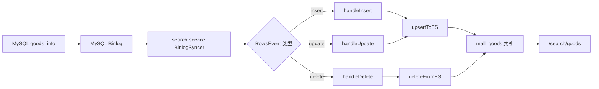
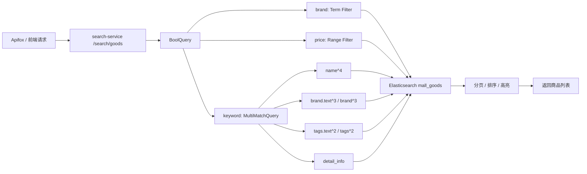

# 搜索模块

这份文档记录搜索服务相关学习：MySQL 到 ES 的数据同步、ES 商品搜索、常见过滤和排序。

## 1. Binlog / CDC 最小闭环

这一轮只学最实用的部分，不深入位点、GTID、断点续传、全量同步。

核心链路：



这条链路要解决的问题是：商品数据以 MySQL 为准，但搜索读取 ES。MySQL 发生变化后，CDC 把变化同步到 ES，让 ES 成为搜索读模型。

## 2. MQ / Outbox / CDC 的边界

三者不要混在一起：

- MQ：表达业务事件，例如订单已支付、订单已取消。
- Outbox：解决本地事务成功但 MQ 发送失败的一致性缺口。
- CDC：监听数据库变更，适合同步 ES、报表、审计，不适合替代核心业务事件。

判断方式：

```text
需要驱动业务动作 -> 优先 MQ
需要保证事务和消息一起成功 -> Outbox
需要把数据库变化同步到搜索/报表 -> CDC
```

## 3. 这轮动手实战

为了看懂 Binlog 事件，我们给 `handleInsert`、`handleUpdate`、`handleDelete` 加了观察日志。

关键点：

- `insert`：RowsEvent 里每行都是新数据。
- `delete`：RowsEvent 里每行都是被删除前的旧数据。
- `update`：RowsEvent 是旧行、新行成对出现，形如 `[oldRow, newRow, oldRow, newRow...]`。

所以 update 要这样理解：

```text
rows[i]     = 修改前
rows[i + 1] = 修改后
```

## 4. 字段顺序坑

当前实现用 `parseRowData(row)` 按表字段顺序把 Binlog 行解析成 map。

这很直观，但有一个常见风险：

```text
代码里的 fields 顺序必须和 goods_info 表结构一致。
如果表中间新增字段，但 fields 没补，后面的 created_at / updated_at / deleted_at 会整体错位。
```

这轮已经补齐：

```text
enable_bargain
bargain_price
```

## 5. 验证方式

执行一组 SQL：

```sql
INSERT INTO goods_info (...) VALUES (...);
UPDATE goods_info SET name = '...', price = ... WHERE id = ...;
DELETE FROM goods_info WHERE id = ...;
```

观察 `search-service` 日志：

```bash
docker logs -f search-service | grep 'CDC'
```

预期看到：

```text
CDC INSERT goods_info id=...
CDC UPDATE goods_info id=... old_name=... new_name=...
CDC DELETE goods_info id=...
```

## 6. 暂不深入的内容

为了保持效率，下面这些先知道名字，不在当前阶段实现：

- Binlog 位点 checkpoint
- GTID
- Canal / Debezium
- 全量同步
- ES 写失败重试
- schema 自动识别

这些是把 CDC 做成生产级同步系统时才需要继续补的内容。

## 7. 下一步：ES 商品搜索实战

下一轮只做最常见的搜索能力：

- 关键词从只搜 `name` 扩展到搜 `name`、`tags`、`brand`、`detail_info`
- 保留品牌过滤、价格区间、销量/价格排序、分页
- 理解 `match` 和 `term` 的区别
- 看懂高亮为什么只对参与搜索的字段生效

目标不是学完 ES，而是能改一个真实商品搜索接口。

## 8. ES 多字段搜索实战

这一轮完成了商品搜索接口的第一版实用改造：从只搜商品名，升级为同时搜索商品名、品牌、标签和详情。

请求入口：

```text
GET http://127.0.0.1:8499/search/goods
```

常用参数：

```text
keyword   搜索关键词
brand     品牌精确过滤
min_price 最低价格，单位分
max_price 最高价格，单位分
sort      default / price_asc / price_desc / sale
page      页码
size      每页数量
```

搜索链路：



几个核心概念：

- `match`：全文搜索，会走分词，适合搜商品名、详情、标签文本。
- `term`：精确匹配，不分词，适合过滤品牌、状态、类型这类枚举或精确值。
- `filter`：只过滤，不参与相关性打分，常用于品牌、价格区间、是否删除。
- `sort`：可以按 `_score`、价格、销量排序。
- `highlight`：只会对搜索命中的字段返回高亮片段。

这次代码里用的是 `MultiMatchQuery`：

```text
name^4
brand.text^3
brand^3
tags.text^2
tags^2
detail_info
```

权重含义：

```text
命中商品名最重要；
命中品牌次之；
命中标签再次之；
命中详情也可以返回，但权重最低。
```

## 9. tags 为什么要加 text 子字段

原来的 `tags` 是 `keyword`：

```json
"tags": {
  "type": "keyword"
}
```

这意味着 `手机,数码,搜索实战` 会被 ES 当成一个完整字符串。搜索 `手机` 时，它不会像中文全文字段那样拆词匹配。

改造后：

```json
"tags": {
  "type": "keyword",
  "fields": {
    "text": {
      "type": "text",
      "analyzer": "ik_max_word",
      "search_analyzer": "ik_smart"
    }
  }
}
```

这样同一个字段有两种用法：

```text
tags      保留 keyword 能力，适合精确匹配或聚合
tags.text 走中文分词，适合关键词搜索
```

这个设计在 ES 里很常见：一个字段既要精确过滤，又要全文搜索，就用 multi-field。

## 10. 这轮踩到的两个真实坑

### 坑 1：不是代码坏了，是 ES 里没有中文数据

当时搜索 `手机` 返回空列表，第一反应容易怀疑查询代码。但直接看 ES 数据后发现，索引里大部分是英文测试商品，比如 `Mock Etcd Desk Lamp`，没有包含 `手机` 的商品。

所以搜索问题要按这个顺序排查：

```text
1. ES 索引里有没有数据
2. 数据里有没有这个关键词
3. 字段 mapping 是否支持分词
4. 查询是否查到了正确字段
5. 服务路由和端口是否打对
```

### 坑 2：8499 和 8199 不是同一个入口

`search-service` 的真实搜索入口是：

```text
http://127.0.0.1:8499/search/goods
```

Apifox 里如果打：

```text
http://127.0.0.1:8199/search/goods
```

返回 `404 Not Found`，不是 ES 搜不到，而是 `gateway-h5` 当前没有绑定搜索路由。后面如果希望 H5 统一从网关访问搜索，要单独给 `gateway-h5` 加一层搜索代理接口。

## 11. 本轮验证记录

为了验证多字段搜索，手动通过同步接口写入一条测试商品：

```text
id: 910001
name: ES多字段搜索手机
brand: SearchLab
tags: 手机,数码,搜索实战
detail_info: 这是一条用于验证 tags text 和 detail_info 多字段搜索的商品
```

验证结果：

```text
keyword=CHANGE_ME_SECRET
keyword=CHANGE_ME_SECRET
keyword=CHANGE_ME_SECRET
```

示例请求：

```bash
curl 'http://127.0.0.1:8499/search/goods?keyword=%E6%89%8B%E6%9C%BA&page=1&size=10'
```

预期结果：

```text
code=0
total=1
list[0].id=910001
highlight 包含 <em>手机</em>
```

注意：如果是在已有索引上新增 `tags.text` 子字段，老文档不会自动重新生成这个子字段的倒排索引。新写入或更新过的文档可以命中；如果要让所有老数据都支持 `tags.text` 搜索，需要做一次 reindex 或全量同步。

## 12. 下一步：搜索接口接入网关联调

现在 search-service 自己已经能搜：

```text
8499 /search/goods -> OK
```

但 H5 网关还没有搜索路由：

```text
8199 /search/goods -> 404
```

下一轮只做一个小闭环：

- 在 `gateway-h5` 增加搜索接口定义
- 控制器里调用 search-service 的搜索能力
- 把路由挂到 H5 网关合适的前缀下
- 用 Apifox 从 H5 网关请求一次商品搜索

目标：前端或 Apifox 不直接打 search-service，而是通过 H5 网关统一访问搜索能力。
